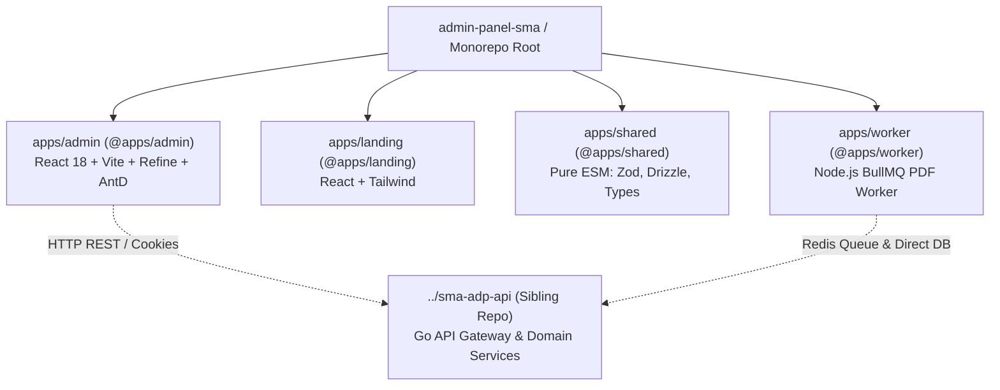
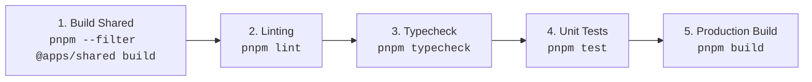

# AI Agent Operating Guidelines & Rules (AGENTS.md)

## SMA Academic & Administrative Management Platform

---

## 1. Core Operating Context & Repository Boundaries

This repository is a **pnpm monorepo** containing frontend applications, shared validation contracts, and background workers.



### Critical Architecture Boundaries

- **No In-Repo Backend API**: The legacy NestJS API (`apps/api`) has been completely decommissioned. The Go backend lives exclusively in the sibling repository `../sma-adp-api`. **Never** attempt to recreate or import from `@api/*`.
- **Authoritative Backend Docs**: Sibling documentation in `../sma-adp-api/docs/FE_BE_MAPPING.md`, `../sma-adp-api/docs/PROJECT_STATUS.md`, and `../sma-adp-api/docs/GO_BACKEND_API_SPECIFICATION.md` is the canonical source of truth for all API contracts and endpoint statuses.

---

## 2. Strict Technical & Module Conventions

### 2.1 ESM (ECMAScript Modules) Rules

All packages in this repository are strict ES Modules (`"type": "module"`):

1. **Explicit File Extensions**: All relative imports in TypeScript files **MUST** include the `.js` extension:

   ```typescript
   // ❌ Incorrect
   import { studentSchema } from "./student";
   import { ROLES } from "../constants/roles";

   // ✅ Correct
   import { studentSchema } from "./student.js";
   import { ROLES } from "../constants/roles.js";
   ```

2. **CommonJS Interoperability**: Packages that do not support named ESM exports (e.g. `pg`) must be imported using default import and destructured:

   ```typescript
   // ❌ Incorrect
   import { Pool } from "pg";

   // ✅ Correct
   import pkg from "pg";
   const { Pool } = pkg;
   type PoolType = InstanceType<typeof Pool>;
   ```

### 2.2 Shared Package Build Discipline

`@apps/shared` compiles to `output/`. When adding or editing Zod schemas, Drizzle models, or constants:

1. Make your changes in `apps/shared/src/`.
2. Ensure you re-export new definitions in `apps/shared/src/index.ts` or `apps/shared/src/schemas/index.ts`.
3. **Always** rebuild the shared package before running workspace typechecks or worker builds:
   ```bash
   pnpm --filter @apps/shared build
   ```

### 2.3 Path Aliases (Admin Panel)

Within `@apps/admin`:

- `@/*` points to `apps/admin/src/*`.
- `@shared/*` or `@apps/shared/*` points to `apps/shared/src/*` (in dev) or `apps/shared/output/*` (in build).
- Do not create custom root aliases that bypass TypeScript configurations (`tsconfig.json`).

---

## 3. Frontend Development Guidelines (`@apps/admin`)

### 3.1 Refine & TanStack Query Patterns

- Use standard Refine hooks (`useTable`, `useForm`, `useShow`, `useList`, `useCreate`, `useUpdate`, `useDelete`) instead of manual Axios or raw `fetch` calls.
- Go backend endpoints return data wrapped in `{ "data": ... }`. `apps/admin/src/providers/dataProvider.ts` handles envelope unwrapping; do not manually double-unwrap data in UI components.
- Invalidate relevant query keys after custom mutations to ensure real-time UI synchrony:
  ```typescript
  const queryClient = useQueryClient();
  // Invalidate attendance queries upon roll-call submission
  queryClient.invalidateQueries(["attendance"]);
  ```

### 3.2 Role-Based Access Control (RBAC)

- Client-side authorization rules are defined in `apps/admin/src/providers/accessControlProvider.ts`.
- Always wrap restricted action buttons (e.g. Delete, Edit, Lock Grade, Promote) with `<ResourceActionGuard>` or check permissions via Refine's `useCan` hook:
  ```tsx
  <ResourceActionGuard resource="grades" action="edit">
    <Button type="primary" onClick={handleSaveGrades}>
      Simpan Nilai
    </Button>
  </ResourceActionGuard>
  ```

### 3.3 Mobile & Responsive UI Standards

- Do not render raw `<Table />` components on main resource index pages without responsive wrappers.
- Use `<ResponsiveList />` to automatically switch between desktop AntD Tables (`lg+`) and mobile card views (`<MobileCardList />`) on smaller screens.
- Keep mobile action bars accessible using `<StickyActionBar />`.

### 3.4 Feature Flag Handling

- The authoritative feature flag state is discovered at runtime via `GET /api/v1/features` (handled in `apps/admin/src/providers/features.ts`).
- When adding a new feature-flagged module:
  1. Add the feature name to `FeatureName` type in `apps/admin/src/providers/features.ts`.
  2. Add the corresponding `VITE_ENABLE_<NAME>` fallback in `apps/admin/.env`.
  3. Register the resource conditionally in `apps/admin/src/main.tsx` inside `selectResources()`.

---

## 4. Verification & Testing Workflow for Agents

Before completing any task, agents **MUST** execute and verify the following commands in the workspace:



### Verification Commands

```bash
# 1. Rebuild shared package
pnpm --filter @apps/shared build

# 2. Run ESLint (v9 flat config)
pnpm lint

# 3. Run TypeScript typecheck across all workspaces
pnpm typecheck

# 4. Run Vitest suite across workspaces
pnpm test

# 5. Build all workspace targets (verifies Rollup / Vite bundling)
pnpm build
```

---

## 5. Agent Do's and Don'ts Checklist

| Do                                                                             | Don't                                                                                |
| :----------------------------------------------------------------------------- | :----------------------------------------------------------------------------------- |
| ✅ **DO** run `pnpm --filter @apps/shared build` after editing `@apps/shared`. | ❌ **DON'T** use `npm` or `yarn` (only `pnpm` with workspace protocol is supported). |
| ✅ **DO** include `.js` extensions on all relative TS imports.                 | ❌ **DON'T** look for NestJS / Prisma in this repo (`apps/api` is gone).             |
| ✅ **DO** wrap restricted actions in `<ResourceActionGuard>`.                  | ❌ **DON'T** store access tokens in `localStorage` or `sessionStorage`.              |
| ✅ **DO** use `ResponsiveList` and Ant Design design tokens.                   | ❌ **DON'T** introduce custom CSS frameworks into `@apps/admin` (AntD is canonical). |
| ✅ **DO** verify tests pass using `pnpm test` and `pnpm typecheck`.            | ❌ **DON'T** commit huge binary files, temporary dumps, or untracked cache files.    |
