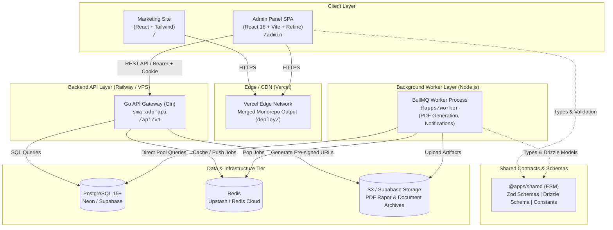
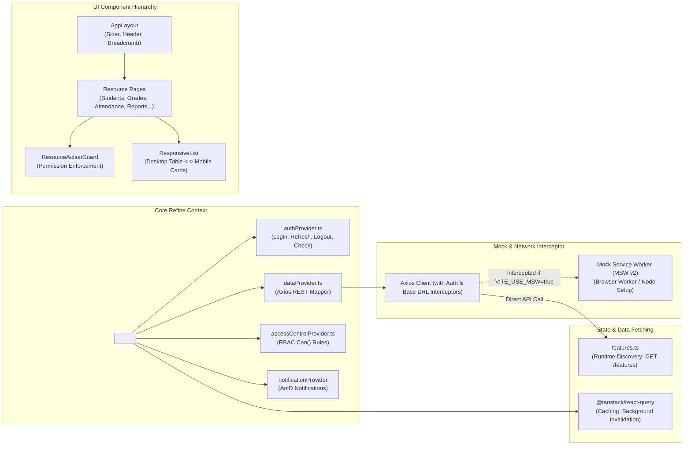
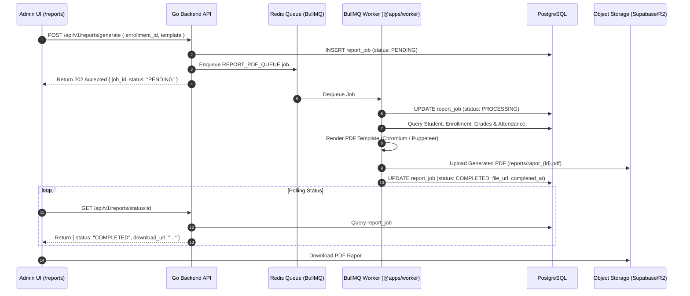
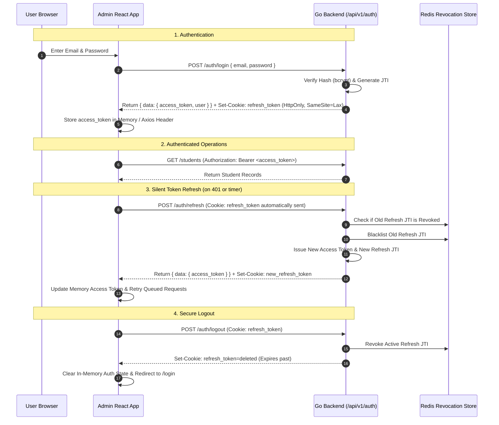
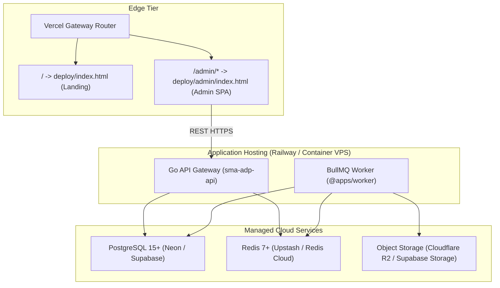

# Architecture Document (ARCHITECTURE.md)

## SMA Academic & Administrative Management Platform

---

## 1. High-Level System Topology

The platform is architected as a decoupled, high-performance distributed system consisting of a **pnpm monorepo** for frontend applications, shared contracts, and background workers, alongside an independent high-throughput **Go backend API** (`sma-adp-api`).



---

## 2. Monorepo Workspace Breakdown

The repository utilizes `pnpm` workspaces (`pnpm-workspace.yaml`) with strict package boundaries:

```
admin-panel-sma/
├── apps/
│   ├── admin/         # Primary single-page application for school staff
│   ├── landing/       # High-speed static marketing & information portal
│   ├── shared/        # Isomorphic schemas, types, Drizzle models, and constants
│   └── worker/        # Node.js BullMQ asynchronous job processor
├── docs/              # Architectural guides, ADRs, runbooks, and API specs
├── deploy/            # Combined build artifact directory for Vercel deployment
├── pnpm-workspace.yaml
├── vercel.json
└── package.json
```

### 2.1 Workspace Responsibilities & Dependencies

| Workspace Package   | Technology Stack                                                                           | Build Output    | Primary Responsibilities                                                                                            |
| :------------------ | :----------------------------------------------------------------------------------------- | :-------------- | :------------------------------------------------------------------------------------------------------------------ |
| **`@apps/admin`**   | React 18, Vite 5, Refine v4 (`@refinedev/antd`), Ant Design v5, TanStack Query v4, MSW v2. | `dist/`         | Complete operational user interface for Superadmin, Admin TU, Wali Kelas, Guru Mapel, and Kepala Sekolah.           |
| **`@apps/landing`** | React 18, Vite 5, Tailwind CSS.                                                            | `dist/`         | Public-facing landing page explaining platform capabilities and directing users to `/admin`.                        |
| **`@apps/shared`**  | TypeScript 5.5, Zod 3.23, Drizzle ORM 0.33.                                                | `output/` (ESM) | Single source of truth for runtime validation schemas, database schema definitions, and shared constants.           |
| **`@apps/worker`**  | Node.js 20+, BullMQ 5, IORedis, pg, Puppeteer/PDF rendering.                               | `dist/` (ESM)   | Heavy background processing: batch report card (PDF Rapor) rendering, document compilation, external notifications. |

---

## 3. Frontend Architecture (`@apps/admin`)

The Admin application is built on top of the **Refine** enterprise framework combined with **Ant Design**, optimized for dense data tables, rapid CRUD workflows, and complex state management.



### 3.1 Data Provider & REST Envelope Handling

- The custom Refine data provider (`apps/admin/src/providers/dataProvider.ts`) communicates with the Go backend via standard REST conventions.
- All Go backend responses are wrapped in a standard JSON envelope: `{ "data": ... }`. The data provider automatically unwraps this envelope for Refine mutations and queries.
- Query parameters (pagination `_start`/`_end`, sorting `_sort`/`_order`, and filtering) are translated into backend-compliant query params (e.g. `page`, `page_size`, `sort`, `filter`).

### 3.2 Dynamic Runtime Feature Discovery

- Rather than relying solely on build-time environment variables, `@apps/admin` executes an unauthenticated runtime discovery request `GET /api/v1/features` upon initialization.
- If reachable, the backend response dictates which navigation menus, routes, and resources are registered in the UI.
- If unreachable (offline mode, development, or network error), the system gracefully falls back to `VITE_ENABLE_*` build-time environment variables.

### 3.3 Mock Service Worker (MSW) Integration

- To support 100% frontend velocity without running database or backend dependencies, `@apps/admin` embeds MSW v2.
- In preview deployments and local development with `VITE_USE_MSW=true`, MSW intercepts network traffic with a complete mock dataset (`mockServiceWorker.js`), simulating multi-role authentication, CRUD operations, and reports generation.

---

## 4. Shared Contract Layer (`@apps/shared`)

`@apps/shared` ensures end-to-end type safety between the frontend and background worker processes:

1. **Zod Validation Schemas (`src/schemas/`)**:
   - `auth.ts`: Login payloads, password reset, token validation.
   - `student.ts`, `teacher.ts`, `user.ts`: Master entity schemas and CSV import validation.
   - `attendance.ts`: Daily and lesson attendance schemas with status enumerations.
   - `grade.ts`: Grade items, score submissions, and KKM validation rules.
   - `report.ts`: Report generation job payloads and template options.
2. **Database Schema (`src/db/schema.ts`)**:
   - Drizzle ORM table models mirroring the PostgreSQL database schema for direct worker querying.
3. **Domain Constants (`src/constants/`)**:
   - `ROLES`: `SUPERADMIN`, `ADMIN_TU`, `WALI_KELAS`, `GURU_MAPEL`, `KEPALA_SEKOLAH`, `SISWA`, `ORTU`.
   - `QUEUE_NAMES`: `REPORT_PDF_QUEUE`, `ATTENDANCE_NOTIFY_QUEUE`, `NOTIFICATION_QUEUE`.
   - `SECURITY`: Password requirements, token lifetimes, and session rules.

> **Compilation Note**: `@apps/shared` is compiled to pure ES Modules in `output/` using TypeScript before dependent packages are built.

---

## 5. Background Processing Architecture (`@apps/worker`)

Asynchronous, resource-heavy operations are isolated from the synchronous API request-response cycle using BullMQ:



### 5.1 Worker ESM & Driver Compatibility

- Direct connection to PostgreSQL via `pg.Pool` utilizing ESM default import interop (`import pkg from "pg"; const { Pool } = pkg;`).
- Direct Redis connection via `ioredis` with TLS support for managed providers (Upstash / Redis Cloud).
- Automatic retry strategies with exponential backoff and dead-letter queue (DLQ) logging for failed report jobs.

---

## 6. Authentication & Security Architecture

The platform implements a hardened session lifecycle combining short-lived in-memory access tokens with automatic rotation of HttpOnly refresh token cookies:



---

## 7. Deployment & Infrastructure Architecture



### 7.1 Unified Vercel Deployment Model

- The monorepo uses `vercel.json` to produce a single merged `deploy/` directory.
- Root path `/` serves the static landing page (`@apps/landing`).
- Subpath `/admin` serves the single-page admin panel (`@apps/admin`) with client-side HTML5 history fallback rewrite rules.
- Preview branches automatically isolate mocks via MSW without communicating with production backend services.
