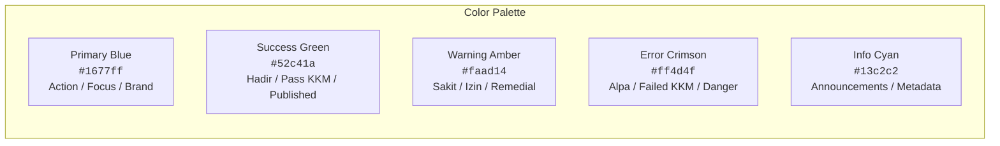
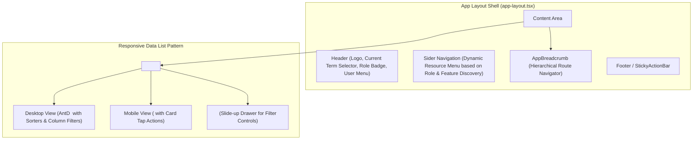
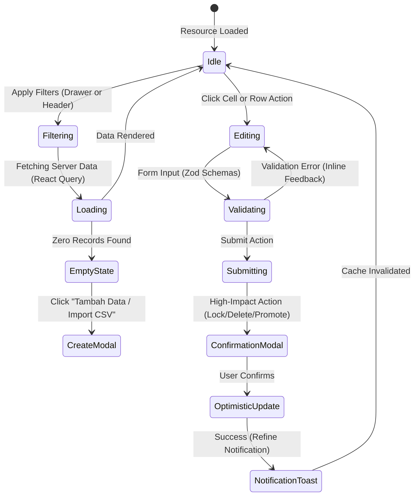

# UI/UX Design System & Behavioral Guidelines (DESIGN.md)

## SMA Academic & Administrative Management Platform

---

## 1. Design Philosophy & Principles

The Admin Panel SMA interface is built for high-stakes, day-to-day academic operations. It balances the high information density required by administrative staff (Tata Usaha) on widescreen desktop displays with the rapid, touch-friendly workflows needed by teachers (Guru Mapel, Wali Kelas) navigating classrooms with smartphones or tablets.

### Core Principles

1. **High Density with Clear Hierarchy**: Maximize visible data on desktop tables (NIS, names, multi-component scores, attendance statuses) without visual clutter, using tabular numeric alignment and compact tags.
2. **Responsive Dual-Mode Experience**: Automatically transform dense desktop data tables into touch-optimized card lists (`MobileCardList`) and slide-up drawers (`FiltersBottomSheet`) on mobile viewports.
3. **Immediate Operational Feedback**: Changes to attendance or grade entries provide instant visual confirmation (optimistic UI feedback and subtle color state transitions).
4. **Safety & Irreversibility Guardrails**: High-impact actions (finalizing grades, triggering semester promotions, student mutations, archiving terms) require explicit confirmation dialogs with clear impact warnings.
5. **Contextual Role Adaptation**: Tailor navigation, dashboards, and action buttons dynamically based on user persona (`SUPERADMIN`, `ADMIN_TU`, `WALI_KELAS`, `GURU_MAPEL`, `KEPALA_SEKOLAH`).

---

## 2. Visual Identity & Theme Tokens

The application leverages **Ant Design v5** design tokens configured in `apps/admin/src/theme/`:

### 2.1 Theme Configuration

- **Primary Color**: `#1677ff` (Academic Blue)
- **Border Radius**: `6px` for controls, `8px` for cards and modals.
- **Font Family**: `-apple-system, BlinkMacSystemFont, 'Segoe UI', Roboto, 'Helvetica Neue', Arial, sans-serif`.
- **Typography Scale**:
  - Page Titles (H1): `20px` (Desktop: `24px`), Semi-Bold (`600`).
  - Section Headings (H2): `16px` (Desktop: `18px`), Medium (`500`).
  - Body Text: `14px`, Regular (`400`).
  - Secondary/Caption Text: `12px`, Regular (`400`).
  - Numeric Data (NIS, NIP, Scores): `font-variant-numeric: tabular-nums`.

### 2.2 Responsive Breakpoints

| Breakpoint | Viewport Width | Typical Target Device          | Layout Adaptation                                                                 |
| :--------- | :------------- | :----------------------------- | :-------------------------------------------------------------------------------- |
| **`xs`**   | `< 576px`      | Mobile smartphones (portrait)  | Single-column cards, collapsible sticky bottom action bar, slide-up filter sheet. |
| **`sm`**   | `≥ 576px`      | Mobile smartphones (landscape) | Single-column cards, compact header.                                              |
| **`md`**   | `≥ 768px`      | Tablets (portrait)             | Collapsed sider, 2-column KPI cards, compact table or card grid.                  |
| **`lg`**   | `≥ 992px`      | Tablets (landscape), Laptops   | Expanded sider, full Ant Design table, inline filters, 4-column KPI cards.        |
| **`xl`**   | `≥ 1200px`     | Desktop monitors               | High-density tables, multi-pane split views, full scheduling grid.                |
| **`xxl`**  | `≥ 1600px`     | Widescreen displays            | Maximum table density, side-by-side analytics panels.                             |

---

## 3. Core Component Architecture & Layouts

### 3.1 Layout Anatomy

- **`AppLayout` (`src/components/layout/app-layout.tsx`)**:
  - **Shell**: The app shell must fill the viewport width on every page. `#root` in `index.html` must stay unstyled — React replaces its children on mount but preserves its inline `style`, so any centering/flex on `#root` squeezes the mounted app.
  - **Header**: Fixed height of `56px` (`HEADER_HEIGHT`), sticky at the top, full viewport width. All vertical layout math (`calc(100vh - …)`) derives from this single constant.
  - **Sider**: Collapsible navigation with brand identity, role-filtered menu items, and active route indicators. On `md+` it is `position: sticky` with `height: calc(100vh - HEADER_HEIGHT)` and scrolls internally, so navigation stays visible while page content scrolls. On `< md` it becomes a slide-in `Drawer` with a fixed bottom navigation bar (56px) instead.
  - **Content**: Single scroll container is the document body; the header and sider stick. Page content renders inside one card (`#main-content`) with responsive padding.
  - **Breadcrumbs (`app-breadcrumb.tsx`)**: Automatic breadcrumb generation translating Refine resource trees into clear Indonesian navigational paths (e.g. `Akademik / Penilaian / Nilai Kelas X-A`).
  - **Wide data tables**: Raw AntD `<Table>` pages must set `scroll={{ x: "max-content" }}` so wide columns scroll within the table instead of overflowing the shell on narrow viewports.

### 3.2 Responsive Component Toolkit

- **`ResponsiveList` (`src/components/responsive/ResponsiveList.tsx`)**:
  A unified container component that checks the active viewport breakpoint. On `lg+` it renders a feature-complete Ant Design Table. On `< lg` it renders an optimized card list.
- **`MobileCardList` (`src/components/responsive/MobileCardList.tsx`)**:
  Renders list items as structured cards featuring avatar/icon, primary title, metadata tags, and quick touch action buttons (Edit, Delete, View).
- **`FiltersBottomSheet` (`src/components/responsive/FiltersBottomSheet.tsx`)**:
  Extracts complex multi-field filters (Term, Class, Subject, Date Range) into a clean slide-up bottom drawer on mobile, keeping the primary card list uncluttered.
- **`StickyActionBar` (`src/components/responsive/StickyActionBar.tsx`)**:
  A fixed bottom bar on mobile screens housing primary CTA buttons (e.g. "Simpan Presensi", "Finalisasi Nilai", "Export CSV") for easy one-thumb reachability.
- **`SummaryCard` (`src/components/dashboard/summary-card.tsx`)**:
  A standardized KPI card component with leading icon, numerical value, percentage trend badge (green/red), progress bar, and clickable drilldown route.
- **`ResourceActionGuard` (`src/components/resource-action-guard.tsx`)**:
  RBAC wrapper that hides or disables buttons and action items based on user permissions checked against `accessControlProvider`.

---

## 4. UI Interaction & Behavioral Guidelines

### 4.1 Form Design & Validation

- **Instant Validation**: All form inputs are validated using Zod schemas (`@apps/shared/schemas`) integrated with Ant Design Form rules.
- **Inline Feedback**: Validation error messages appear immediately below the affected field in red text with explanatory guidance.
- **Auto-Formatting**: NIS/NIP, phone numbers, and currency/score inputs format automatically on blur.

### 4.2 Modal & Confirmation Dialogs

- **Confirmation Modals (`confirm-modal.tsx`)**: Destructive actions (deletions, term closures, grade finalization, student mutations) require confirmation with descriptive impact summaries.
- **Modal Drawers for Complex Creation**: Multi-field entity creation (e.g. Schedule Creation, Teacher Assignment) opens in a right-hand slide drawer on desktop and a full-screen modal on mobile.

### 4.3 Notifications & Feedback

- **Toasts**: Auto-dismissing notifications (3 seconds) for successful CRUD operations using Refine's `notificationProvider`.
- **Error Alerts**: Persistent error banners for network failures or validation rejections with retry triggers.
- **Empty States**: Clear empty-state illustrations with actionable buttons (e.g. "Belum ada siswa di kelas ini. Tambah Siswa atau Import CSV").

---

## 5. Screen-by-Screen UI Specifications

### 5.1 Dashboard (`/dashboard`)

- **Top Row**: 4 KPI `SummaryCard` widgets (Total Siswa Aktif, Rata-rata Kehadiran Hari Ini, Guru Mengajar, Rata-rata Nilai Akademik).
- **Middle Section**: Attendance trend chart (Presensi 14 Hari Terakhir) with filter by Grade Level (X, XI, XII) and drilldown links to `/attendance-analytics`.
- **Bottom Section**: Recent school announcements, upcoming calendar events, and quick shortcut action buttons.

### 5.2 Daily Attendance (`/attendance-daily`)

- **Control Bar**: Term Selector, Class Selector, and Date Picker.
- **Student Roll-Call Grid**:
  - Avatar, NIS, Student Name.
  - 4 Quick-Toggle Status Buttons: **H** (Hadir - Green), **S** (Sakit - Amber), **I** (Izin - Blue), **A** (Alpa - Red).
  - Notes / Catatan input for Doctor's note or reason.
- **Footer Summary**: Real-time counter of Hadir, Sakit, Izin, Alpa counts and "Simpan Presensi" submission button.

### 5.3 Lesson Attendance (`/attendance-lesson`)

- **Control Bar**: Class, Subject, Date, and Schedule Slot / Jam Ke.
- **Quick Actions**: "Tandai Semua Hadir" (Mark All Present) one-click button.
- **Individual Overrides**: Immediate toggle buttons for absent or late students with note capture.

### 5.4 Gradebook & Scoring (`/grades`)

- **Filter Bar**: Subject, Class, Term, and Grade Component (e.g. Tugas 1, UTS, UAS).
- **Spreadsheet Grid**: High-density numerical inputs with immediate pass/fail color coding based on KKM threshold (e.g. green if ≥ 75, red if < 75).
- **Locking Workflow**: Two-step action bar ("Simpan Draft" -> "Kunci & Finalisasi Nilai"). Locked grades show a padlock icon and disable cell inputs.

### 5.5 Schedule Grid & Generator (`/schedules`, `/schedule-generator`)

- **Timetable Matrix**: 5-day / 6-day weekly grid with time slots (Jam 1 to Jam 8).
- **Visual Schedule Cards**: Class name, Subject, Teacher badge, and Room tag with collision warning highlights.
- **Generator Wizard**: Step-by-step constraint setup (Teacher unavailable hours, lab availability) and animated conflict resolution summary.

### 5.6 Report Cards (`/reports`)

- **Class Batch Card**: List of classes with progress bars showing Grade Completion % and Report Status (`PENDING`, `GENERATING`, `READY`).
- **Batch Action**: "Generate Semua Rapor Kelas" triggering BullMQ worker job with real-time polling progress bar.
- **Export Action**: Direct PDF download button and batch ZIP archive generation.

### 5.7 Setup Wizard (`/setup-wizard`)

- **Step 1**: Academic Year & Term Configuration.
- **Step 2**: Bulk CSV Ingestion (Students, Teachers, Subjects) with schema error preview.
- **Step 3**: Classroom Formation & Homeroom Assignment.
- **Step 4**: Schedule Initialization.
