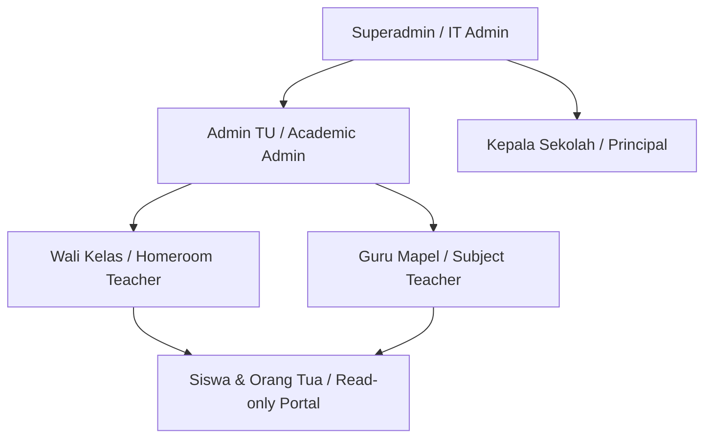
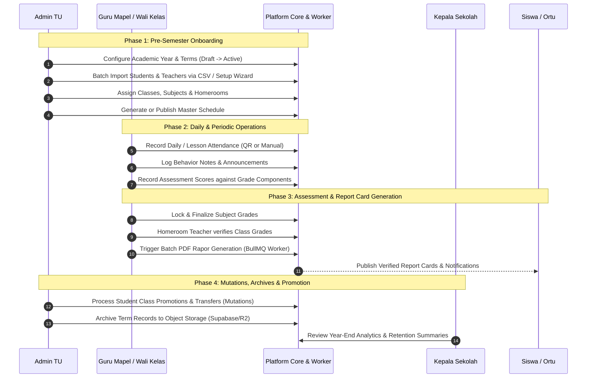

# Product Requirements Document (PRD)

## SMA Academic & Administrative Management Platform (Admin Panel SMA)

---

## 1. Executive Summary & Problem Statement

### 1.1 Why Are We Building This?

Secondary education institutions (Sekolah Menengah Atas / SMA in Indonesia) face significant operational friction across their academic lifecycle. Traditional processes rely on fragmented spreadsheets, physical paper forms, manual attendance logs, and disconnected communication channels. This fragmentation leads to:

- **Data Inconsistencies & Redundancies**: Student records, enrollment lists, subject allocations, and grade sheets often diverge across administrative departments (Tata Usaha) and teaching staff.
- **Labor-Intensive Assessment & Reporting**: Compiling mid-term and semester report cards (_Buku Rapor_) requires manual aggregation of attendance, subject competencies, behavioral notes, and extracurricular scores—consuming weeks of teacher and administrative time.
- **Delayed Intervention on Student Attendance & Behavior**: Truancy and behavioral flags are logged on paper and communicated slowly, preventing timely homeroom teacher (Wali Kelas) and parental intervention.
- **Complex Timetable Generation**: Scheduling dozens of classes, teachers with specific availability constraints, and specialized laboratories without conflicts is computationally burdensome and error-prone when done manually.

### 1.2 Product Vision

The **SMA Academic & Administrative Management Platform** is an enterprise-grade, high-performance School Information System (SIS) and Academic Operations Platform. It centralizes master data management, daily and subject-level attendance, dynamic curriculum grading configurations, automated report card compilation, conflict-free schedule generation, and executive decision-support analytics into a unified, secure, and responsive web application.

---

## 2. Target Personas & Role-Based Access Control (RBAC)

The system enforces strict role-based access control with granular permissions tailored to standard Indonesian high school organizational structures:

| Persona / Role                              | Key Responsibilities                                                                                                                                                      | Primary System Touchpoints                                                                                |
| :------------------------------------------ | :------------------------------------------------------------------------------------------------------------------------------------------------------------------------ | :-------------------------------------------------------------------------------------------------------- |
| **`SUPERADMIN`**                            | System provisioning, tenant & environment settings, user lifecycle management, security audits, feature flag toggles.                                                     | `/users`, `/configuration`, `/audit`, Feature Flags.                                                      |
| **`ADMIN_TU`** (Tata Usaha)                 | Academic year & term setup, master data (students, teachers, classrooms, subjects), teacher-subject allocations, student mutations, timetable management, archives.       | `/setup-wizard`, `/terms`, `/students`, `/teachers`, `/classes`, `/schedules`, `/mutations`, `/archives`. |
| **`KEPALA_SEKOLAH`** (Principal)            | Executive oversight, academic achievement monitoring, attendance trend analytics, teacher performance review, final report card authorization.                            | `/dashboard`, `/attendance-analytics`, `/grades-analytics`, `/behavior-analytics`, `/reports`.            |
| **`WALI_KELAS`** (Homeroom Teacher)         | Daily classroom attendance verification, homeroom behavior notes, student pastoral care, mid-term & final grade verification, batch report card generation.               | `/attendance-daily`, `/homeroom-assignments`, `/behavior-notes`, `/reports`, `/classes-show`.             |
| **`GURU_MAPEL`** (Subject Teacher)          | Lesson attendance tracking, grade component weighting (KKM, quizzes, assignments, exams), score entry & finalization, teacher scheduling preferences.                     | `/attendance-lesson`, `/grades`, `/grade-components`, `/teacher-preferences`, `/schedules`.               |
| **`SISWA`** & **`ORTU`** (Student & Parent) | Monitoring individual attendance history, viewing lesson schedules, tracking published grades, downloading generated semester report cards, reading school announcements. | Read-Only Student/Parent Portal, `/announcements`, `/calendar`.                                           |

---

## 3. Academic Lifecycle Workflows

The platform is designed around four continuous stages of the school calendar:

---

## 4. Functional Capabilities & Module Breakdown

### 4.1 Master Data & Setup Wizard

- **Academic Hierarchy**: Hierarchical management of Academic Years (`AcademicYear`) and Semester Terms (`Term`). Status transitions enforce one active term globally.
- **Guided Setup Wizard**: Step-by-step onboarding for new academic years covering term initialization, bulk CSV imports (with automatic duplicate detection for NIS/NIP), classroom formation, and teacher allocation.
- **Batch CSV Import**: Validation against strict Zod schemas, dry-run parsing, schema error highlighting, and background ingestion.

### 4.2 Scheduling & Timetable Engine

- **Master Timetable Grid**: Interactive weekly visual matrix by class, teacher, or room.
- **Teacher Availability & Preferences**: Allows teachers to set preferred and unavailable time slots before schedule generation.
- **Automated Schedule Generator**: Constraint-satisfaction engine resolving teacher collisions, maximum daily hours, subject distributions, and room capacity.

### 4.3 Attendance Management

- **Daily Attendance (Presensi Harian)**: Homeroom-level check supporting statuses: `PRESENT` (Hadir), `SICK` (Sakit), `PERMISSION` (Izin), `ABSENT` (Alpa).
- **Lesson Attendance (Presensi Mapel)**: Per-session attendance recorded by subject teachers tied directly to the active schedule slot.
- **QR Code Attendance**: Dynamic QR session generation for rapid student check-in with token expiration to prevent spoofing.
- **Automated Alerts**: Identification of consecutive or high-frequency absences triggering counselor/homeroom notifications.

### 4.4 Assessment & Gradebook

- **Configurable Grading Scheme**: Supports both _Kurikulum Merdeka_ and _Kurikulum 2013 (K13)_. Dynamic definition of passing grades (KKM) per subject/grade level.
- **Assessment Components**: Flexible weightings for Formative assessments (Tugas, Kuis, PR) and Summative assessments (UTS, UAS, Proyek Penguatan Profil Pelajar Pancasila - P5).
- **Inline Fast Grade Entry**: High-density grid for bulk score input with immediate calculation of averages, weighted totals, and letter grades.
- **Grade Finalization & Locking**: Two-tier locking mechanism (Teacher Lock -> Homeroom Verification) preventing unauthorized modifications post-deadline.
- **Audit Trails & Soft Deletion**: Full history of grade updates and soft-delete capabilities with restoration support.

### 4.5 Report Card (Buku Rapor) Engine

- **Asynchronous PDF Compilation**: Offloads resource-intensive PDF rendering to a dedicated Node.js BullMQ worker.
- **Standardized Templates**: Clean Indonesian academic report formatting including school identity, student biodata, attendance summary, subject scores, teacher comments, and physical signature zones.
- **Batch Processing & Status Polling**: Homeroom teachers can generate full class batches with a single click, monitor progress via real-time status bars, and download individual or bundled ZIP archives.

### 4.6 Student Mutations & Document Archives

- **Student Mutations**: Formal tracking of student transfers (in/out), class transfers, dropouts, and academic promotions with full audit logs.
- **Secure Document Archives**: Long-term preservation of historical report cards, attendance registries, and administrative records stored in S3-compatible storage (Supabase / Cloudflare R2) with configurable retention policies and metadata search.

### 4.7 Executive Analytics & Decision Support

- **Attendance Analytics**: Aggregated school-wide and grade-level attendance percentages, trend charts, day-of-week anomaly detection, and student drilldown.
- **Academic Performance Analytics**: Subject difficulty heatmaps, grade distribution curves, and early identification of students at risk of failing KKM.
- **Behavior & Pastoral Analytics**: Categorized tracking of student achievements and disciplinary incidents.

---

## 5. Non-Functional Requirements (NFRs)

| Category                       | Requirement                                                                                                                                                                     | Verification Method                                                       |
| :----------------------------- | :------------------------------------------------------------------------------------------------------------------------------------------------------------------------------ | :------------------------------------------------------------------------ |
| **Performance**                | Initial page load under 1.5s; client-side route transitions under 100ms; grade entry debounce under 300ms.                                                                      | Chrome DevTools Lighthouse & Web Vitals benchmarks.                       |
| **Scalability**                | Support up to 3,000 active students, 200 faculty members, and concurrent report card generation of 50+ classes without UI degradation.                                          | Load testing worker queues and backend query performance.                 |
| **Security**                   | In-memory access token storage, HttpOnly SameSite refresh token cookie with automated JTI rotation, strict RBAC guardrails on all API routes, no token leakage to localStorage. | Security audit, automated contract tests, OWASP compliance tests.         |
| **Reliability & Offline Dev**  | Full offline / mock capability via MSW (Mock Service Worker) allowing zero-backend frontend development and isolated Vercel preview environments.                               | Vitest MSW suite (160+ unit/integration tests) and Playwright E2E suites. |
| **Usability & Responsiveness** | Fully responsive layout adapting from widescreen desktop monitors (data tables, scheduling grids) down to mobile smartphones (attendance check-in, quick grade entry).          | Cross-device Playwright testing across desktop and mobile viewports.      |
| **Compliance**                 | Conforms to Indonesian Ministry of Education (Kemendikbudristek) grading standards and Kurikulum Merdeka guidelines.                                                            | Domain verification with academic administrative staff.                   |

---

## 6. Success Metrics & Key Performance Indicators (KPIs)

1. **Administrative Time Reduction**: Decrease time spent on semester report card compilation by ≥ 75% (from 2 weeks to < 3 days).
2. **Grade Entry Compliance**: Achieve 100% on-time grade finalization by subject teachers prior to report card deadlines.
3. **Attendance Logging Timeliness**: Ensure ≥ 95% of daily morning attendance is recorded and finalized within the first 60 minutes of the school day.
4. **Platform Uptime & Availability**: Maintain 99.9% uptime during peak end-of-term grading and report generation windows.
5. **Zero Data Loss**: Full auditability and backup integrity for all grade changes and historical student transcripts.
