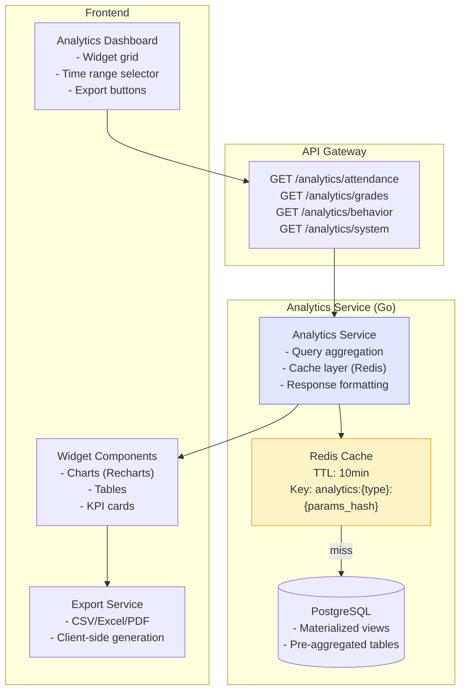
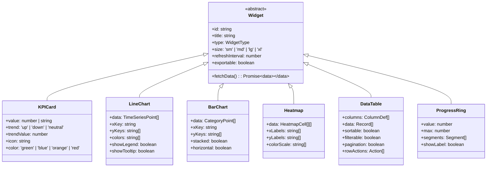

# Analytics Dashboard Guide

> **Purpose:** Technical specification for the analytics dashboard — widgets, data endpoints, export functionality, and real-time updates for Admin Panel SMA.

---

## 1. Overview

### 1.1 Problem Statement

Provide actionable insights for school administrators through:

- **Attendance Analytics** — trends, patterns, at-risk students
- **Grades Analytics** — distribution, progression, subject performance
- **Behavior Analytics** — incidents, trends, intervention tracking
- **System Analytics** — usage, performance, capacity

Requirements:

- 4 dedicated API endpoints (already implemented)
- Dashboard widgets with configurable time ranges
- Export to CSV/Excel/PDF
- Role-based visibility (admin vs teacher vs parent)
- Caching for performance (10min TTL)

### 1.2 Architecture



### 1.3 Feature Flag

```bash
# Backend
ENABLE_ANALYTICS=true
ANALYTICS_CACHE_TTL=10m

# Frontend
VITE_ENABLE_ANALYTICS=true
```

---

## 2. API Endpoints

### 2.1 Attendance Analytics

```http
GET /api/v1/analytics/attendance?term_id=term_2025_1&start_date=2025-01-01&end_date=2025-06-30&group_by=week&class_id=class_10_ip_a
Authorization: Bearer <token>
```

**Query Parameters:**
| Param | Type | Required | Default | Description |
|-------|------|----------|---------|-------------|
| `term_id` | string | Yes | - | Term UUID |
| `start_date` | date | No | Term start | Filter start |
| `end_date` | date | No | Term end | Filter end |
| `group_by` | enum | No | `day` | `day`, `week`, `month` |
| `class_id` | string | No | All | Filter by class |
| `student_id` | string | No | All | Filter by student |
| `status` | enum | No | All | `PRESENT`, `ABSENT`, `LATE`, `EXCUSED` |

**Response (200 OK):**

```json
{
  "data": {
    "summary": {
      "total_sessions": 180,
      "present_count": 156,
      "absent_count": 18,
      "late_count": 6,
      "excused_count": 4,
      "attendance_rate": 86.7,
      "chronic_absenteeism_rate": 12.5
    },
    "trends": [
      { "period": "2025-01", "present": 92, "absent": 5, "late": 2, "rate": 92.9 },
      { "period": "2025-02", "present": 88, "absent": 8, "late": 3, "rate": 88.9 },
      { "period": "2025-03", "present": 85, "absent": 10, "late": 4, "rate": 85.9 }
    ],
    "by_class": [
      { "class_id": "class_10_ip_a", "class_name": "10 IPA A", "rate": 91.2, "students": 32 },
      { "class_id": "class_10_ips_b", "class_name": "10 IPS B", "rate": 84.5, "students": 28 }
    ],
    "at_risk_students": [
      {
        "student_id": "stu_001",
        "name": "Ahmad",
        "class": "10 IPA A",
        "absent_days": 15,
        "rate": 65.0
      }
    ],
    "by_status": {
      "PRESENT": 156,
      "ABSENT": 18,
      "LATE": 6,
      "EXCUSED": 4
    },
    "heatmap": {
      "monday": [95, 92, 88, 90, 87],
      "tuesday": [93, 90, 85, 89, 86],
      "wednesday": [94, 91, 87, 88, 85],
      "thursday": [92, 89, 86, 87, 84],
      "friday": [88, 85, 82, 83, 80]
    }
  },
  "meta": {
    "cached": true,
    "cache_expires_at": "2025-01-15T10:40:00Z",
    "query_time_ms": 45
  }
}
```

### 2.2 Grades Analytics

```http
GET /api/v1/analytics/grades?term_id=term_2025_1&subject_id=subj_math&class_id=class_10_ip_a&include_distribution=true
Authorization: Bearer <token>
```

**Response:**

```json
{
  "data": {
    "summary": {
      "total_students": 32,
      "total_assessments": 128,
      "average_score": 78.4,
      "median_score": 80.0,
      "std_deviation": 12.3,
      "pass_rate": 87.5,
      "grade_distribution": {
        "A": 8,
        "B": 12,
        "C": 8,
        "D": 3,
        "E": 1
      }
    },
    "by_subject": [
      {
        "subject_id": "subj_math",
        "name": "Matematika",
        "avg": 75.2,
        "median": 78.0,
        "pass_rate": 81.3
      },
      {
        "subject_id": "subj_phys",
        "name": "Fisika",
        "avg": 82.1,
        "median": 84.0,
        "pass_rate": 93.8
      }
    ],
    "by_class": [
      { "class_id": "class_10_ip_a", "name": "10 IPA A", "avg": 78.4, "median": 80.0 },
      { "class_id": "class_10_ip_b", "name": "10 IPA B", "avg": 74.2, "median": 76.0 }
    ],
    "by_assessment_type": [
      { "type": "UTS", "avg": 76.5, "count": 32 },
      { "type": "UAS", "avg": 80.2, "count": 32 },
      { "type": "QUIZ", "avg": 79.1, "count": 64 }
    ],
    "distribution": {
      "bins": [0, 10, 20, 30, 40, 50, 60, 70, 80, 90, 100],
      "counts": [0, 0, 1, 2, 3, 5, 8, 10, 12, 8, 3]
    },
    "trends": [
      { "assessment": "Quiz 1", "avg": 75.0 },
      { "assessment": "Quiz 2", "avg": 78.0 },
      { "assessment": "UTS", "avg": 76.5 },
      { "assessment": "Quiz 3", "avg": 81.0 },
      { "assessment": "UAS", "avg": 80.2 }
    ],
    "student_details": [
      {
        "student_id": "stu_001",
        "name": "Ahmad",
        "subject": "Matematika",
        "scores": [75, 80, 78, 82],
        "average": 78.75
      }
    ]
  }
}
```

### 2.3 Behavior Analytics

```http
GET /api/v1/analytics/behavior?term_id=term_2025_1&type=positive,negative&class_id=class_10_ip_a
Authorization: Bearer <token>
```

**Response:**

```json
{
  "data": {
    "summary": {
      "total_incidents": 45,
      "positive_count": 28,
      "negative_count": 17,
      "positive_ratio": 62.2,
      "students_with_incidents": 18,
      "most_common_positive": "Helping peers",
      "most_common_negative": "Late to class"
    },
    "by_type": {
      "positive": [
        { "category": "Helping peers", "count": 12 },
        { "category": "Leadership", "count": 8 },
        { "category": "Academic excellence", "count": 8 }
      ],
      "negative": [
        { "category": "Late to class", "count": 7 },
        { "category": "Disruptive behavior", "count": 5 },
        { "category": "Missing homework", "count": 5 }
      ]
    },
    "by_class": [
      { "class_id": "class_10_ip_a", "positive": 15, "negative": 8, "ratio": 65.2 },
      { "class_id": "class_10_ips_b", "positive": 13, "negative": 9, "ratio": 59.1 }
    ],
    "by_student": [
      { "student_id": "stu_005", "name": "Budi", "positive": 5, "negative": 0, "net_score": 5 },
      { "student_id": "stu_012", "name": "Citra", "positive": 2, "negative": 4, "net_score": -2 }
    ],
    "trends": [
      { "week": "2025-W01", "positive": 5, "negative": 2 },
      { "week": "2025-W02", "positive": 4, "negative": 3 },
      { "week": "2025-W03", "positive": 6, "negative": 1 }
    ],
    "interventions_needed": [
      {
        "student_id": "stu_012",
        "name": "Citra",
        "negative_count": 4,
        "last_incident": "2025-01-15",
        "suggested_action": "Parent conference"
      }
    ]
  }
}
```

### 2.4 System Analytics

```http
GET /api/v1/analytics/system?start_date=2025-01-01&end_date=2025-01-31
Authorization: Bearer <token>
```

**Response:**

```json
{
  "data": {
    "usage": {
      "active_users_daily": [120, 135, 142, 138, 145, 130, 125],
      "active_users_weekly": 180,
      "sessions_total": 3240,
      "avg_session_duration_min": 18.5,
      "peak_concurrent_users": 45
    },
    "by_role": {
      "admin": { "users": 5, "sessions": 120 },
      "teacher": { "users": 45, "sessions": 1800 },
      "student": { "users": 120, "sessions": 1200 },
      "parent": { "users": 10, "sessions": 120 }
    },
    "by_feature": [
      { "feature": "grades", "usage_count": 1200, "unique_users": 150 },
      { "feature": "attendance", "usage_count": 980, "unique_users": 140 },
      { "feature": "schedule", "usage_count": 650, "unique_users": 100 },
      { "feature": "reports", "usage_count": 320, "unique_users": 40 }
    ],
    "performance": {
      "api_p50_ms": 85,
      "api_p95_ms": 240,
      "api_p99_ms": 580,
      "error_rate": 0.02,
      "uptime_percentage": 99.97
    },
    "capacity": {
      "storage_used_gb": 12.5,
      "storage_limit_gb": 100,
      "db_connections_active": 15,
      "db_connections_max": 100,
      "redis_memory_mb": 256
    }
  }
}
```

---

## 3. Dashboard Widgets Specification

### 3.1 Widget Types



### 3.2 Default Dashboard Layout

```mermaid
graph TB
    subgraph "Analytics Dashboard (Grid: 12 columns)"
        ROW1["Row 1: KPI Cards (4 × 3-col)"]
        ROW2["Row 2: Attendance Trend (8-col) | At-Risk Students (4-col)"]
        ROW3["Row 3: Grades Distribution (6-col) | Grade Trends (6-col)"]
        ROW4["Row 4: Behavior Summary (6-col) | Interventions (6-col)"]
        ROW5["Row 5: Attendance Heatmap (12-col)"]
        ROW6["Row 6: System Usage (6-col) | System Performance (6-col)"]
    end

    ROW1 --> KPI1["Attendance Rate"]
    ROW1 --> KPI2["Avg Grade"]
    ROW1 --> KPI3["Behavior Ratio"]
    ROW1 --> KPI4["Active Users"]

    ROW2 --> ATT["LineChart: Daily/Weekly Attendance"]
    ROW2 --> RISK["DataTable: At-Risk Students"]

    ROW3 --> DIST["BarChart: Grade Distribution"]
    ROW3 --> TREND["LineChart: Assessment Trends"]

    ROW4 --> BEH["ProgressRing: Pos/Neg Ratio"]
    ROW4 --> INT["DataTable: Interventions Needed"]

    ROW5 --> HEAT["Heatmap: Day × Week Attendance"]

    ROW6 --> USAGE["BarChart: Feature Usage"]
    ROW6 --> PERF["LineChart: API Latency"]
```



### 3.3 Widget Configuration (Per Analytics Type)

| Analytics      | Widgets (Default)                                               | Size           | Refresh |
| -------------- | --------------------------------------------------------------- | -------------- | ------- |
| **Attendance** | Rate KPI, Trend Line, Heatmap, At-Risk Table                    | lg, lg, xl, md | 5 min   |
| **Grades**     | Avg Grade KPI, Distribution Bar, Trend Line, Subject Comparison | lg, lg, lg, md | 10 min  |
| **Behavior**   | Ratio ProgressRing, Category Bars, Student Table, Interventions | lg, md, lg, md | 10 min  |
| **System**     | Active Users KPI, Feature Usage Bar, Latency Line, Capacity     | lg, lg, lg, md | 1 min   |

---

## 4. Frontend Implementation Spec

### 4.1 Pages & Components

```
apps/admin/src/
├── features/analytics/
│   ├── pages/
│   │   ├── AnalyticsDashboard.tsx      # Main dashboard with widget grid
│   │   ├── AttendanceAnalytics.tsx     # Deep-dive attendance page
│   │   ├── GradesAnalytics.tsx         # Deep-dive grades page
│   │   ├── BehaviorAnalytics.tsx       # Deep-dive behavior page
│   │   └── SystemAnalytics.tsx         # Deep-dive system page
│   ├── components/
│   │   ├── widgets/
│   │   │   ├── KPICard.tsx
│   │   │   ├── LineChartWidget.tsx
│   │   │   ├── BarChartWidget.tsx
│   │   │   ├── HeatmapWidget.tsx
│   │   │   ├── DataTableWidget.tsx
│   │   │   ├── ProgressRingWidget.tsx
│   │   │   └── WidgetWrapper.tsx       # Header, refresh, export, resize
│   │   ├── DashboardGrid.tsx           # React-grid-layout wrapper
│   │   ├── TimeRangeSelector.tsx       # Presets + custom range
│   │   ├── ExportDropdown.tsx          # CSV/Excel/PDF/JSON
│   │   └── WidgetConfigModal.tsx       # Customize widget settings
│   ├── hooks/
│   │   ├── useAttendanceAnalytics.ts
│   │   ├── useGradesAnalytics.ts
│   │   ├── useBehaviorAnalytics.ts
│   │   ├── useSystemAnalytics.ts
│   │   └── useWidgetData.ts            # Generic widget data fetcher
│   ├── utils/
│   │   ├── export.ts                   # CSV/Excel/PDF generation
│   │   ├── chartColors.ts              # Consistent color palette
│   │   └── formatters.ts               # Number, date, percentage formatting
│   └── types/
│       └── analytics.ts                # TypeScript interfaces
```

### 4.2 Time Range Selector

```tsx
// features/analytics/components/TimeRangeSelector.tsx
const TIME_RANGE_PRESETS = [
  {
    key: "today",
    label: "Today",
    getRange: () => ({ start: startOfDay(new Date()), end: new Date() }),
  },
  {
    key: "week",
    label: "This Week",
    getRange: () => ({ start: startOfWeek(new Date()), end: new Date() }),
  },
  {
    key: "month",
    label: "This Month",
    getRange: () => ({ start: startOfMonth(new Date()), end: new Date() }),
  },
  { key: "term", label: "Current Term", getRange: () => ({ start: termStart, end: termEnd }) },
  { key: "custom", label: "Custom Range", getRange: null },
];

export function TimeRangeSelector({ value, onChange, termStart, termEnd }: TimeRangeSelectorProps) {
  return (
    <div className="time-range-selector">
      <Select
        value={value.preset}
        onValueChange={(preset) => {
          if (preset === "custom") return;
          const range = TIME_RANGE_PRESETS.find((p) => p.key === preset)?.getRange?.();
          onChange({ preset, ...range });
        }}
      >
        {TIME_RANGE_PRESETS.map((p) => (
          <SelectItem key={p.key} value={p.key}>
            {p.label}
          </SelectItem>
        ))}
      </Select>

      {value.preset === "custom" && (
        <div className="custom-range">
          <DatePicker value={value.start} onChange={(start) => onChange({ ...value, start })} />
          <span>to</span>
          <DatePicker value={value.end} onChange={(end) => onChange({ ...value, end })} />
        </div>
      )}
    </div>
  );
}
```

### 4.3 Export Functionality

```typescript
// features/analytics/utils/export.ts
export type ExportFormat = "csv" | "xlsx" | "pdf" | "json";

export async function exportWidgetData(
  widget: Widget,
  data: any,
  format: ExportFormat,
  options: ExportOptions = {}
): Promise<Blob> {
  switch (format) {
    case "csv":
      return exportToCSV(data, widget.columns);
    case "xlsx":
      return exportToExcel(data, widget.columns, options.sheetName);
    case "pdf":
      return exportToPDF(widget, data, options);
    case "json":
      return new Blob([JSON.stringify(data, null, 2)], { type: "application/json" });
  }
}

function exportToCSV(data: any[], columns: ColumnDef[]): Blob {
  const headers = columns.map((c) => c.header).join(",");
  const rows = data.map((row) => columns.map((c) => escapeCSV(row[c.key])).join(","));
  return new Blob([headers + "\n" + rows.join("\n")], { type: "text/csv;charset=utf-8" });
}

function exportToExcel(data: any[], columns: ColumnDef[], sheetName = "Export"): Blob {
  const wb = XLSX.utils.book_new();
  const ws = XLSX.utils.json_to_sheet(
    data.map((row) => columns.reduce((acc, c) => ({ ...acc, [c.header]: row[c.key] }), {}))
  );
  XLSX.utils.book_append_sheet(wb, ws, sheetName);
  const buf = XLSX.write(wb, { type: "array", bookType: "xlsx" });
  return new Blob([buf], {
    type: "application/vnd.openxmlformats-officedocument.spreadsheetml.sheet",
  });
}

async function exportToPDF(widget: Widget, data: any, options: ExportOptions): Promise<Blob> {
  const element = document.getElementById(`widget-${widget.id}`);
  const canvas = await html2canvas(element);
  const pdf = new jsPDF({ orientation: options.orientation || "landscape" });
  pdf.addImage(canvas.toDataURL("image/png"), "PNG", 10, 10, 190, 0);
  return pdf.output("blob");
}
```

### 4.4 Dashboard Grid (Drag-Resize-Persist)

```tsx
// features/analytics/components/DashboardGrid.tsx
import { Responsive, WidthProvider } from "react-grid-layout";
const ResponsiveGridLayout = WidthProvider(Responsive);

export function DashboardGrid({ widgets, onLayoutChange }: DashboardGridProps) {
  const [layout, setLayout] = useLocalStorage("analytics-dashboard-layout", defaultLayout);

  return (
    <ResponsiveGridLayout
      className="analytics-grid"
      layouts={layout}
      onLayoutChange={setLayout}
      breakpoints={{ lg: 1200, md: 996, sm: 768, xs: 480 }}
      cols={{ lg: 12, md: 10, sm: 6, xs: 4 }}
      rowHeight={60}
      draggableHandle=".widget-header"
    >
      {widgets.map((w) => (
        <WidgetWrapper key={w.id} widget={w} />
      ))}
    </ResponsiveGridLayout>
  );
}
```

---

## 5. Backend Implementation Spec

### 5.1 Service Structure

```
sma-adp-api/internal/
├── analytics/
│   ├── service.go              # Orchestration + caching
│   ├── attendance.go           # Attendance queries
│   ├── grades.go               # Grades queries
│   ├── behavior.go             # Behavior queries
│   ├── system.go               # System metrics
│   ├── cache.go                # Redis cache layer
│   ├── dto/
│   │   ├── request.go
│   │   └── response.go
│   └── middleware/
│       └── feature_flag.go     # RequireFeature("ENABLE_ANALYTICS")
```

### 5.2 Caching Strategy

```go
// internal/analytics/cache.go
func (s *Service) GetAttendanceAnalytics(ctx context.Context, params AttendanceParams) (*AttendanceResponse, error) {
    cacheKey := fmt.Sprintf("analytics:attendance:%x", hashParams(params))

    // Try cache first
    if cached, err := s.redis.Get(ctx, cacheKey); err == nil {
        var resp AttendanceResponse
        if json.Unmarshal([]byte(cached), &resp) == nil {
            resp.Meta.Cached = true
            return &resp, nil
        }
    }

    // Cache miss - query database
    resp, err := s.queryAttendance(ctx, params)
    if err != nil { return nil, err }

    // Store in cache
    data, _ := json.Marshal(resp)
    s.redis.Set(ctx, cacheKey, data, s.cfg.CacheTTL)

    return resp, nil
}
```

### 5.3 Materialized Views (Performance)

```sql
-- Attendance daily aggregates
CREATE MATERIALIZED VIEW mv_attendance_daily AS
SELECT
  term_id,
  class_id,
  student_id,
  date,
  COUNT(*) FILTER (WHERE status = 'PRESENT') as present_count,
  COUNT(*) FILTER (WHERE status = 'ABSENT') as absent_count,
  COUNT(*) FILTER (WHERE status = 'LATE') as late_count,
  COUNT(*) FILTER (WHERE status = 'EXCUSED') as excused_count
FROM attendance_records
GROUP BY term_id, class_id, student_id, date;

-- Grades aggregates
CREATE MATERIALIZED VIEW mv_grades_summary AS
SELECT
  term_id,
  class_id,
  subject_id,
  student_id,
  AVG(score) as avg_score,
  COUNT(*) as assessment_count
FROM grades
GROUP BY term_id, class_id, subject_id, student_id;

-- Refresh job (run every 10 min via pg_cron or worker)
REFRESH MATERIALIZED VIEW CONCURRENTLY mv_attendance_daily;
REFRESH MATERIALIZED VIEW CONCURRENTLY mv_grades_summary;
```

---

## 6. Testing Strategy

### 6.1 Unit Tests

| Test                          | Description                         |
| ----------------------------- | ----------------------------------- |
| `TestAttendanceQuery`         | Correct aggregation with filters    |
| `TestGradesDistribution`      | Histogram bins match expected       |
| `TestBehaviorRatio`           | Positive/negative ratio calculation |
| `TestCacheHitMiss`            | Cache returns data, TTL respected   |
| `TestMaterializedViewRefresh` | Data freshness after refresh        |

### 6.2 Integration Tests

```go
func TestAnalyticsEndpoints_Integration(t *testing.T) {
    // 1. Seed: term, classes, students, attendance, grades, behavior
    // 2. GET /analytics/attendance?term_id=X
    // 3. Verify response structure + summary calculations
    // 4. Repeat for grades, behavior, system
}

func TestAnalyticsCaching_Integration(t *testing.T) {
    // 1. First request → cache miss, query DB
    // 2. Second request (within TTL) → cache hit
    // 3. Verify meta.cached = true
    // 4. Wait for TTL expiry → cache miss again
}
```

### 6.3 E2E Tests (Playwright)

```typescript
// tests/e2e/feature-specific.spec.ts (existing)
test("Analytics: Attendance, Grades, Behavior, System endpoints", async ({ authenticatedPage }) => {
  await gotoAndWait(page, "/analytics", '[data-testid="analytics-dashboard"]');

  // Verify widgets load
  await expect(page.locator('[data-testid="widget-attendance-rate"]')).toBeVisible();
  await expect(page.locator('[data-testid="widget-grade-distribution"]')).toBeVisible();
  await expect(page.locator('[data-testid="widget-behavior-ratio"]')).toBeVisible();
  await expect(page.locator('[data-testid="widget-active-users"]')).toBeVisible();

  // Test time range change
  await page.selectOption('[data-testid="time-range-preset"]', "month");
  await page.waitForResponse("/api/v1/analytics/attendance*");

  // Test export
  await page.click('[data-testid="widget-attendance-trend"] [data-testid="export-btn"]');
  await page.click('[data-testid="export-csv"]');
  // Verify download
});
```

---

## 7. Performance Benchmarks

| Endpoint                | Data Volume | Target p95 | Cache Hit Rate |
| ----------------------- | ----------- | ---------- | -------------- |
| `/analytics/attendance` | 10k records | < 200ms    | > 90%          |
| `/analytics/grades`     | 50k records | < 300ms    | > 85%          |
| `/analytics/behavior`   | 5k records  | < 150ms    | > 95%          |
| `/analytics/system`     | Real-time   | < 100ms    | N/A (no cache) |

---

## 8. Future Enhancements

| Feature                   | Priority | Description                                           |
| ------------------------- | -------- | ----------------------------------------------------- |
| **Real-time Updates**     | P2       | WebSocket push for live attendance/behavior           |
| **Custom Dashboards**     | P2       | User-defined widget layouts, saved per role           |
| **Alerting**              | P3       | Threshold-based alerts (attendance < 75%, grade drop) |
| **Predictive Analytics**  | P3       | ML models for at-risk prediction, grade forecasting   |
| **Comparative Analytics** | P3       | Term-over-term, class-vs-class, school benchmarks     |
| **Embedded BI**           | P4       | Metabase/Superset integration for advanced viz        |

---

_Last updated: 2025-01-15 | Owner: Platform Team | Review: Per release_
