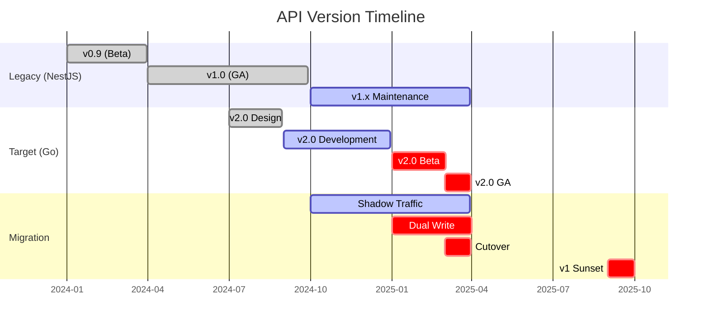
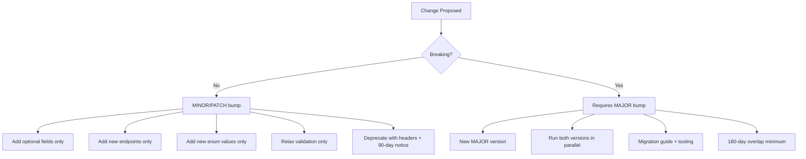
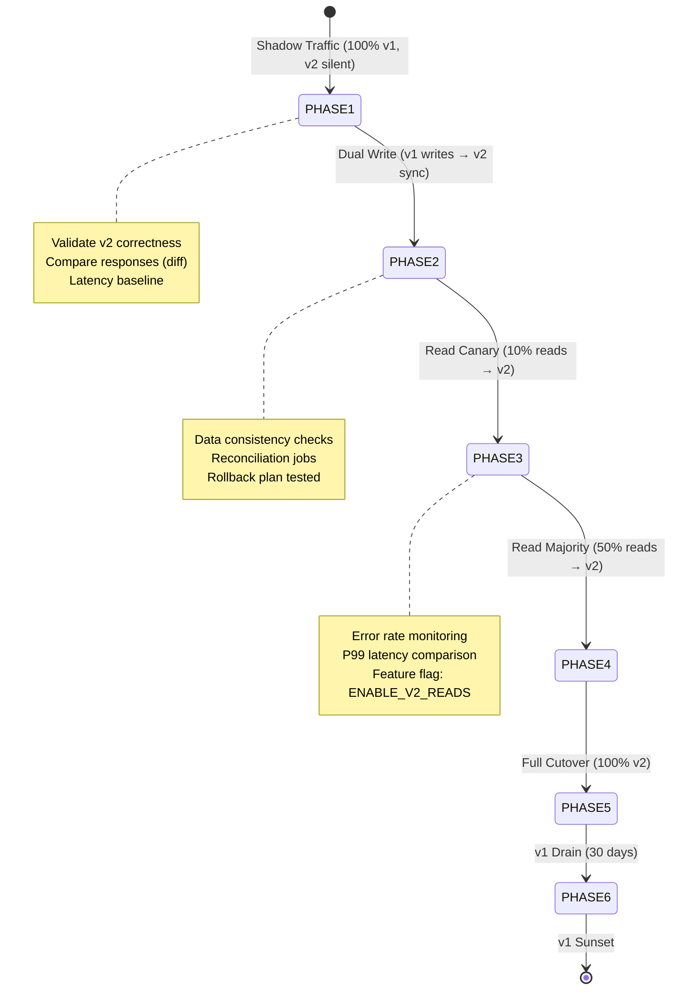
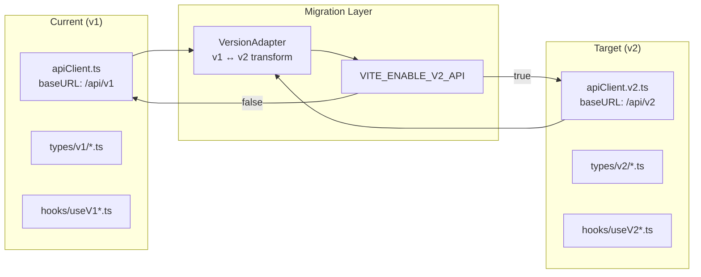
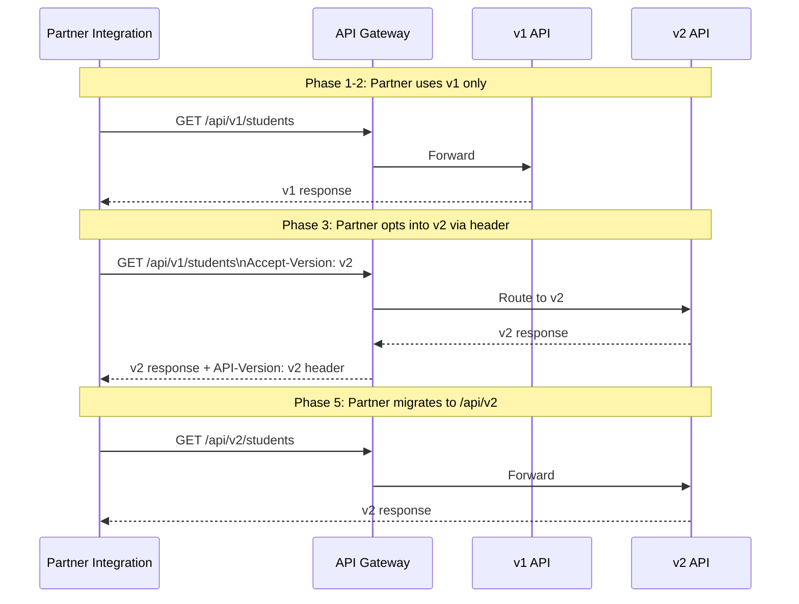
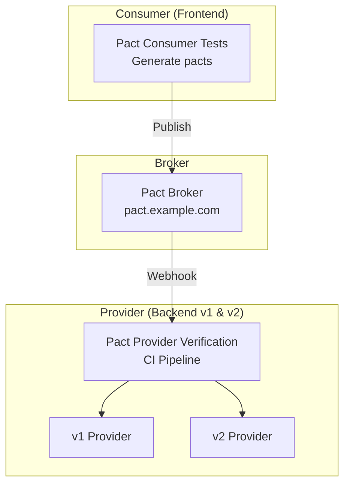
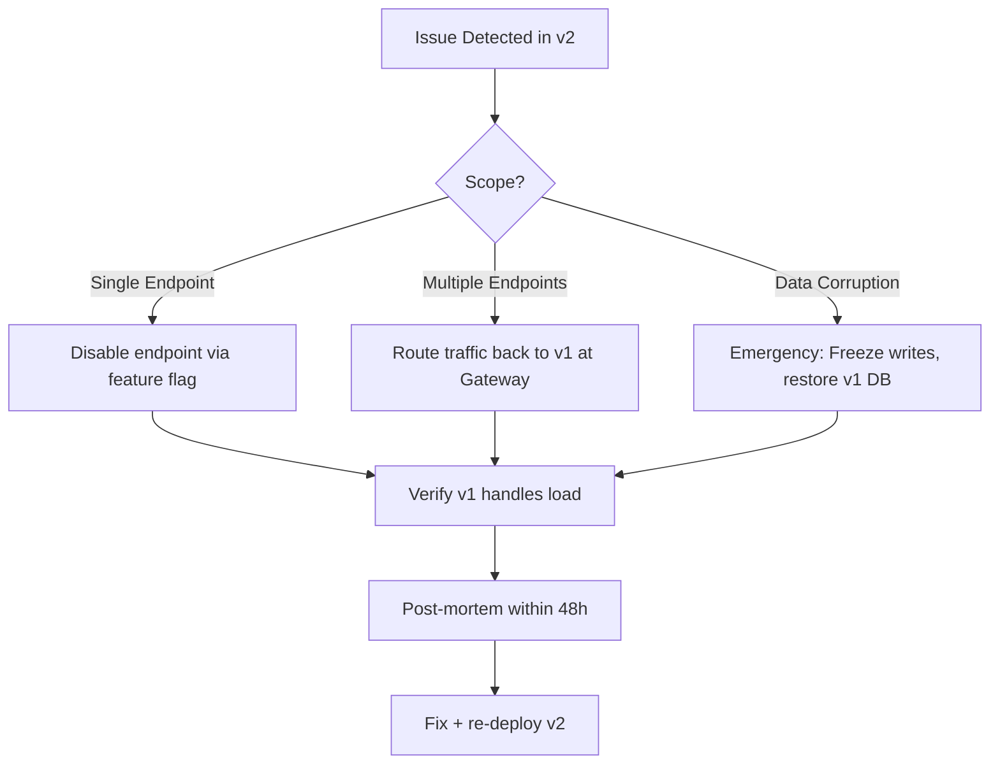
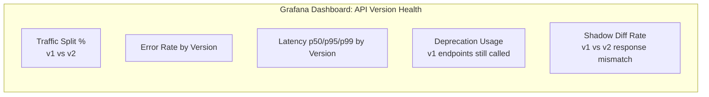

# API Versioning Guide

> **Purpose:** Defines the versioning strategy, compatibility contracts, and migration procedures for the Admin Panel SMA API as we migrate from NestJS (legacy) to Go (target).

---

## 1. Versioning Strategy

### 1.1 Version Format

```
MAJOR.MINOR.PATCH
```

| Component | When to Increment                                                                   | Example             |
| --------- | ----------------------------------------------------------------------------------- | ------------------- |
| **MAJOR** | Breaking changes (removed fields, changed semantics, auth changes)                  | `v1` → `v2`         |
| **MINOR** | Backward-compatible additions (new endpoints, new optional fields, new enum values) | `v1.0` → `v1.1`     |
| **PATCH** | Bug fixes, internal refactors, performance improvements                             | `v1.0.0` → `v1.0.1` |

### 1.2 Version Locations

```mermaid
graph LR
    subgraph "Request"
        URL["URL Path: /api/v1/..."]
        HEADER["Header: Accept-Version: v1"]
        QUERY["Query: ?version=v1 (deprecated)"]
    end

    subgraph "Response"
        RESP_HEADER["Header: API-Version: v1.3.0"]
        DEPRECATION["Header: Deprecation: true"]
        SUNSET["Header: Sunset: Sat, 01 Jan 2026 00:00:00 GMT"]
        BODY["Body: { \"apiVersion\": \"v1.3.0\" }"]
    end

    URL -->|Primary| SERVER["API Gateway"]
    HEADER -->|Override| SERVER
    SERVER --> RESP_HEADER
    SERVER --> DEPRECATION
    SERVER --> SUNSET
    SERVER --> BODY
```

### 1.3 Current Version Status



---

## 2. Compatibility Guarantees

### 2.1 Backward Compatibility Rules (Within MAJOR)



### 2.2 What Constitutes a Breaking Change

| Category       | Breaking                                                          | Non-Breaking                                                |
| -------------- | ----------------------------------------------------------------- | ----------------------------------------------------------- |
| **Fields**     | Remove field, rename field, change type, make required → optional | Add optional field, make optional → required (with default) |
| **Endpoints**  | Remove endpoint, change path, change method                       | Add endpoint, add optional query params                     |
| **Enums**      | Remove value, rename value                                        | Add value                                                   |
| **Auth**       | Change auth scheme, remove scope                                  | Add scope, extend token TTL                                 |
| **Errors**     | Remove error code, change HTTP status                             | Add error code, add detail field                            |
| **Pagination** | Change default page size, change cursor format                    | Add new pagination param                                    |

### 2.3 Deprecation Protocol

```mermaid
sequenceDiagram
    participant Dev as Developer
    participant API as API Gateway
    participant Client as API Consumer
    participant Monitor as Monitoring

    Dev->>API: Deploy v1.5 with Deprecation header on /old-endpoint
    API-->>Client: 200 OK + Deprecation: true + Sunset: <date> + Link: <new-endpoint>; rel="successor-version"
    Monitor->>Monitor: Alert if usage > 0 after Sunset - 30d
    Client->>Client: Migrate to new endpoint
    Dev->>API: After 90 days + zero usage → Remove endpoint
    API-->>Client: 410 Gone (if accessed after removal)
```

**Deprecation Headers (RFC 8594):**

```
Deprecation: true
Sunset: Sat, 01 Apr 2025 00:00:00 GMT
Link: <https://api.example.com/api/v1/new-endpoint>; rel="successor-version"
Link: <https://docs.example.com/migration/v1-to-v2>; rel="deprecation-info"
```

---

## 3. Version Migration: v1 (NestJS) → v2 (Go)

### 3.1 Migration Architecture

```mermaid
graph TB
    subgraph "Client Layer"
        WEB["Web App\n(React)"]
        MOBILE["Mobile App\n(React Native)"]
        EXT["External\nIntegrations"]
    end

    subgraph "API Gateway (Kong/Envoy)"
        GW["Gateway\nv1 & v2 routing"]
    end

    subgraph "v1 Legacy (NestJS)"
        V1_API["NestJS API\nPort 3000"]
        V1_DB[("PostgreSQL\nv1 schema")]
    end

    subgraph "v2 Target (Go)"
        V2_API["Gin API\nPort 8080"]
        V2_DB[("PostgreSQL\nv2 schema")]
        SYNC["Data Sync\nCDC / Dual Write"]
    end

    WEB --> GW
    MOBILE --> GW
    EXT --> GW

    GW -->|v1 traffic| V1_API
    GW -->|v2 traffic (shadow)| V2_API
    GW -->|v2 traffic (canary)| V2_API

    V1_API --> V1_DB
    V2_API --> V2_DB
    V1_DB -.->|CDC| SYNC
    SYNC -.-> V2_DB
```

### 3.2 Migration Phases



### 3.3 API Contract Differences (v1 → v2)

| Area            | v1 (NestJS)               | v2 (Go)                                 | Migration Notes                    |
| --------------- | ------------------------- | --------------------------------------- | ---------------------------------- |
| **Base Path**   | `/api/v1`                 | `/api/v2`                               | Gateway handles routing            |
| **Auth**        | JWT in cookie             | JWT in header + refresh token           | v2 supports both during transition |
| **Pagination**  | Offset/limit              | Cursor-based                            | New `pageInfo` object              |
| **Errors**      | `{ message, statusCode }` | `{ code, message, details[], traceId }` | Structured error codes             |
| **Dates**       | ISO strings (UTC)         | RFC3339 + timezone                      | `time.RFC3339`                     |
| **Enums**       | UPPER_SNAKE_CASE          | PascalCase                              | `STUDENT_ACTIVE` → `StudentActive` |
| **IDs**         | UUID v4                   | UUID v7 (time-ordered)                  | Compatible, better indexing        |
| **File Upload** | Multipart                 | Presigned S3 URLs                       | Direct to storage                  |

### 3.4 Response Format Comparison

**v1 Response:**

```json
{
  "data": [...],
  "meta": { "total": 100, "page": 1, "pageSize": 20 }
}
```

**v2 Response:**

```json
{
  "data": [...],
  "pagination": {
    "firstCursor": "eyJpZCI6MX0=",
    "lastCursor": "eyJpZCI6MjB9",
    "hasNextPage": true,
    "hasPrevPage": false
  },
  "meta": {
    "requestId": "req_abc123",
    "apiVersion": "v2.1.0",
    "traceId": "trace_xyz789"
  }
}
```

---

## 4. Client Migration Guide

### 4.1 Web App (React) Migration



**Implementation:**

```typescript
// src/lib/api/versionAdapter.ts
export class VersionAdapter {
  private useV2 = import.meta.env.VITE_ENABLE_V2_API === "true";

  async request<T>(config: RequestConfig): Promise<T> {
    const url = this.useV2 ? config.url.replace("/api/v1", "/api/v2") : config.url;

    const response = await fetch(url, config.options);

    if (this.useV2) {
      return this.transformV2ToV1(response); // For gradual migration
    }
    return response.json();
  }

  private transformV2ToV1(v2Response: V2Response): V1Response {
    // Map pagination, errors, enums, dates
    return {
      data: v2Response.data,
      meta: {
        total: v2Response.pagination?.total ?? v2Response.data.length,
        page: 1,
        pageSize: v2Response.data.length,
      },
    };
  }
}
```

### 4.2 Mobile App Migration

- Use **feature flag** from remote config (Firebase/App Center)
- Maintain **dual clients** during transition
- **Offline-first**: cache v2 responses with version marker
- **Force update** minimum version after v1 sunset

### 4.3 External Integrations



**Communication Timeline:**

- **T-180 days**: Announce v2 beta, provide sandbox
- **T-90 days**: v2 GA, deprecation notice for v1
- **T-30 days**: Final reminder, migration support ends
- **T-0**: v1 returns 410 Gone

---

## 5. Testing Strategy

### 5.1 Contract Testing (Pact)



**Commands:**

```bash
# Consumer (frontend) - generate pacts
cd apps/admin && pnpm pact:generate

# Provider (backend) - verify against broker
cd sma-adp-api && pnpm pact:verify --provider-version=$GIT_SHA
```

### 5.2 Compatibility Smoke Tests

```python
# tests/compatibility_smoke.py (existing)
async def test_v1_v2_response_parity():
    """Compare v1 and v2 responses for same logical query."""
    v1_resp = await client.get("/api/v1/students", params={"limit": 10})
    v2_resp = await client.get("/api/v2/students", params={"cursor": None, "limit": 10})

    # Normalize and compare
    v1_normalized = normalize_v1(v1_resp.json())
    v2_normalized = normalize_v2(v2_resp.json())

    assert v1_normalized == v2_normalized, "Contract drift detected!"
```

### 5.3 Shadow Traffic Diff

```bash
# Run shadow comparison (10% of production traffic)
cd sma-adp-api && \
  SHADOW_MODE=true \
  SHADOW_SAMPLE_RATE=0.1 \
  python tools/shadow_diff.py --duration 3600
```

---

## 6. Rollback Procedures

### 6.1 API Version Rollback



**Gateway Rollback (Envoy/Kong):**

```yaml
# envoy.yaml - instant rollback
route_config:
  virtual_hosts:
    - name: api
      routes:
        - match:
            prefix: "/api/v2"
          route:
            cluster: v1_upstream # Switch back to v1
            rate_limits:
              - actions:
                  - request_headers:
                      header_name: "x-shadow-request"
                      descriptor_key: "shadow"
```

### 6.2 Database Migration Rollback

- **Never** roll back schema migrations directly
- Use **backward-compatible migrations** (additive only)
- For breaking schema changes: **dual-write period** with reconciliation
- Point-in-time recovery (PITR) as last resort

---

## 7. Monitoring & Alerting

### 7.1 Key Metrics per Version

| Metric            | v1 Target | v2 Target | Alert Threshold |
| ----------------- | --------- | --------- | --------------- |
| **Error Rate**    | < 0.1%    | < 0.05%   | > 0.5% for 5m   |
| **P99 Latency**   | < 500ms   | < 300ms   | > 2s for 5m     |
| **Availability**  | 99.9%     | 99.95%    | < 99.5% for 15m |
| **Traffic Share** | 100% → 0% | 0% → 100% | Stuck > 24h     |

### 7.2 Version-Aware Dashboards



### 7.3 Critical Alerts

```yaml
# alerts/api_versioning.yml
groups:
  - name: api_versioning
    rules:
      - alert: V2ErrorRateHigh
        expr: |
          sum(rate(http_requests_total{version="v2",code=~"5.."}[5m]))
          /
          sum(rate(http_requests_total{version="v2"}[5m])) > 0.005
        for: 5m
        labels:
          severity: critical
        annotations:
          summary: "v2 error rate > 0.5%"

      - alert: V1TrafficStuck
        expr: |
          sum(rate(http_requests_total{version="v1"}[1h])) > 0
          and
          time() > v1_sunset_timestamp - 86400
        for: 1h
        labels:
          severity: warning
        annotations:
          summary: "v1 traffic detected < 24h before sunset"

      - alert: ShadowDiffRateHigh
        expr: |
          sum(rate(shadow_diff_total[10m])) > 0.01
        for: 10m
        labels:
          severity: warning
        annotations:
          summary: "v1/v2 response divergence > 1%"
```

---

## 8. Documentation & Communication

### 8.1 Version Documentation Structure

```
docs/
├── api/
│   ├── v1/
│   │   ├── openapi.yaml
│   │   ├── CHANGELOG.md
│   │   └── MIGRATION_TO_V2.md
│   ├── v2/
│   │   ├── openapi.yaml
│   │   ├── CHANGELOG.md
│   │   └── BREAKING_CHANGES.md
│   └── VERSIONING_POLICY.md
```

### 8.2 Release Communication Template

```markdown
# API v2.x Release Notes

## 🚀 What's New

- [Feature] New cursor-based pagination for all list endpoints
- [Feature] Structured error responses with trace IDs
- [Performance] 40% latency improvement on student roster

## ⚠️ Breaking Changes (from v1)

- Date format: RFC3339 with timezone (was ISO UTC)
- Enum casing: PascalCase (was UPPER_SNAKE_CASE)
- Pagination: cursor-based (was offset/limit)

## 📅 Migration Timeline

- **Today**: v2 GA, v1 deprecated
- **2025-04-01**: v1 sunset (410 Gone)
- **2025-03-01**: Migration support ends

## 🔗 Resources

- [Migration Guide](/docs/api/v1/MIGRATION_TO_V2.md)
- [v2 OpenAPI Spec](/docs/api/v2/openapi.yaml)
- [Sandbox Environment](https://api-sandbox.example.com)
- [Support Slack](https://slack.example.com/#api-migration)
```

---

## 9. Quick Reference

### 9.1 Version Detection

```bash
# Check API version from response headers
curl -I https://api.example.com/api/v1/health
# API-Version: v1.3.0
# Deprecation: true
# Sunset: Sat, 01 Apr 2025 00:00:00 GMT

# Request specific version
curl -H "Accept-Version: v2" https://api.example.com/api/v1/students
# Routes to v2 if available, else 406 Not Acceptable
```

### 9.2 Feature Flag for Version Routing

| Flag                 | Purpose                          | Values         |
| -------------------- | -------------------------------- | -------------- |
| `ENABLE_V2_READS`    | Route GET requests to v2         | `true`/`false` |
| `ENABLE_V2_WRITES`   | Route POST/PUT/DELETE to v2      | `true`/`false` |
| `ENABLE_V2_SHADOW`   | Mirror traffic to v2 for diffing | `true`/`false` |
| `VITE_ENABLE_V2_API` | Frontend uses v2 client          | `true`/`false` |

### 9.3 Useful Commands

```bash
# Generate OpenAPI specs for both versions
cd sma-adp-api && make openapi-v1 openapi-v2

# Run contract tests
cd sma-adp-api && pnpm test:contract

# Shadow diff for 1 hour
cd sma-adp-api && python tools/shadow_diff.py --duration 3600 --output diff-report.html

# Check deprecation status
curl -s https://api.example.com/api/deprecation-status | jq .

# Force v2 in frontend locally
echo "VITE_ENABLE_V2_API=true" >> apps/admin/.env.local
```

---

## 10. Appendix: Version History

| Version | Release Date | Status      | Key Changes          |
| ------- | ------------ | ----------- | -------------------- |
| v0.9    | 2024-01-15   | Retired     | Beta release         |
| v1.0    | 2024-04-01   | Deprecated  | GA, NestJS           |
| v1.1    | 2024-06-15   | Deprecated  | Attendance module    |
| v1.2    | 2024-08-01   | Deprecated  | Reports module       |
| v1.3    | 2024-10-01   | Maintenance | Current legacy       |
| v2.0    | 2025-03-01   | Planned     | GA, Go/Gin           |
| v2.1    | 2025-06-01   | Planned     | Webhooks, WebSockets |

---

_Last updated: 2025-01-15 | Owner: Platform Team | Review: Quarterly_
