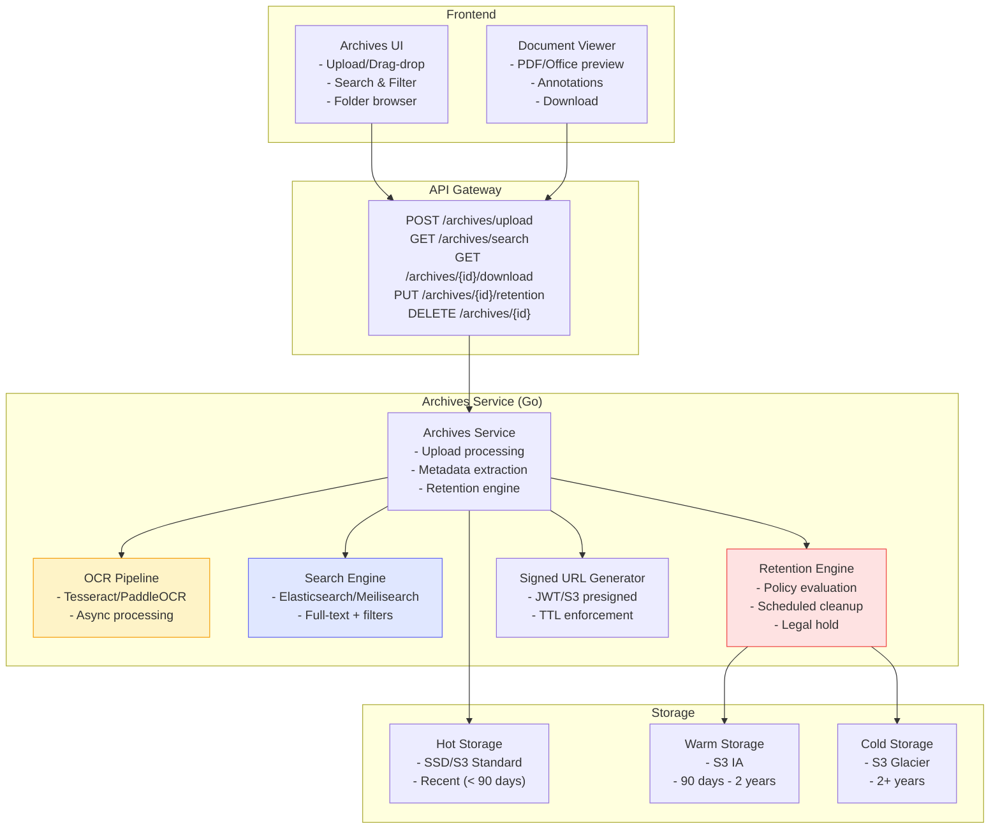
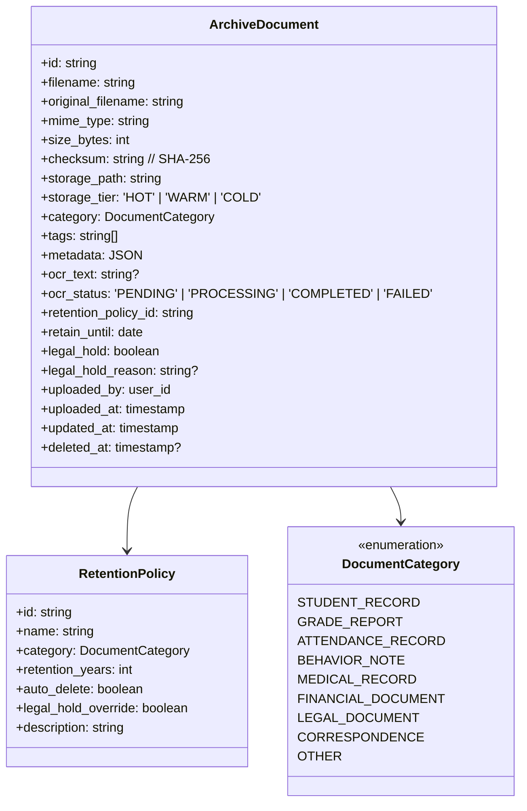
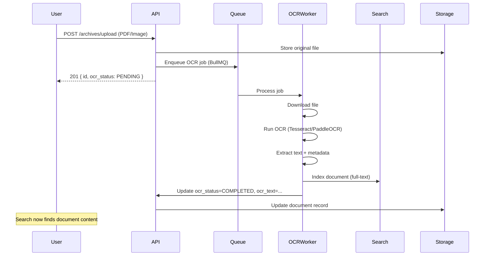
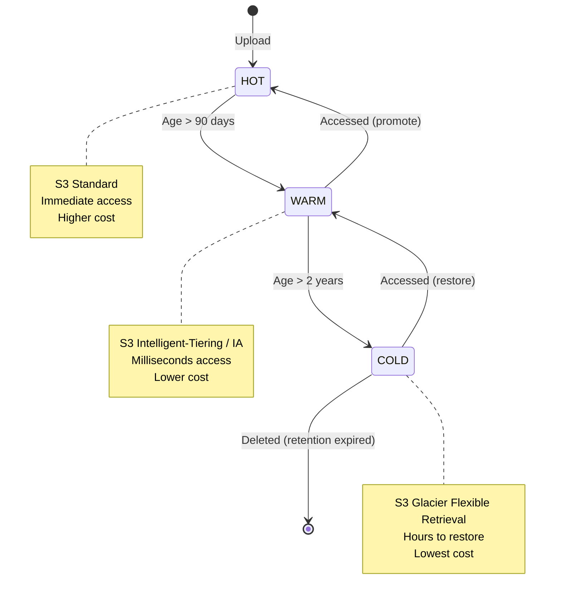

# Archives Retention & Search Guide

> **Purpose:** Technical specification for document archival — retention policies, search, signed URLs, and compliance for Admin Panel SMA.

---

## 1. Overview

### 1.1 Problem Statement

Manage document lifecycle with:

- **Retention Policies** — Automatic expiration based on document type
- **Full-text Search** — OCR + metadata search across archives
- **Signed URLs** — Secure, expiring download links
- **Compliance** — Audit trail, legal hold, GDPR/PDPA support
- **Storage Tiering** — Hot/warm/cold storage optimization

### 1.2 Architecture



### 1.3 Feature Flag

```bash
# Backend
ENABLE_ARCHIVES=true
ARCHIVES_STORAGE_DIR=./archives
ARCHIVES_SIGNED_URL_SECRET=change_me_archives
ARCHIVES_SIGNED_URL_TTL=30m
ARCHIVES_MAX_FILE_SIZE=10485760
ARCHIVES_ALLOWED_MIME_TYPES=application/pdf,application/vnd.openxmlformats-officedocument.wordprocessingml.document,application/vnd.openxmlformats-officedocument.spreadsheetml.sheet,application/zip

# Frontend
VITE_ENABLE_ARCHIVES=true
```

---

## 2. Data Model

### 2.1 Archive Document



### 2.2 Default Retention Policies

| Category               | Retention                | Auto-Delete | Legal Hold Override | Regulation   |
| ---------------------- | ------------------------ | ----------- | ------------------- | ------------ |
| **Student Record**     | 7 years after graduation | Yes         | No                  | PDPA/FERPA   |
| **Grade Report**       | 7 years                  | Yes         | No                  | Academic     |
| **Attendance Record**  | 5 years                  | Yes         | No                  | Academic     |
| **Behavior Note**      | 3 years                  | Yes         | Yes                 | Disciplinary |
| **Medical Record**     | 10 years                 | No          | No                  | HIPAA/PDPA   |
| **Financial Document** | 10 years                 | Yes         | No                  | Tax/Audit    |
| **Legal Document**     | Permanent                | No          | N/A                 | Legal        |
| **Correspondence**     | 3 years                  | Yes         | Yes                 | General      |

---

## 3. API Specification

### 3.1 Upload Document

```http
POST /api/v1/archives/upload
Content-Type: multipart/form-data
Authorization: Bearer <token>

Form Fields:
- file: (binary)
- category: STUDENT_RECORD
- tags: ["grade-10", "2025", "transcript"]
- metadata: {"student_id": "stu_001", "term_id": "term_2025_1"}
- retention_policy_id: "pol_student_record"  // optional, defaults by category
```

**Response (201 Created):**

```json
{
  "data": {
    "id": "arch_abc123",
    "filename": "transcript_stu_001_2025.pdf",
    "original_filename": "transcript.pdf",
    "mime_type": "application/pdf",
    "size_bytes": 245760,
    "checksum": "sha256:abc123...",
    "storage_tier": "HOT",
    "category": "STUDENT_RECORD",
    "tags": ["grade-10", "2025", "transcript"],
    "metadata": { "student_id": "stu_001", "term_id": "term_2025_1" },
    "ocr_status": "PENDING",
    "retention_policy_id": "pol_student_record",
    "retain_until": "2032-06-15",
    "legal_hold": false,
    "uploaded_at": "2025-01-15T10:30:00Z",
    "download_url": "/api/v1/archives/arch_abc123/download?token=xxx"
  }
}
```

### 3.2 Search Archives

```http
GET /api/v1/archives/search?q=transcript&category=STUDENT_RECORD&tags=grade-10&date_from=2025-01-01&date_to=2025-12-31&page=1&limit=20
Authorization: Bearer <token>
```

**Response:**

```json
{
  "data": [
    {
      "id": "arch_abc123",
      "filename": "transcript_stu_001_2025.pdf",
      "original_filename": "transcript.pdf",
      "mime_type": "application/pdf",
      "size_bytes": 245760,
      "category": "STUDENT_RECORD",
      "tags": ["grade-10", "2025", "transcript"],
      "metadata": { "student_id": "stu_001", "term_id": "term_2025_1" },
      "ocr_status": "COMPLETED",
      "snippet": "...transcript for Ahmad... Grade: A ...",
      "retain_until": "2032-06-15",
      "legal_hold": false,
      "uploaded_at": "2025-01-15T10:30:00Z"
    }
  ],
  "meta": {
    "total": 1,
    "page": 1,
    "limit": 20,
    "query_time_ms": 45
  }
}
```

### 3.3 Download Document (Signed URL)

```http
GET /api/v1/archives/{id}/download
Authorization: Bearer <token>
```

**Response (302 Redirect):**

```
Location: https://s3.region.amazonaws.com/bucket/archives/arch_abc123.pdf?X-Amz-Signature=xxx&X-Amz-Expires=1800
```

### 3.4 Update Retention / Legal Hold

```http
PUT /api/v1/archives/{id}/retention
Content-Type: application/json
Authorization: Bearer <token>

{
  "action": "EXTEND",           // EXTEND | REDUCE | LEGAL_HOLD | RELEASE_HOLD
  "retain_until": "2035-06-15", // Required for EXTEND/REDUCE
  "reason": "Pending litigation"
}
```

### 3.5 Bulk Operations

```http
POST /api/v1/archives/bulk
Content-Type: application/json
Authorization: Bearer <token>

{
  "action": "DOWNLOAD",         // DOWNLOAD | DELETE | CHANGE_CATEGORY | APPLY_RETENTION
  "ids": ["arch_001", "arch_002", "arch_003"],
  "parameters": {
    "category": "FINANCIAL_DOCUMENT",
    "retention_policy_id": "pol_financial"
  }
}
```

---

## 4. OCR Pipeline

### 4.1 Processing Flow



### 4.2 OCR Configuration

```go
// internal/archives/ocr.go
type OCRConfig struct {
    Engine          string        `mapstructure:"OCR_ENGINE"`            // tesseract|paddleocr
    Languages       []string      `mapstructure:"OCR_LANGUAGES"`         // ["ind", "eng"]
    DPI             int           `mapstructure:"OCR_DPI"`               // 300
    Timeout         time.Duration `mapstructure:"OCR_TIMEOUT"`           // 5m
    MaxPages        int           `mapstructure:"OCR_MAX_PAGES"`         // 100
    PreprocessSteps []string      `mapstructure:"OCR_PREPROCESS"`        // ["deskew", "denoise", "binarize"]
}
```

### 4.3 Supported Formats

| Format        | OCR Support | Notes                                   |
| ------------- | ----------- | --------------------------------------- |
| **PDF**       | Yes         | Text extraction + OCR for scanned pages |
| **PNG/JPG**   | Yes         | Direct OCR                              |
| **TIFF**      | Yes         | Multi-page support                      |
| **DOCX/XLSX** | Text only   | Native text extraction                  |
| **ZIP**       | Recursive   | Extracts and processes contents         |

---

## 5. Search Engine

### 5.1 Index Schema (Elasticsearch/Meilisearch)

```json
{
  "index": "archives",
  "settings": {
    "analysis": {
      "analyzer": {
        "indonesian_analyzer": {
          "type": "custom",
          "tokenizer": "standard",
          "filter": ["lowercase", "indonesian_stop", "indonesian_stemmer"]
        }
      }
    }
  },
  "mappings": {
    "properties": {
      "id": { "type": "keyword" },
      "filename": { "type": "text", "analyzer": "indonesian_analyzer" },
      "original_filename": { "type": "text", "analyzer": "indonesian_analyzer" },
      "ocr_text": { "type": "text", "analyzer": "indonesian_analyzer" },
      "category": { "type": "keyword" },
      "tags": { "type": "keyword" },
      "metadata": { "type": "object", "enabled": true },
      "mime_type": { "type": "keyword" },
      "size_bytes": { "type": "long" },
      "uploaded_by": { "type": "keyword" },
      "uploaded_at": { "type": "date" },
      "retain_until": { "type": "date" },
      "legal_hold": { "type": "boolean" },
      "ocr_status": { "type": "keyword" }
    }
  }
}
```

### 5.2 Search Features

| Feature          | Implementation                                   |
| ---------------- | ------------------------------------------------ |
| **Full-text**    | BM25 on filename + ocr_text                      |
| **Filters**      | Category, tags, date range, uploader, legal_hold |
| **Facets**       | Aggregations on category, tags, mime_type, year  |
| **Highlighting** | Snippet extraction with `<em>` tags              |
| **Fuzzy**        | Edit distance 1-2 for typos                      |
| **Pagination**   | Cursor-based for deep paging                     |

---

## 6. Retention Engine

### 6.1 Policy Evaluation

```go
// internal/archives/retention.go
func (e *RetentionEngine) EvaluatePolicies(ctx context.Context) error {
    // 1. Find documents eligible for action
    docs, err := e.repo.FindEligibleForRetention(ctx)
    if err != nil { return err }

    for _, doc := range docs {
        policy, _ := e.policyRepo.GetByID(ctx, doc.RetentionPolicyID)

        // Skip if legal hold
        if doc.LegalHold && !policy.LegalHoldOverride {
            e.auditLog(ctx, doc.ID, "SKIPPED_LEGAL_HOLD", "")
            continue
        }

        // Check retention expiry
        if time.Now().After(doc.RetainUntil) {
            if policy.AutoDelete {
                e.scheduleDeletion(ctx, doc.ID, "RETENTION_EXPIRED")
            } else {
                e.auditLog(ctx, doc.ID, "RETENTION_EXPIRED_MANUAL_REVIEW", "")
                e.notifyAdmins(ctx, doc, "Retention expired - manual review required")
            }
        }

        // Tier migration
        e.migrateStorageTier(ctx, doc)
    }
    return nil
}
```

### 6.2 Storage Tier Migration



---

## 7. Signed URL Security

### 7.1 URL Structure

```
https://storage.example.com/archives/{id}/{filename}?
  X-Amz-Algorithm=AWS4-HMAC-SHA256&
  X-Amz-Credential={access_key}%2F{date}%2F{region}%2Fs3%2Faws4_request&
  X-Amz-Date={timestamp}&
  X-Amz-Expires=1800&
  X-Amz-SignedHeaders=host&
  X-Amz-Signature={signature}
```

### 7.2 Security Controls

| Control          | Implementation                                      |
| ---------------- | --------------------------------------------------- |
| **TTL**          | Default 30 min, max 24h (`ARCHIVES_SIGNED_URL_TTL`) |
| **Single-use**   | Optional: invalidate after first download           |
| **IP Binding**   | Optional: restrict to requester IP                  |
| **Audit Log**    | Every download logged with user, IP, timestamp      |
| **Watermarking** | Optional: dynamic watermark on PDF download         |

---

## 8. Frontend Implementation Spec

### 8.1 Pages & Components

```
apps/admin/src/
├── features/archives/
│   ├── pages/
│   │   ├── ArchivesDashboard.tsx       # Search + list + upload
│   │   ├── ArchiveDetailPage.tsx       # Metadata, preview, actions
│   │   ├── RetentionPolicyPage.tsx     # Policy management
│   │   └── LegalHoldPage.tsx           # Legal hold management
│   ├── components/
│   │   ├── UploadZone.tsx              # Drag-drop upload
│   │   ├── SearchFilters.tsx           # Category, tags, date, text
│   │   ├── ArchiveTable.tsx            # Sortable, paginated results
│   │   ├── DocumentViewer.tsx          # PDF/Office preview (PDF.js)
│   │   ├── MetadataEditor.tsx          # Edit tags, category, metadata
│   │   ├── RetentionBadge.tsx          # Shows retain_until, status
│   │   ├── LegalHoldIndicator.tsx      // Warning banner
│   │   └── BulkActionsToolbar.tsx      // Select multiple → action
│   ├── hooks/
│   │   ├── useArchivesSearch.ts
│   │   ├── useArchiveUpload.ts
│   │   ├── useRetentionPolicies.ts
│   │   └── useLegalHolds.ts
│   └── types/
│       └── archives.ts
```

### 8.2 Search Interface

```tsx
// features/archives/components/SearchFilters.tsx
export function SearchFilters({
  filters,
  onChange,
  categories,
  availableTags,
  onSearch,
}: SearchFiltersProps) {
  return (
    <div className="search-filters">
      <div className="filter-row">
        <Input
          placeholder="Search documents..."
          value={filters.q}
          onChange={(e) => onChange({ ...filters, q: e.target.value })}
          onKeyDown={(e) => e.key === "Enter" && onSearch()}
        />
        <Button onClick={onSearch}>Search</Button>
      </div>

      <div className="filter-row">
        <Select
          value={filters.category}
          onValueChange={(v) => onChange({ ...filters, category: v })}
        >
          <SelectItem value="">All Categories</SelectItem>
          {categories.map((c) => (
            <SelectItem key={c} value={c}>
              {c}
            </SelectItem>
          ))}
        </Select>

        <MultiSelect
          value={filters.tags}
          onChange={(v) => onChange({ ...filters, tags: v })}
          options={availableTags}
          placeholder="Filter by tags"
        />

        <DateRangePicker
          value={{ start: filters.date_from, end: filters.date_to }}
          onChange={(range) => onChange({ ...filters, date_from: range.start, date_to: range.end })}
        />
      </div>

      <div className="filter-row advanced">
        <Checkbox
          checked={filters.legal_hold_only}
          onChange={(e) => onChange({ ...filters, legal_hold_only: e.target.checked })}
        >
          Legal Hold Only
        </Checkbox>
        <Checkbox
          checked={filters.ocr_only}
          onChange={(e) => onChange({ ...filters, ocr_only: e.target.checked })}
        >
          OCR Completed Only
        </Checkbox>
        <Select
          value={filters.storage_tier}
          onValueChange={(v) => onChange({ ...filters, storage_tier: v })}
        >
          <SelectItem value="">All Tiers</SelectItem>
          <SelectItem value="HOT">Hot</SelectItem>
          <SelectItem value="WARM">Warm</SelectItem>
          <SelectItem value="COLD">Cold</SelectItem>
        </Select>
      </div>
    </div>
  );
}
```

### 8.3 Document Viewer (PDF.js)

```tsx
// features/archives/components/DocumentViewer.tsx
import { Viewer } from "@react-pdf-viewer/core";
import { defaultLayoutPlugin } from "@react-pdf-viewer/default-layout";
import { getFilePlugin } from "@react-pdf-viewer/get-file";

export function DocumentViewer({ documentId, downloadUrl }: DocumentViewerProps) {
  const getFilePluginInstance = getFilePlugin();
  const defaultLayoutPluginInstance = defaultLayoutPlugin({
    getFilePlugin: getFilePluginInstance,
  });

  return (
    <div className="document-viewer" style={{ height: "80vh" }}>
      <Viewer
        fileUrl={downloadUrl}
        getFilePlugin={getFilePluginInstance}
        plugins={[defaultLayoutPluginInstance]}
        renderViewer={defaultLayoutPluginInstance.RenderViewer}
      />
    </div>
  );
}
```

---

## 9. Backend Implementation Spec

### 9.1 Service Structure

```
sma-adp-api/internal/
├── archives/
│   ├── service.go              # Orchestration
│   ├── upload.go               # Upload handling + validation
│   ├── search.go               # Search integration
│   ├── ocr.go                  # OCR pipeline
│   ├── retention.go            # Retention engine
│   ├── signed_url.go           # Signed URL generation
│   ├── legal_hold.go           # Legal hold management
│   ├── storage.go              # Storage tier management
│   ├── dto/
│   │   ├── request.go
│   │   └── response.go
│   └── middleware/
│       └── feature_flag.go     # RequireFeature("ENABLE_ARCHIVES")
```

### 9.2 Database Schema

```sql
CREATE TABLE archive_documents (
    id UUID PRIMARY KEY DEFAULT gen_random_uuid(),
    filename VARCHAR(255) NOT NULL,
    original_filename VARCHAR(255) NOT NULL,
    mime_type VARCHAR(100) NOT NULL,
    size_bytes BIGINT NOT NULL,
    checksum VARCHAR(64) NOT NULL,  -- SHA-256 hex
    storage_path VARCHAR(500) NOT NULL,
    storage_tier VARCHAR(10) DEFAULT 'HOT', -- HOT, WARM, COLD
    category VARCHAR(50) NOT NULL,
    tags TEXT[] DEFAULT '{}',
    metadata JSONB DEFAULT '{}',
    ocr_text TEXT,
    ocr_status VARCHAR(20) DEFAULT 'PENDING', -- PENDING, PROCESSING, COMPLETED, FAILED
    retention_policy_id UUID NOT NULL REFERENCES retention_policies(id),
    retain_until DATE NOT NULL,
    legal_hold BOOLEAN DEFAULT FALSE,
    legal_hold_reason TEXT,
    uploaded_by UUID NOT NULL REFERENCES users(id),
    uploaded_at TIMESTAMPTZ DEFAULT NOW(),
    updated_at TIMESTAMPTZ DEFAULT NOW(),
    deleted_at TIMESTAMPTZ
);

CREATE TABLE retention_policies (
    id UUID PRIMARY KEY DEFAULT gen_random_uuid(),
    name VARCHAR(100) NOT NULL UNIQUE,
    category VARCHAR(50) NOT NULL,
    retention_years INT NOT NULL,
    auto_delete BOOLEAN DEFAULT TRUE,
    legal_hold_override BOOLEAN DEFAULT FALSE,
    description TEXT,
    created_at TIMESTAMPTZ DEFAULT NOW(),
    updated_at TIMESTAMPTZ DEFAULT NOW()
);

CREATE TABLE archive_audit_log (
    id UUID PRIMARY KEY DEFAULT gen_random_uuid(),
    document_id UUID NOT NULL REFERENCES archive_documents(id),
    action VARCHAR(50) NOT NULL, -- UPLOAD, DOWNLOAD, SEARCH, RETENTION_CHANGE, LEGAL_HOLD, DELETE
    user_id UUID NOT NULL REFERENCES users(id),
    ip_address INET,
    user_agent TEXT,
    details JSONB,
    created_at TIMESTAMPTZ DEFAULT NOW()
);

CREATE INDEX idx_archive_category ON archive_documents (category);
CREATE INDEX idx_archive_tags ON archive_documents USING GIN (tags);
CREATE INDEX idx_archive_retain_until ON archive_documents (retain_until);
CREATE INDEX idx_archive_legal_hold ON archive_documents (legal_hold);
CREATE INDEX idx_archive_uploaded_by ON archive_documents (uploaded_by);
CREATE INDEX idx_archive_uploaded_at ON archive_documents (uploaded_at);
CREATE INDEX idx_archive_deleted_at ON archive_documents (deleted_at) WHERE deleted_at IS NOT NULL;
```

---

## 10. Compliance & Audit

### 10.1 Audit Log Events

| Action               | Logged Fields                                           |
| -------------------- | ------------------------------------------------------- |
| **UPLOAD**           | document_id, filename, size, category, uploader         |
| **DOWNLOAD**         | document_id, requester, IP, signed_url_token            |
| **SEARCH**           | query, filters, result_count, requester                 |
| **RETENTION_CHANGE** | document_id, old_retain_until, new_retain_until, reason |
| **LEGAL_HOLD**       | document_id, action (APPLY/RELEASE), reason, requester  |
| **DELETE**           | document_id, reason, requester, policy_override         |

### 10.2 GDPR/PDPA Support

```go
// internal/archives/gdpr.go
func (s *Service) HandleDataSubjectRequest(ctx context.Context, req DataSubjectRequest) error {
    switch req.Type {
    case "ACCESS":
        // Export all documents for student/user
        docs, _ := s.repo.FindBySubject(ctx, req.SubjectID)
        return s.exportToZip(ctx, docs, req.RequesterEmail)

    case "RECTIFICATION":
        // Update metadata (not file content)
        return s.repo.UpdateMetadata(ctx, req.DocumentID, req.Corrections)

    case "ERASURE":
        // Only if no legal hold and retention expired
        doc, _ := s.repo.GetByID(ctx, req.DocumentID)
        if doc.LegalHold {
            return ErrLegalHoldActive
        }
        if time.Now().Before(doc.RetainUntil) {
            return ErrRetentionNotExpired
        }
        return s.scheduleDeletion(ctx, req.DocumentID, "GDPR_ERASURE")

    case "PORTABILITY":
        // Export in machine-readable format
        docs, _ := s.repo.FindBySubject(ctx, req.SubjectID)
        return s.exportJSON(ctx, docs, req.RequesterEmail)
    }
    return nil
}
```

---

## 11. Testing Strategy

### 11.1 Unit Tests

| Test                      | Description                          |
| ------------------------- | ------------------------------------ |
| `TestUploadValidation`    | MIME type, size, checksum validation |
| `TestSearchQuery`         | Full-text + filters + pagination     |
| `TestOCRProcessing`       | Text extraction accuracy             |
| `TestRetentionEvaluation` | Policy application, legal hold skip  |
| `TestSignedURLGeneration` | TTL, signature, IP binding           |
| `TestTierMigration`       | HOT→WARM→COLD transitions            |

### 11.2 Integration Tests

```go
func TestArchiveLifecycle_Integration(t *testing.T) {
    // 1. Upload document
    doc := uploadDocument(t, "test.pdf", CategoryStudentRecord)
    assert.Equal(t, "PENDING", doc.OCRStatus)

    // 2. Wait for OCR completion
    waitForOCR(t, doc.ID)
    doc = getDocument(t, doc.ID)
    assert.Equal(t, "COMPLETED", doc.OCRStatus)
    assert.NotEmpty(t, doc.OCRText)

    // 3. Search finds content
    results := searchArchives(t, "transcript")
    assert.Contains(t, results, doc.ID)

    // 4. Download via signed URL
    downloadURL := getDownloadURL(t, doc.ID)
    assertValidSignedURL(t, downloadURL)

    // 5. Apply legal hold
    applyLegalHold(t, doc.ID, "Litigation")
    doc = getDocument(t, doc.ID)
    assert.True(t, doc.LegalHold)

    // 6. Retention engine skips legal hold
    runRetentionEngine(t)
    doc = getDocument(t, doc.ID)
    assert.False(t, doc.Deleted)
}
```

### 11.3 E2E Tests (Playwright)

```typescript
// tests/e2e/feature-specific.spec.ts
test("Archives: Upload, OCR, search, download, legal hold", async ({ authenticatedPage }) => {
  await gotoAndWait(page, "/archives", '[data-testid="archives-dashboard"]');

  // Upload
  await page.setInputFiles('[data-testid="upload-zone"]', "test-files/transcript.pdf");
  await expect(page.locator('[data-testid="upload-success"]')).toBeVisible();

  // Wait for OCR (poll)
  await page.waitForSelector('[data-testid="ocr-status-COMPLETED"]', { timeout: 60000 });

  // Search
  await page.fill('[data-testid="search-input"]', "transcript");
  await page.click('[data-testid="search-btn"]');
  await expect(page.locator('[data-testid="archive-row"]')).toHaveCount(1);

  // Download
  const downloadPromise = page.waitForEvent("download");
  await page.click('[data-testid="download-btn"]');
  const download = await downloadPromise;
  expect(download.suggestedFilename()).toBe("transcript.pdf");

  // Legal hold
  await page.click('[data-testid="legal-hold-btn"]');
  await page.fill('[data-testid="legal-hold-reason"]', "Pending audit");
  await page.click('[data-testid="confirm-legal-hold"]');
  await expect(page.locator('[data-testid="legal-hold-badge"]')).toBeVisible();
});
```

---

## 12. Performance Benchmarks

| Operation           | Target  | Notes               |
| ------------------- | ------- | ------------------- |
| Upload (10MB)       | < 5s    | Includes checksum   |
| OCR (10 pages)      | < 30s   | Async, non-blocking |
| Search (100k docs)  | < 200ms | Elasticsearch       |
| Signed URL gen      | < 50ms  | S3 presign          |
| Bulk download (100) | < 10s   | Zip streaming       |
| Retention scan      | < 5min  | Daily batch         |

---

## 13. Future Enhancements

| Feature                  | Priority | Description                        |
| ------------------------ | -------- | ---------------------------------- |
| **Versioning**           | P2       | Document versions with diff        |
| **Annotations**          | P3       | Highlights, comments on PDFs       |
| **Workflow**             | P3       | Approval chains for sensitive docs |
| **AI Classification**    | P3       | Auto-categorize on upload          |
| **e-Discovery**          | P4       | Legal export packages              |
| **Blockchain Anchoring** | P4       | Immutable audit trail              |

---

_Last updated: 2025-01-15 | Owner: Platform Team | Review: Per release_
