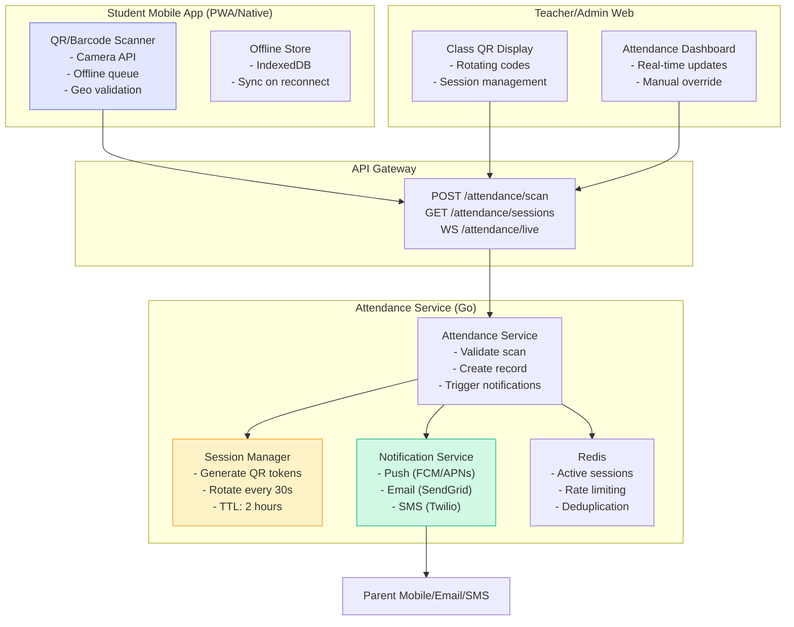
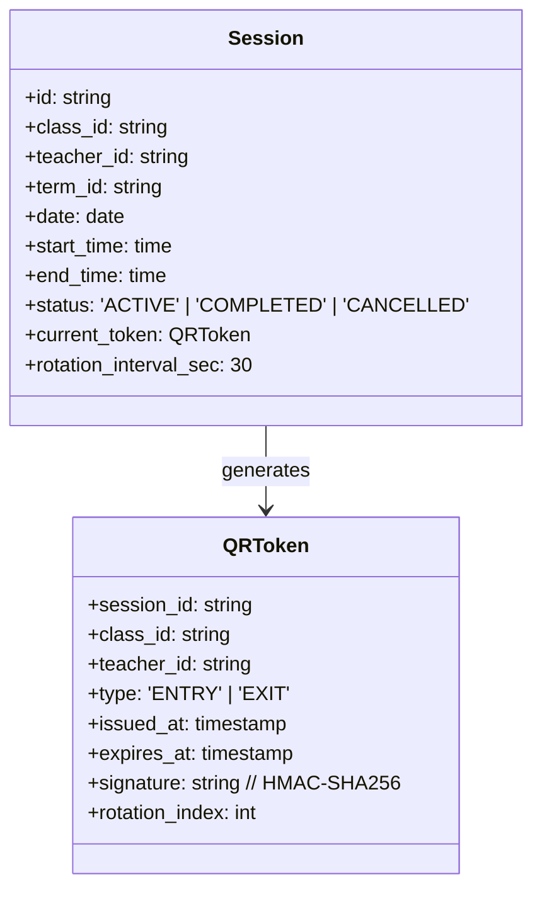
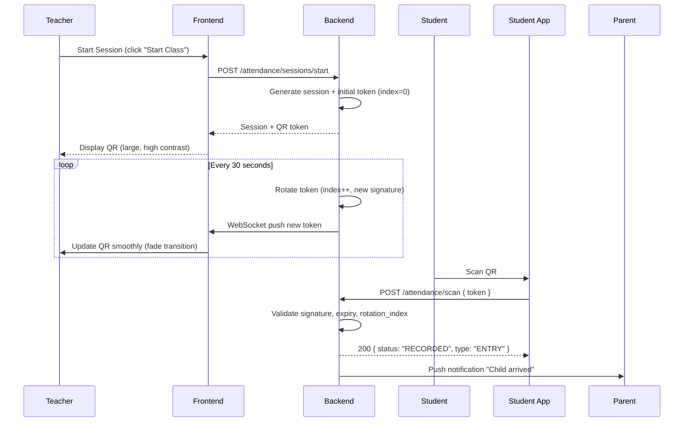
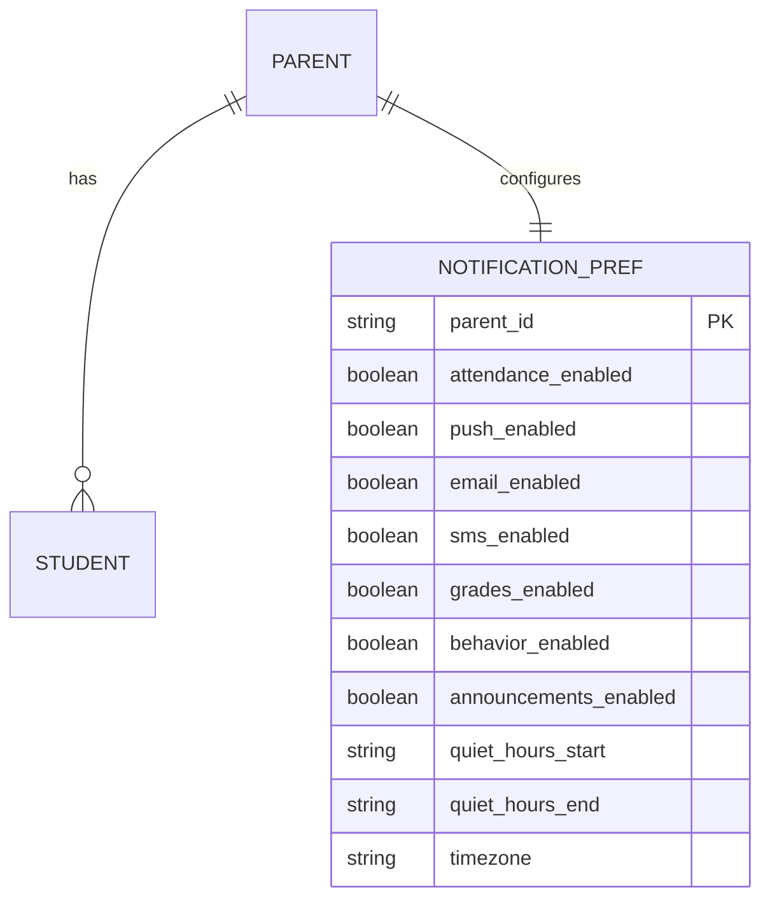
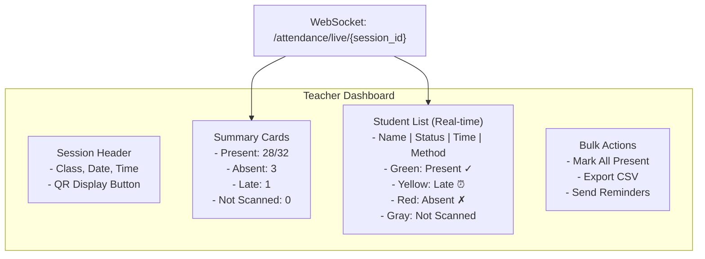

# Attendance QR/Code Scanning Guide

> **Purpose:** Technical specification for QR code and barcode-based attendance tracking with parent notifications for Admin Panel SMA.

---

## 1. Overview

### 1.1 Problem Statement

Replace manual attendance taking with:

- **QR Code Scanning** — Students scan class QR on entry/exit
- **Barcode/ID Card Scanning** — Physical ID cards with barcode
- **Geofence Validation** — Optional GPS verification
- **Real-time Parent Notifications** — Push/email/SMS on arrival/departure
- **Offline-First** — Mobile app works offline, syncs when online

### 1.2 Architecture



### 1.3 Feature Flag

```bash
# Backend
ENABLE_ATTENDANCE_ALIAS=true

# Frontend
VITE_ENABLE_ATTENDANCE_ALIAS=true
```

---

## 2. QR Code System

### 2.1 Token Structure



**JWT-like Token (URL-safe base64):**

```
eyJzZXNzaW9uX2lkIjoic2Vzc19hYmMxMjMiLCJjbGFzc19pZCI6ImNsYXNzXzEwX2lwX2EiLCJ0ZWFjaGVyX2lkIjoidGVhY2hlcl94eXoiLCJ0eXBlIjoiRU5UUllfSU5URVJOQUwiLCJpc3N1ZWRfYXQiOiIyMDI1LTAxLTE1VDA4OjAwOjAwWiIsImV4cGlyZXNfYXQiOiIyMDI1LTAxLTE1VDA4OjA1OjAwWiIsInJvdGF0aW9uX2luZGV4Ijo1LCJzaWduYXR1cmUiOiJhYmMxMjMifQ==
```

Decoded payload:

```json
{
  "session_id": "sess_abc123",
  "class_id": "class_10_ip_a",
  "teacher_id": "teacher_xyz",
  "type": "ENTRY",
  "issued_at": "2025-01-15T08:00:00Z",
  "expires_at": "2025-01-15T08:05:00Z",
  "rotation_index": 5,
  "signature": "abc123"
}
```

### 2.2 Token Rotation



### 2.3 QR Display Component (Teacher View)

```tsx
// features/attendance/components/ClassQRDisplay.tsx
interface ClassQRDisplayProps {
  sessionId: string;
  className: string;
  onSessionEnd: () => void;
}

export function ClassQRDisplay({ sessionId, className, onSessionEnd }: ClassQRDisplayProps) {
  const [token, setToken] = useState<QRToken | null>(null);
  const [timeRemaining, setTimeRemaining] = useState(0);

  useEffect(() => {
    // Initial fetch
    fetchSession(sessionId).then(setToken);

    // WebSocket for real-time rotation
    const ws = new WebSocket(`${WS_URL}/attendance/sessions/${sessionId}/qr`);
    ws.onmessage = (e) => {
      const newToken = JSON.parse(e.data);
      setToken(newToken);
      setTimeRemaining(30); // Reset countdown
    };

    // Countdown timer
    const interval = setInterval(() => setTimeRemaining((t) => Math.max(0, t - 1)), 1000);

    return () => {
      ws.close();
      clearInterval(interval);
    };
  }, [sessionId]);

  const qrValue = token ? encodeToken(token) : "";
  const qrSize = 280; // px, minimum for reliable scanning

  return (
    <div className="qr-display" role="region" aria-label="Class QR Code">
      <div className="qr-header">
        <h2>{className}</h2>
        <div className="session-status">
          <StatusBadge status="ACTIVE" />
          <CountdownTimer seconds={timeRemaining} />
        </div>
      </div>

      <div className="qr-code-container">
        {qrValue && (
          <QRCode
            value={qrValue}
            size={qrSize}
            level="M"
            includeMargin={true}
            imageSettings={{
              src: "/school-logo.png",
              height: 40,
              width: 40,
              excavate: true,
            }}
          />
        )}
      </div>

      <div className="qr-meta">
        <p>Scan to mark attendance</p>
        <p className="token-hint">Token rotates every 30s · Expires in {token?.expires_at}</p>
      </div>

      <Button variant="danger" onClick={onSessionEnd} className="end-session-btn">
        End Session
      </Button>
    </div>
  );
}
```

---

## 3. Scanning & Validation

### 3.1 Scan Endpoint

```http
POST /api/v1/attendance/scan
Content-Type: application/json
Authorization: Bearer <student_token>

{
  "token": "eyJzZXNzaW9uX2lkIjoi...",  // Scanned QR token
  "scan_type": "QR",                    // QR | BARCODE | NFC | MANUAL
  "location": {                         // Optional geofence
    "latitude": -6.2088,
    "longitude": 106.8456,
    "accuracy": 10
  },
  "device_id": "device_abc123"
}
```

**Response (200 OK):**

```json
{
  "data": {
    "record_id": "att_rec_xyz789",
    "status": "RECORDED",
    "type": "ENTRY", // ENTRY | EXIT
    "session_id": "sess_abc123",
    "class_name": "10 IPA A",
    "recorded_at": "2025-01-15T08:02:15Z",
    "method": "QR",
    "location_verified": true
  }
}
```

**Error Responses:**
| Code | Scenario |
|------|----------|
| 400 | Invalid token format |
| 401 | Expired token (rotation_index mismatch) |
| 403 | Token not for this student's class |
| 409 | Duplicate scan (already recorded for this session+type) |
| 422 | Geofence validation failed |
| 429 | Rate limited (max 1 scan per 10s per student) |

### 3.2 Validation Logic

```go
// internal/attendance/validator.go
func (v *Validator) ValidateScan(ctx context.Context, req ScanRequest) (*ScanResult, error) {
    // 1. Decode & verify token signature
    payload, err := v.decodeToken(req.Token)
    if err != nil { return nil, ErrInvalidToken }

    // 2. Check expiry
    if time.Now().After(payload.ExpiresAt) {
        return nil, ErrTokenExpired
    }

    // 3. Check rotation index (prevent replay)
    currentIndex, _ := v.redis.Get(ctx, fmt.Sprintf("session:%s:rotation", payload.SessionID)).Int()
    if payload.RotationIndex != currentIndex {
        return nil, ErrTokenStale // Old token, already rotated
    }

    // 4. Verify student enrolled in class
    enrolled, err := v.repo.IsStudentEnrolled(ctx, req.StudentID, payload.ClassID)
    if err != nil { return nil, err }
    if !enrolled {
        return nil, ErrNotEnrolled
    }

    // 5. Check duplicate (idempotency key: student_id + session_id + type)
    idempotencyKey := fmt.Sprintf("scan:%s:%s:%s", req.StudentID, payload.SessionID, payload.Type)
    if exists, _ := v.redis.Exists(ctx, idempotencyKey).Result(); exists {
        return nil, ErrDuplicateScan
    }

    // 6. Optional: Geofence validation
    if req.Location != nil && v.config.GeofenceEnabled {
        if !v.validateGeofence(payload.ClassID, req.Location) {
            return nil, ErrGeofenceFailed
        }
    }

    // 7. Rate limit (1 scan per 10s per student)
    rateKey := fmt.Sprintf("ratelimit:scan:%s", req.StudentID)
    if allowed, _ := v.redis.SetNX(ctx, rateKey, 1, 10*time.Second).Result(); !allowed {
        return nil, ErrRateLimited
    }

    return &ScanResult{
        SessionID: payload.SessionID,
        Type:      payload.Type,
        ClassID:   payload.ClassID,
    }, nil
}
```

### 3.3 Offline-First Mobile App

```typescript
// mobile/src/services/attendanceScanner.ts
interface QueuedScan {
  token: string;
  scanType: "QR" | "BARCODE";
  location?: Location;
  timestamp: number;
  deviceId: string;
  retryCount: number;
}

class AttendanceScanner {
  private db: IDBPDatabase;
  private syncInterval: number = 30000; // 30s

  async scan(token: string, options: ScanOptions): Promise<ScanResult> {
    const queuedScan: QueuedScan = {
      token,
      scanType: options.scanType || "QR",
      location: options.location,
      timestamp: Date.now(),
      deviceId: await this.getDeviceId(),
      retryCount: 0,
    };

    // Try immediate send
    if (navigator.onLine) {
      try {
        return await this.sendScan(queuedScan);
      } catch (err) {
        // Queue for later
        await this.queueScan(queuedScan);
        throw new OfflineError("Queued for sync");
      }
    } else {
      await this.queueScan(queuedScan);
      throw new OfflineError("Offline - queued for sync");
    }
  }

  private async queueScan(scan: QueuedScan) {
    const tx = this.db.transaction("scans", "readwrite");
    await tx.store.put(scan);
    await tx.done;
  }

  async syncQueuedScans(): Promise<void> {
    if (!navigator.onLine) return;

    const tx = this.db.transaction("scans", "readwrite");
    const scans = await tx.store.getAll();

    for (const scan of scans) {
      try {
        await this.sendScan(scan);
        await tx.store.delete(scan.timestamp); // Remove on success
      } catch (err) {
        if (scan.retryCount >= 3) {
          // Move to dead letter queue
          await this.moveToDeadLetter(scan);
        } else {
          // Increment retry count
          await tx.store.put({ ...scan, retryCount: scan.retryCount + 1 });
        }
      }
    }
    await tx.done;
  }

  // Background sync on online event
  setupBackgroundSync() {
    window.addEventListener("online", () => this.syncQueuedScans());
    setInterval(() => this.syncQueuedScans(), this.syncInterval);
  }
}
```

---

## 4. Parent Notifications

### 4.1 Notification Types

| Trigger               | Channel            | Template                                                               | Timing                   |
| --------------------- | ------------------ | ---------------------------------------------------------------------- | ------------------------ |
| **Entry Recorded**    | Push + Email       | "✅ {child_name} arrived at {class_name} at {time}"                    | Immediate                |
| **Exit Recorded**     | Push + Email       | "🚪 {child_name} left {class_name} at {time}"                          | Immediate                |
| **Absent (No Entry)** | Push + Email + SMS | "⚠️ {child_name} not marked present for {class_name} by {cutoff_time}" | 30 min after class start |
| **Late Arrival**      | Push               | "⏰ {child_name} marked late for {class_name} at {time}"               | Immediate                |
| **Daily Summary**     | Email              | Daily attendance digest                                                | 6 PM daily               |

### 4.2 Notification Service

```go
// internal/attendance/notifications.go
type NotificationService struct {
    fcmClient     *fcm.Client
    emailClient   *sendgrid.Client
    smsClient     *twilio.Client
    templates     map[string]NotificationTemplate
    preferences   PreferenceRepository
}

func (n *NotificationService) NotifyAttendanceRecorded(ctx context.Context, record AttendanceRecord) error {
    // Get parent contacts for student
    parents, err := n.prefRepo.GetParentContacts(ctx, record.StudentID)
    if err != nil { return err }

    for _, parent := range parents {
        // Check preferences
        prefs := parent.NotificationPreferences
        if !prefs.AttendanceEnabled { continue }

        var channels []Channel
        if prefs.PushEnabled { channels = append(channels, ChannelPush) }
        if prefs.EmailEnabled { channels = append(channels, ChannelEmail) }
        if prefs.SMSEnabled { channels = append(channels, ChannelSMS) }

        // Send via each channel
        for _, ch := range channels {
            n.sendAsync(ctx, parent, ch, record)
        }
    }
    return nil
}

func (n *NotificationService) sendAsync(ctx context.Context, parent ParentContact, channel Channel, record AttendanceRecord) {
    go func() {
        ctx, cancel := context.WithTimeout(context.Background(), 10*time.Second)
        defer cancel()

        template := n.templates[fmt.Sprintf("attendance_%s", record.Type)] // entry|exit|absent|late

        data := TemplateData{
            ChildName: record.StudentName,
            ClassName: record.ClassName,
            Time:      record.RecordedAt.Format("15:04"),
            Date:      record.RecordedAt.Format("2006-01-02"),
        }

        switch channel {
        case ChannelPush:
            n.fcmClient.Send(ctx, parent.FCMToken, template.PushTitle(data), template.PushBody(data))
        case ChannelEmail:
            n.emailClient.Send(ctx, parent.Email, template.EmailSubject(data), template.EmailHTML(data))
        case ChannelSMS:
            n.smsClient.Send(ctx, parent.Phone, template.SMSBody(data))
        }
    }()
}
```

### 4.3 Notification Preferences (Parent Portal)



---

## 5. Teacher Dashboard (Real-time)

### 5.1 Live Attendance View



### 5.2 Real-time Updates via WebSocket

```typescript
// features/attendance/hooks/useLiveAttendance.ts
export function useLiveAttendance(sessionId: string) {
  const [records, setRecords] = useState<AttendanceRecord[]>([]);
  const [summary, setSummary] = useState<AttendanceSummary>({
    present: 0,
    absent: 0,
    late: 0,
    notScanned: 0,
  });

  useEffect(() => {
    const ws = new WebSocket(`${WS_URL}/attendance/live/${sessionId}`);

    ws.onmessage = (e) => {
      const update = JSON.parse(e.data);

      switch (update.type) {
        case "SCAN_RECORDED":
          setRecords((prev) => [...prev, update.record]);
          setSummary((prev) => ({
            ...prev,
            [update.record.status.toLowerCase()]: prev[update.record.status.toLowerCase()] + 1,
            notScanned: prev.notScanned - 1,
          }));
          break;

        case "SESSION_ENDED":
          // Handle session end
          break;

        case "MANUAL_OVERRIDE":
          setRecords((prev) =>
            prev.map((r) => (r.student_id === update.student_id ? { ...r, ...update.changes } : r))
          );
          break;
      }
    };

    return () => ws.close();
  }, [sessionId]);

  return { records, summary };
}
```

---

## 6. Barcode/ID Card Support

### 6.1 Barcode Format

```
Student ID Card Barcode (Code 128):
┌─────────────────────────────────────┐
│  SMA:{student_id}:{checksum}        │
│  e.g., SMA:STU001234:A7F3           │
└─────────────────────────────────────┘
```

### 6.2 Barcode Scan Endpoint

```http
POST /api/v1/attendance/scan
Content-Type: application/json
Authorization: Bearer <student_token>

{
  "code": "SMA:STU001234:A7F3",
  "scan_type": "BARCODE",
  "session_id": "sess_abc123"  // Required for barcode (no token)
}
```

**Backend Validation:**

1. Parse barcode → extract student_id
2. Verify checksum
3. Look up active session for student's class at current time
4. Create attendance record

---

## 7. API Specification Summary

| Endpoint                                | Method  | Auth          | Description                          |
| --------------------------------------- | ------- | ------------- | ------------------------------------ |
| `/attendance/sessions`                  | POST    | Teacher       | Start new session (returns QR token) |
| `/attendance/sessions/{id}`             | GET     | Teacher       | Get session details + current QR     |
| `/attendance/sessions/{id}/end`         | POST    | Teacher       | End session                          |
| `/attendance/sessions/{id}/qr`          | WS      | Teacher       | Real-time QR rotation                |
| `/attendance/scan`                      | POST    | Student       | Submit QR/barcode scan               |
| `/attendance/live/{session_id}`         | WS      | Teacher       | Real-time attendance updates         |
| `/attendance/records`                   | GET     | Teacher/Admin | List records with filters            |
| `/attendance/records/{id}/override`     | PATCH   | Teacher       | Manual status correction             |
| `/attendance/notifications/preferences` | GET/PUT | Parent        | Notification settings                |

---

## 8. Testing Strategy

### 8.1 Unit Tests

| Test                        | Description                                                    |
| --------------------------- | -------------------------------------------------------------- |
| `TestTokenGeneration`       | Valid JWT structure, signature, expiry                         |
| `TestTokenRotation`         | Index increments, old tokens rejected                          |
| `TestScanValidation`        | All validation rules (expiry, enrollment, duplicate, geofence) |
| `TestGeofenceValidation`    | Inside/outside boundary                                        |
| `TestNotificationTemplates` | All channels render correctly                                  |

### 8.2 Integration Tests

```go
func TestAttendanceFlow_Integration(t *testing.T) {
    // 1. Teacher starts session
    session := startSession(t, teacherToken, classID)

    // 2. Student scans QR
    record := scanQR(t, studentToken, session.currentToken)
    assert.Equal(t, "ENTRY", record.Type)
    assert.Equal(t, "RECORDED", record.Status)

    // 3. Verify real-time update to teacher
    wsUpdate := waitForWSUpdate(t, teacherWS, session.ID)
    assert.Equal(t, "SCAN_RECORDED", wsUpdate.Type)

    // 4. Parent receives notification
    notification := waitForNotification(t, parentID)
    assert.Contains(t, notification.Body, "arrived")

    // 5. Student scans exit
    exitRecord := scanQR(t, studentToken, session.exitToken)
    assert.Equal(t, "EXIT", exitRecord.Type)
}

func TestOfflineSync_Integration(t *testing.T) {
    // 1. Go offline
    // 2. Scan multiple QR codes
    // 3. Go online
    // 4. Verify all queued scans synced in order
}
```

### 8.3 E2E Tests (Playwright)

```typescript
// tests/e2e/feature-specific.spec.ts
test("Attendance: QR Scan Flow with Parent Notification", async ({
  authenticatedPage,
  context,
}) => {
  // Teacher starts session
  await gotoAndWait(page, "/attendance/teacher", '[data-testid="teacher-dashboard"]');
  await page.click('[data-testid="start-session-btn"]');
  await expect(page.locator('[data-testid="qr-display"]')).toBeVisible();

  // Capture QR token (simulate student scan)
  const qrToken = await page.locator('[data-testid="qr-display"]').getAttribute("data-token");

  // Student scans (API call)
  await api.post(
    "/attendance/scan",
    { token: qrToken },
    { headers: { Authorization: `Bearer ${studentToken}` } }
  );

  // Verify teacher sees real-time update
  await expect(
    page.locator('[data-testid="student-row-stu_001"] [data-testid="status"]')
  ).toHaveText("Present");

  // Verify parent notification (mock/check notification service)
});
```

---

## 9. Security Considerations

| Threat                | Mitigation                                                  |
| --------------------- | ----------------------------------------------------------- |
| **Token Replay**      | Rotation index + Redis check; token TTL 5 min               |
| **QR Sharing**        | Geofence validation; device fingerprinting                  |
| **Brute Force Scan**  | Rate limiting (1/10s per student); CAPTCHA after 5 failures |
| **Notification Spam** | Quiet hours; preference controls; daily digest option       |
| **Data Privacy**      | Encrypt PII at rest; TLS in transit; minimal data in QR     |

---

## 10. Future Enhancements

| Feature                              | Priority | Description                           |
| ------------------------------------ | -------- | ------------------------------------- |
| **NFC/RFID Support**                 | P2       | Tap student ID card on reader         |
| **Face Recognition**                 | P3       | Optional biometric verification       |
| **Multi-campus Geofence**            | P2       | Different boundaries per campus       |
| **Attendance Analytics Integration** | P1       | Feed into analytics dashboard         |
| **Parent App Deep Links**            | P2       | Notification → open attendance detail |
| **Bulk Import (CSV)**                | P3       | Legacy data migration                 |

---

_Last updated: 2025-01-15 | Owner: Platform Team | Review: Per release_
