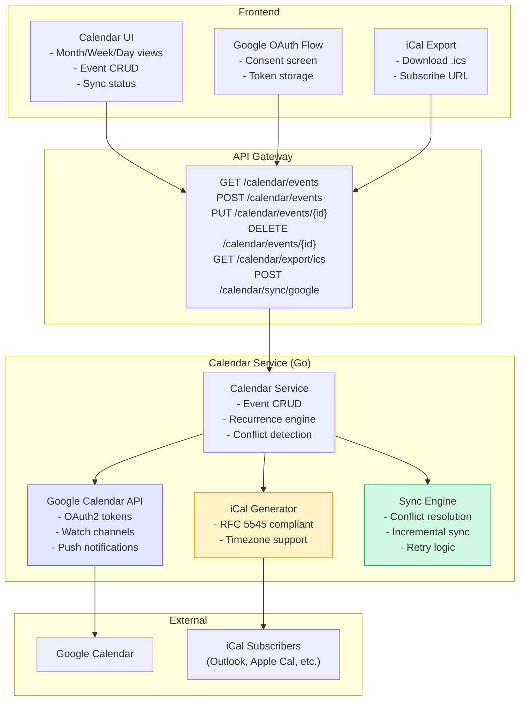
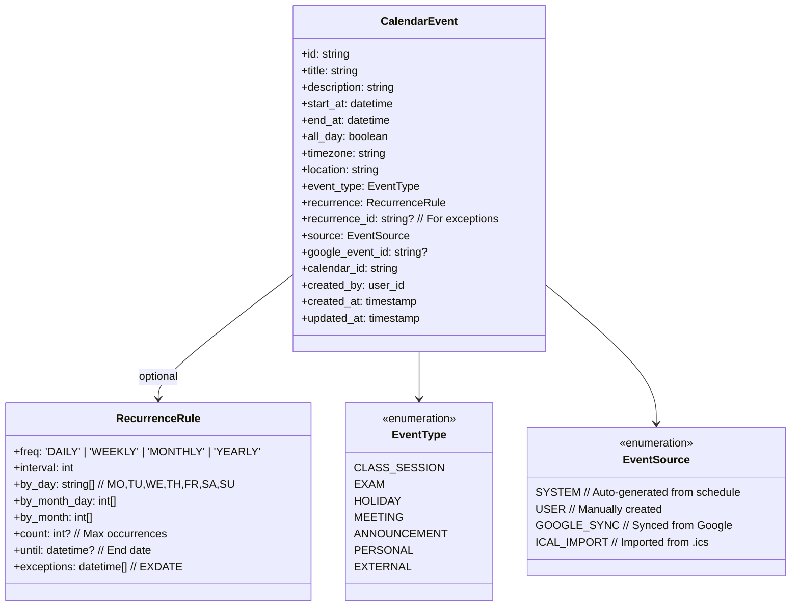
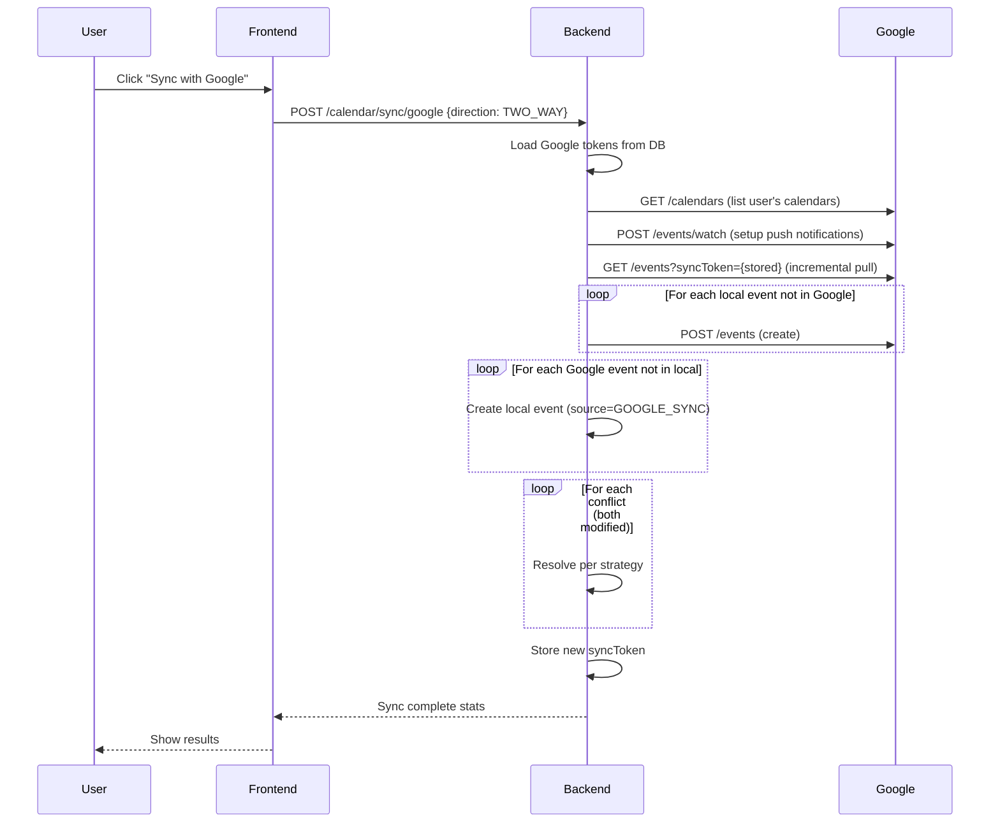
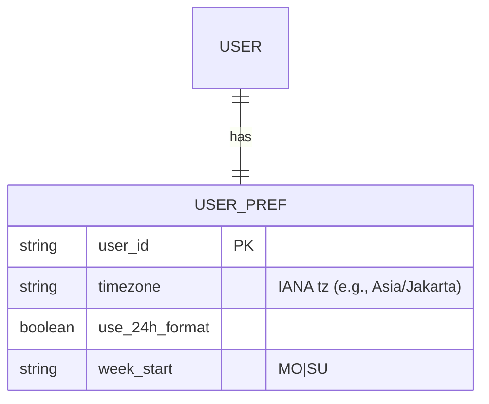

# Calendar Sync Guide

> **Purpose:** Technical specification for calendar integration — iCal export, Google Calendar sync, recurring events, and two-way synchronization for Admin Panel SMA.

---

## 1. Overview

### 1.1 Problem Statement

Enable seamless calendar integration for:

- **iCal Export** — Download `.ics` files for schedules, exams, events
- **Google Calendar Sync** — Two-way sync with OAuth2
- **Recurring Events** — Weekly classes, monthly exams, annual holidays
- **Calendar Alias** — Unified view across academic, personal, and external calendars

### 1.2 Architecture



### 1.3 Feature Flag

```bash
# Backend
ENABLE_CALENDAR_ALIAS=true

# Frontend
VITE_ENABLE_CALENDAR_ALIAS=true
```

---

## 2. Data Model

### 2.1 Event Entity



### 2.2 Calendar Configuration

```go
// internal/calendar/config.go
type CalendarConfig struct {
    // Google OAuth
    GoogleClientID     string `mapstructure:"GOOGLE_CLIENT_ID"`
    GoogleClientSecret string `mapstructure:"GOOGLE_CLIENT_SECRET"`
    GoogleRedirectURL  string `mapstructure:"GOOGLE_REDIRECT_URL"`
    GoogleScopes       []string `mapstructure:"GOOGLE_SCOPES"` // calendar.events, calendar.readonly

    // iCal
    ICalTimezone       string `mapstructure:"ICAL_TIMEZONE"`        // Asia/Jakarta
    ICalPublisherID    string `mapstructure:"ICAL_PUBLISHER_ID"`    // -//SMA Admin//EN
    ICalSubscribeSecret string `mapstructure:"ICAL_SUBSCRIBE_SECRET"` // For signed subscribe URLs

    // Sync
    SyncIntervalMinutes int    `mapstructure:"CALENDAR_SYNC_INTERVAL"` // 15
    MaxRetries          int    `mapstructure:"CALENDAR_MAX_RETRIES"`   // 3
    ConflictStrategy    string `mapstructure:"CALENDAR_CONFLICT_STRATEGY"` // LOCAL_WINS|REMOTE_WINS|MERGE
}
```

---

## 3. API Specification

### 3.1 Event CRUD

```http
GET /api/v1/calendar/events?start=2025-01-01&end=2025-01-31&calendar_id=cal_academic
Authorization: Bearer <token>
```

**Response:**

```json
{
  "data": [
    {
      "id": "evt_abc123",
      "title": "Matematika - 10 IPA A",
      "description": "Ruang 101, Budi Santoso",
      "start_at": "2025-01-15T07:00:00+07:00",
      "end_at": "2025-01-15T08:30:00+07:00",
      "all_day": false,
      "timezone": "Asia/Jakarta",
      "location": "Ruang 101",
      "event_type": "CLASS_SESSION",
      "recurrence": {
        "freq": "WEEKLY",
        "interval": 1,
        "by_day": ["MO", "WE"],
        "until": "2025-06-15T00:00:00+07:00"
      },
      "source": "SYSTEM",
      "google_event_id": "google_evt_xyz",
      "calendar_id": "cal_academic",
      "created_at": "2025-01-01T00:00:00Z"
    }
  ]
}
```

```http
POST /api/v1/calendar/events
Content-Type: application/json
Authorization: Bearer <token>

{
  "title": "Parent-Teacher Meeting",
  "description": "Quarterly review",
  "start_at": "2025-02-01T14:00:00+07:00",
  "end_at": "2025-02-01T15:00:00+07:00",
  "timezone": "Asia/Jakarta",
  "location": "Meeting Room A",
  "event_type": "MEETING",
  "recurrence": {
    "freq": "MONTHLY",
    "interval": 3,
    "by_month_day": [1],
    "count": 4
  },
  "calendar_id": "cal_personal"
}
```

### 3.2 iCal Export

```http
GET /api/v1/calendar/export/ics?calendar_id=cal_academic&start=2025-01-01&end=2025-12-31
Authorization: Bearer <token>
```

**Response:** `Content-Type: text/calendar; charset=utf-8`, `Content-Disposition: attachment; filename="calendar_academic_2025.ics"`

**Sample iCal Output:**

```ical
BEGIN:VCALENDAR
VERSION:2.0
PRODID:-//SMA Admin//EN
CALSCALE:GREGORIAN
METHOD:PUBLISH
X-WR-CALNAME:Academic Calendar 2025
X-WR-TIMEZONE:Asia/Jakarta
BEGIN:VTIMEZONE
TZID:Asia/Jakarta
X-LIC-LOCATION:Asia/Jakarta
BEGIN:STANDARD
TZOFFSETFROM:+0700
TZOFFSETTO:+0700
TZNAME:WIB
DTSTART:19700101T000000
END:STANDARD
END:VTIMEZONE
BEGIN:VEVENT
UID:evt_abc123@sma-admin
DTSTAMP:20250101T000000Z
DTSTART;TZID=Asia/Jakarta:20250115T070000
DTEND;TZID=Asia/Jakarta:20250115T083000
RRULE:FREQ=WEEKLY;INTERVAL=1;BYDAY=MO,WE;UNTIL=20250615T000000Z
SUMMARY:Matematika - 10 IPA A
DESCRIPTION:Ruang 101, Budi Santoso
LOCATION:Ruang 101
CATEGORIES:CLASS_SESSION
END:VEVENT
END:VCALENDAR
```

### 3.3 iCal Subscribe URL (Public/Private)

```http
GET /api/v1/calendar/subscribe/ics?calendar_id=cal_academic&token={signed_token}
```

**Response:** Live iCal feed (auto-updates for subscribers)

### 3.4 Google Calendar Sync

```http
POST /api/v1/calendar/sync/google
Content-Type: application/json
Authorization: Bearer <token>

{
  "calendar_id": "cal_academic",
  "direction": "TWO_WAY",        // PUSH | PULL | TWO_WAY
  "sync_token": "optional_sync_token_for_incremental"
}
```

**Response:**

```json
{
  "data": {
    "sync_id": "sync_abc123",
    "status": "IN_PROGRESS",
    "direction": "TWO_WAY",
    "stats": {
      "created": 0,
      "updated": 0,
      "deleted": 0,
      "conflicts": 0,
      "errors": 0
    },
    "started_at": "2025-01-15T10:30:00Z"
  }
}
```

### 3.5 Google OAuth Flow

```http
GET /api/v1/calendar/google/auth?redirect_uri=https://app.example.com/calendar/callback
Authorization: Bearer <token>
```

**Response:** Redirects to Google consent screen

```http
GET /api/v1/calendar/google/callback?code={auth_code}&state={state}
```

**Response:** Stores refresh token, returns success

```http
DELETE /api/v1/calendar/google/disconnect
Authorization: Bearer <token>
```

**Response:** Revokes tokens, disables sync

---

## 4. Recurrence Engine

### 4.1 RRULE Implementation (RFC 5545)

```go
// internal/calendar/recurrence.go
type RecurrenceEngine struct {
    timezone *time.Location
}

func (e *RecurrenceEngine) Expand(rule RecurrenceRule, start, end time.Time) ([]time.Time, error) {
    rrule := rrule.NewRRule(rrule.ROption{
        Freq:      e.mapFreq(rule.Freq),
        Interval:  rule.Interval,
        ByWeekday: e.mapWeekdays(rule.ByDay),
        ByMonthDay: rule.ByMonthDay,
        ByMonth:   rule.ByMonth,
        Count:     rule.Count,
        Until:     rule.Until,
        ExcludeDates: rule.Exceptions,
        DtStart:   start,
    })

    return rrule.Between(start, end, true), nil
}

func (e *RecurrenceEngine) GenerateExceptions(baseEvent CalendarEvent, exceptionDates []time.Time) []CalendarEvent {
    var exceptions []CalendarEvent
    for _, exDate := range exceptionDates {
        exceptions = append(exceptions, CalendarEvent{
            ID:            uuid.NewString(),
            Title:         baseEvent.Title + " (Cancelled)",
            Description:   baseEvent.Description,
            StartAt:       exDate,
            EndAt:         exDate.Add(baseEvent.EndAt.Sub(baseEvent.StartAt)),
            RecurrenceID:  &baseEvent.ID,  // Links to master event
            EventType:     baseEvent.EventType,
            Source:        EventSourceUser,
            CalendarID:    baseEvent.CalendarID,
        })
    }
    return exceptions
}
```

### 4.2 Recurrence Patterns Supported

| Pattern            | RRULE Example                            | Use Case         |
| ------------------ | ---------------------------------------- | ---------------- |
| **Weekly Classes** | `FREQ=WEEKLY;BYDAY=MO,WE;UNTIL=20250615` | Class sessions   |
| **Bi-weekly Lab**  | `FREQ=WEEKLY;INTERVAL=2;BYDAY=TU`        | Lab sessions     |
| **Monthly Exam**   | `FREQ=MONTHLY;BYMONTHDAY=15;COUNT=4`     | Mid-term/Final   |
| **Annual Holiday** | `FREQ=YEARLY;BYMONTH=8;BYMONTHDAY=17`    | Independence Day |
| **Daily Ramadan**  | `FREQ=DAILY;UNTIL=20250409`              | Prayer schedule  |

---

## 5. Google Calendar Two-Way Sync

### 5.1 Sync Architecture



### 5.2 Conflict Resolution Strategies

| Strategy        | Behavior                                                     |
| --------------- | ------------------------------------------------------------ |
| **LOCAL_WINS**  | Local changes overwrite remote (default for system events)   |
| **REMOTE_WINS** | Google changes overwrite local (default for personal events) |
| **MERGE**       | Combine non-conflicting fields; flag conflicts for review    |
| **MANUAL**      | Create conflict record, notify user to resolve               |

### 5.3 Push Notifications (Google Webhook)

```go
// internal/calendar/google_webhook.go
func (s *Service) HandleGoogleWebhook(ctx context.Context, req GoogleWebhookRequest) error {
    // Verify channel ID matches our watch
    channel := s.getWatchChannel(req.ChannelID)
    if channel == nil {
        return ErrInvalidChannel
    }

    // Get changes since last sync token
    events, newSyncToken, err := s.googleClient.ListEvents(ctx, channel.CalendarID, channel.SyncToken)
    if err != nil {
        return err
    }

    // Process changes
    for _, event := range events {
        s.processGoogleEventChange(ctx, channel, event)
    }

    // Update sync token
    channel.SyncToken = newSyncToken
    s.saveWatchChannel(channel)

    return nil
}
```

---

## 6. Frontend Implementation Spec

### 6.1 Pages & Components

```
apps/admin/src/
├── features/calendar/
│   ├── pages/
│   │   ├── CalendarView.tsx              # Main calendar (FullCalendar)
│   │   ├── CalendarSettings.tsx          # Calendars, sync, preferences
│   │   ├── GoogleSyncSetup.tsx           # OAuth flow UI
│   │   └── EventModal.tsx                # Create/edit event
│   ├── components/
│   │   ├── CalendarWrapper.tsx           # FullCalendar wrapper
│   │   ├── EventPopover.tsx              # Click event details
│   │   ├── RecurrenceEditor.tsx          # Visual RRULE builder
│   │   ├── CalendarSelector.tsx          # Toggle calendars
│   │   ├── SyncStatusBadge.tsx           # Synced/Pending/Error
│   │   ├── ICalExportButton.tsx          # Download .ics
│   │   └── ICalSubscribeDialog.tsx       # Copy subscribe URL
│   ├── hooks/
│   │   ├── useCalendarEvents.ts          # Fetch events for date range
│   │   ├── useGoogleCalendarSync.ts      # Sync trigger + status
│   │   ├── useICalExport.ts              # Generate download URL
│   │   └── useRecurrenceRule.ts          # Build/parse RRULE
│   ├── utils/
│   │   ├── recurrence.ts                 # RRULE helpers
│   │   ├── timezone.ts                   # Timezone handling
│   │   └── ical.ts                       # iCal parsing/generation
│   └── types/
│       └── calendar.ts                   # TypeScript interfaces
```

### 6.2 Recurrence Editor (Visual RRULE Builder)

```tsx
// features/calendar/components/RecurrenceEditor.tsx
interface RecurrenceEditorProps {
  value: RecurrenceRule;
  onChange: (rule: RecurrenceRule) => void;
}

export function RecurrenceEditor({ value, onChange }: RecurrenceEditorProps) {
  const [freq, setFreq] = useState(value.freq || "WEEKLY");
  const [interval, setInterval] = useState(value.interval || 1);
  const [byDay, setByDay] = useState(value.byDay || []);
  const [endType, setEndType] = useState(value.until ? "until" : value.count ? "count" : "never");
  const [count, setCount] = useState(value.count || 10);
  const [until, setUntil] = useState(value.until ? new Date(value.until) : null);

  const WEEKDAYS = ["SU", "MO", "TU", "WE", "TH", "FR", "SA"];

  const updateRule = useCallback(() => {
    const rule: RecurrenceRule = {
      freq,
      interval,
      byDay: byDay.length > 0 ? byDay : undefined,
      count: endType === "count" ? count : undefined,
      until: endType === "until" ? until?.toISOString() : undefined,
    };
    onChange(rule);
  }, [freq, interval, byDay, endType, count, until, onChange]);

  useEffect(() => {
    updateRule();
  }, [updateRule]);

  return (
    <div className="recurrence-editor">
      <Select value={freq} onValueChange={setFreq}>
        <SelectItem value="DAILY">Daily</SelectItem>
        <SelectItem value="WEEKLY">Weekly</SelectItem>
        <SelectItem value="MONTHLY">Monthly</SelectItem>
        <SelectItem value="YEARLY">Yearly</SelectItem>
      </Select>

      <Input
        type="number"
        value={interval}
        onChange={(e) => setInterval(parseInt(e.target.value))}
        min={1}
      />

      {freq === "WEEKLY" && (
        <div className="weekday-selector">
          {WEEKDAYS.map((day) => (
            <Checkbox
              key={day}
              checked={byDay.includes(day)}
              onChange={(checked) =>
                setByDay(checked ? [...byDay, day] : byDay.filter((d) => d !== day))
              }
            >
              {day}
            </Checkbox>
          ))}
        </div>
      )}

      <RadioGroup value={endType} onValueChange={setEndType}>
        <RadioItem value="never">Never ends</RadioItem>
        <RadioItem value="count">After {count} occurrences</RadioItem>
        <RadioItem value="until">Until {until?.toLocaleDateString()}</RadioItem>
      </RadioGroup>

      {endType === "count" && (
        <Input type="number" value={count} onChange={(e) => setCount(parseInt(e.target.value))} />
      )}
      {endType === "until" && <DatePicker value={until} onChange={setUntil} />}
    </div>
  );
}
```

### 6.3 Calendar View (FullCalendar Integration)

```tsx
// features/calendar/components/CalendarWrapper.tsx
import FullCalendar from '@fullcalendar/react';
import dayGridPlugin from '@fullcalendar/daygrid';
import timeGridPlugin from '@fullcalendar/timegrid';
import interactionPlugin from '@fullcalendar/interaction';
import googleCalendarPlugin from '@fullcalendar/google-calendar';

export function CalendarWrapper({
  events,
  onEventClick,
  onDateSelect,
  calendars,
  googleCalendarId
}: CalendarWrapperProps) {
  return (
    <FullCalendar
      plugins={[dayGridPlugin, timeGridPlugin, interactionPlugin]}
      initialView="dayGridMonth"
      headerToolbar={{
        left: 'prev,next today',
        center: 'title',
        right: 'dayGridMonth,timeGridWeek,timeGridDay,listWeek'
      }}
      events={events.map(e => ({
        id: e.id,
        title: e.title,
        start: e.start_at,
        end: e.end_at,
        allDay: e.all_day,
        backgroundColor: getCalendarColor(e.calendar_id),
        borderColor: getCalendarColor(e.calendar_id),
        extendedProps: {
          description: e.description,
          location: e.location,
          eventType: e.event_type,
          recurrence: e.recurrence,
          googleEventId: e.google_event_id,
          syncStatus: e.google_event_id ? 'synced' : 'local'
        }
      })}}
      eventClick={onEventClick}
      select={onDateSelect}
      selectable={true}
      selectMirror={true}
      dayMaxEvents={3}
      weekends={true}
      nowIndicator={true}
      timeZone="Asia/Jakarta"
      height="auto"
    />
  );
}
```

---

## 7. Backend Implementation Spec

### 7.1 Service Structure

```
sma-adp-api/internal/
├── calendar/
│   ├── service.go              # Orchestration
│   ├── events.go               # CRUD + recurrence expansion
│   ├── ical.go                 # iCal generation/parsing
│   ├── google.go               # Google Calendar API client
│   ├── sync.go                 # Sync engine + conflict resolution
│   ├── webhook.go              # Google push notifications
│   ├── recurrence.go           # RRULE engine
│   ├── dto/
│   │   ├── request.go
│   │   └── response.go
│   └── middleware/
│       └── feature_flag.go     # RequireFeature("ENABLE_CALENDAR_ALIAS")
```

### 7.2 Event Store (Database)

```sql
CREATE TABLE calendar_events (
    id UUID PRIMARY KEY DEFAULT gen_random_uuid(),
    title VARCHAR(255) NOT NULL,
    description TEXT,
    start_at TIMESTAMPTZ NOT NULL,
    end_at TIMESTAMPTZ NOT NULL,
    all_day BOOLEAN DEFAULT FALSE,
    timezone VARCHAR(50) DEFAULT 'Asia/Jakarta',
    location VARCHAR(255),
    event_type VARCHAR(50) NOT NULL,
    recurrence_rule JSONB,           -- Stored RRULE
    recurrence_id UUID REFERENCES calendar_events(id), -- For exceptions
    source VARCHAR(20) NOT NULL,     -- SYSTEM, USER, GOOGLE_SYNC, ICAL_IMPORT
    google_event_id VARCHAR(255),    -- For sync mapping
    google_etag VARCHAR(255),        -- For conflict detection
    calendar_id UUID NOT NULL REFERENCES calendars(id),
    created_by UUID NOT NULL REFERENCES users(id),
    created_at TIMESTAMPTZ DEFAULT NOW(),
    updated_at TIMESTAMPTZ DEFAULT NOW(),
    deleted_at TIMESTAMPTZ
);

CREATE INDEX idx_calendar_events_range ON calendar_events (start_at, end_at);
CREATE INDEX idx_calendar_events_google ON calendar_events (google_event_id);
CREATE INDEX idx_calendar_events_recurrence ON calendar_events (recurrence_id);
```

### 7.3 Google Calendar Client

```go
// internal/calendar/google.go
type GoogleCalendarClient struct {
    config *oauth2.Config
    httpClient *http.Client
}

func (c *GoogleCalendarClient) GetEvents(ctx context.Context, calendarID, syncToken string) ([]GoogleEvent, string, error) {
    params := url.Values{}
    if syncToken != "" {
        params.Set("syncToken", syncToken)
    } else {
        params.Set("timeMin", time.Now().AddDate(0, -1, 0).Format(time.RFC3339))
    }
    params.Set("singleEvents", "true")
    params.Set("orderBy", "startTime")
    params.Set("showDeleted", "true")

    req, _ := http.NewRequestWithContext(ctx, "GET",
        fmt.Sprintf("https://www.googleapis.com/calendar/v3/calendars/%s/events?%s", calendarID, params.Encode()), nil)

    resp, err := c.httpClient.Do(req)
    // ... parse response, handle pagination
}

func (c *GoogleCalendarClient) CreateEvent(ctx context.Context, calendarID string, event CalendarEvent) (*GoogleEvent, error) {
    googleEvent := c.toGoogleEvent(event)
    // POST /calendars/{calendarId}/events
}

func (c *GoogleCalendarClient) WatchEvents(ctx context.Context, calendarID, channelID, webhookURL string) (*WatchChannel, error) {
    // POST /calendars/{calendarId}/events/watch
    // Body: { "id": channelID, "type": "web_hook", "address": webhookURL }
}
```

---

## 8. Timezone Handling

### 8.1 Strategy

| Layer        | Timezone Handling                                                     |
| ------------ | --------------------------------------------------------------------- |
| **Database** | All timestamps stored as UTC (`TIMESTAMPTZ`)                          |
| **API**      | Accept/return ISO 8601 with offset (`2025-01-15T07:00:00+07:00`)      |
| **Frontend** | Display in user's local timezone (detected via `Intl.DateTimeFormat`) |
| **iCal**     | Include `VTIMEZONE` component; use `TZID` references                  |
| **Google**   | Send timezone in event; Google stores as UTC                          |

### 8.2 User Timezone Preference



---

## 9. Testing Strategy

### 9.1 Unit Tests

| Test                       | Description                               |
| -------------------------- | ----------------------------------------- |
| `TestRecurrenceExpansion`  | RRULE expands correctly for all patterns  |
| `TestRecurrenceExceptions` | EXDATE and recurrence_id work             |
| `TestICalGeneration`       | Valid RFC 5545 output, VTIMEZONE included |
| `TestICalParsing`          | Import .ics → events with recurrence      |
| `TestGoogleEventMapping`   | Bidirectional conversion preserves data   |
| `TestConflictResolution`   | All strategies produce expected results   |

### 9.2 Integration Tests

```go
func TestCalendarSync_Integration(t *testing.T) {
    // 1. Setup: User with Google tokens
    // 2. Create local events (some recurring)
    // 3. POST /calendar/sync/google {direction: TWO_WAY}
    // 4. Verify:
    //    - Local events appear in Google
    //    - Google events appear locally (source=GOOGLE_SYNC)
    //    - Sync token updated
    //    - Watch channel registered
}

func TestICalSubscribe_Integration(t *testing.T) {
    // 1. Generate subscribe URL with signed token
    // 2. GET /calendar/subscribe/ics?token=xxx
    // 3. Parse response as iCal
    // 4. Verify events match calendar
    // 5. Add event → re-fetch → new event appears
}
```

### 9.3 E2E Tests (Playwright)

```typescript
// tests/e2e/feature-specific.spec.ts
test("Calendar: Create recurring event, export iCal, sync Google", async ({
  authenticatedPage,
}) => {
  await gotoAndWait(page, "/calendar", '[data-testid="calendar-view"]');

  // Create recurring event
  await page.click('[data-testid="date-2025-01-20"]');
  await page.fill('[data-testid="event-title"]', "Weekly Math Lab");
  await page.selectOption('[data-testid="recurrence-freq"]', "WEEKLY");
  await page.check('[data-testid="recurrence-mo"]');
  await page.check('[data-testid="recurrence-we"]');
  await page.click('[data-testid="save-event"]');

  // Verify on calendar
  await expect(page.locator('[data-event-title="Weekly Math Lab"]')).toHaveCount(2); // Two weeks visible

  // Export iCal
  const downloadPromise = page.waitForEvent("download");
  await page.click('[data-testid="export-ical-btn"]');
  const download = await downloadPromise;
  expect(download.suggestedFilename()).toMatch(/\.ics$/);

  // Google sync (if configured)
  // ... mock Google OAuth + API
});
```

---

## 10. Performance & Limits

| Operation                 | Target  | Limit            |
| ------------------------- | ------- | ---------------- |
| Event list (30 days)      | < 200ms | 1000 events      |
| iCal export (1 year)      | < 2s    | 5000 events      |
| Google sync (incremental) | < 10s   | 100 changes      |
| Recurrence expansion      | < 50ms  | 500 occurrences  |
| Webhook processing        | < 500ms | 100 events/batch |

---

## 11. Future Enhancements

| Feature                   | Priority | Description                                 |
| ------------------------- | -------- | ------------------------------------------- |
| **Outlook/Exchange Sync** | P2       | Microsoft Graph API integration             |
| **CalDAV Support**        | P3       | Standard protocol for self-hosted calendars |
| **Resource Booking**      | P2       | Rooms, equipment as bookable calendars      |
| **Event Reminders**       | P2       | Configurable notifications (email/push)     |
| **Shared Calendars**      | P3       | Team/class calendars with permissions       |
| **Calendar Analytics**    | P3       | Utilization, conflicts, density metrics     |

---

_Last updated: 2025-01-15 | Owner: Platform Team | Review: Per release_
