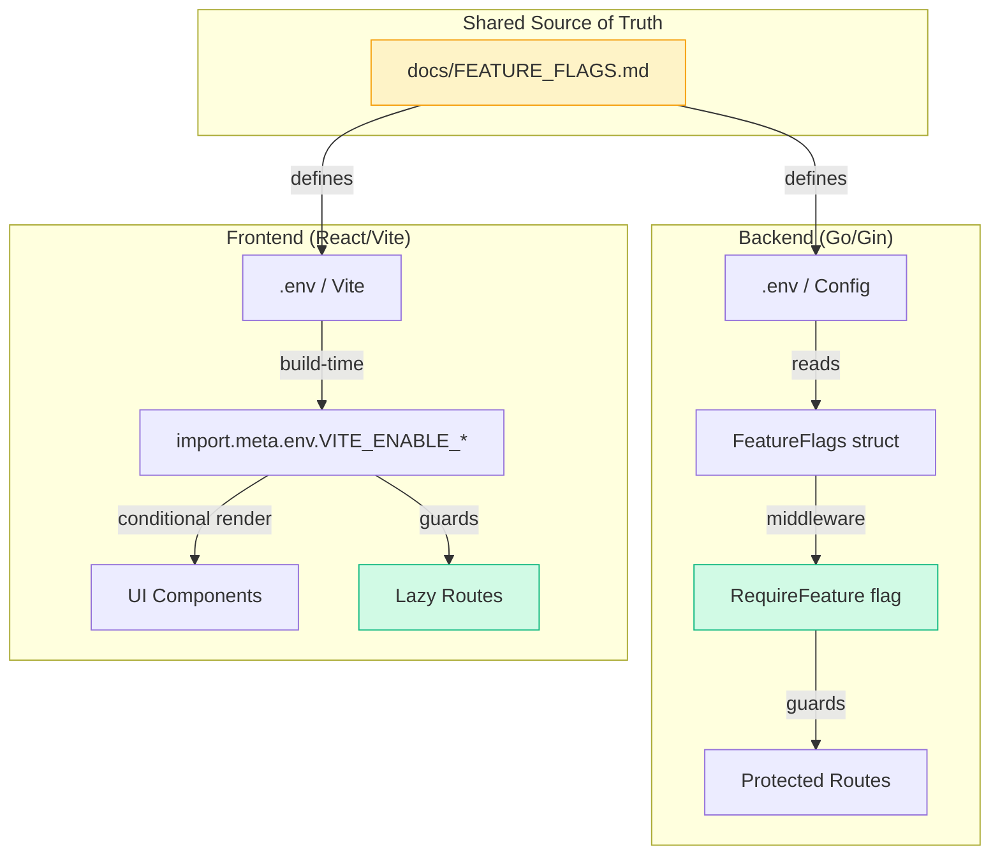
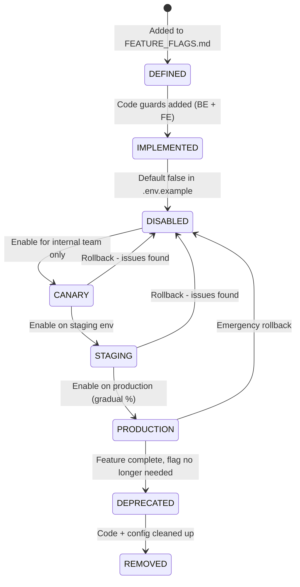
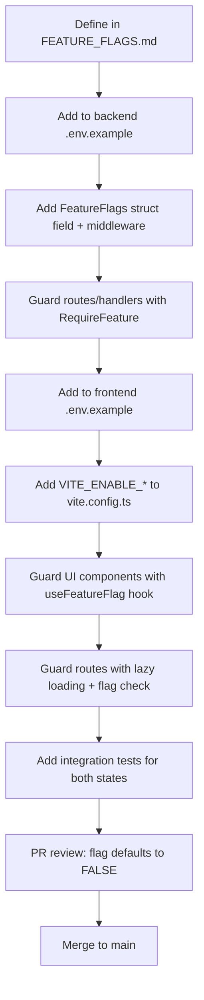
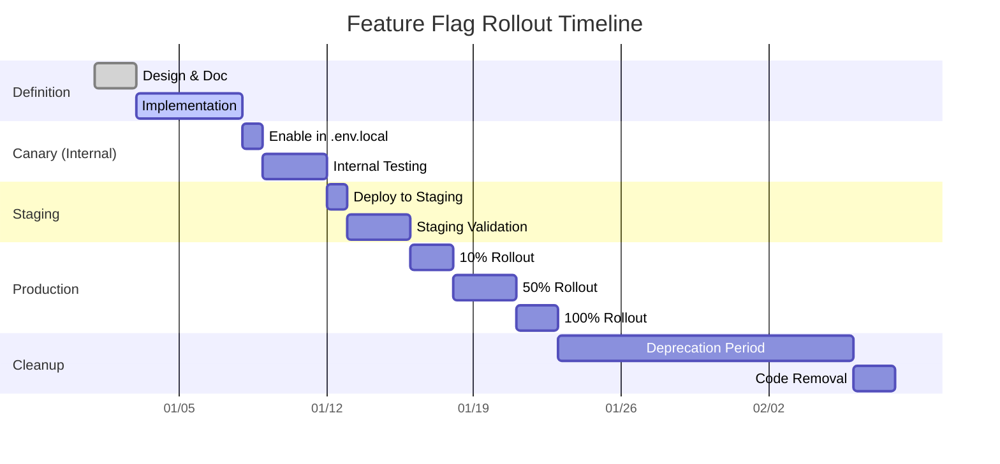
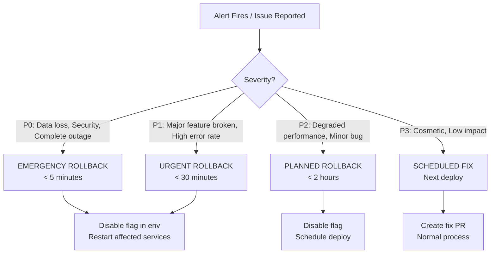

# Feature Flag Rollout & Rollback Runbook

> **Purpose:** Standardized procedure for safely enabling, rolling out, and rolling back feature flags across the Admin Panel SMA stack (Go backend + React/Vite frontend).

---

## 1. Overview

### 1.1 Feature Flag Architecture



### 1.2 Flag Lifecycle States



---

## 2. Adding a New Feature Flag

### 2.1 Prerequisites Checklist

- [ ] Feature designed behind a flag from day one
- [ ] Flag name follows convention: `ENABLE_<FEATURE>_ALIAS` (alias for rename-safe) or `ENABLE_<FEATURE>`
- [ ] Documented in `docs/FEATURE_FLAGS.md` with:
  - [ ] Purpose & user-facing description
  - [ ] Owner team
  - [ ] Target rollout date
  - [ ] Rollback criteria (metrics/alerts)
  - [ ] Deprecation plan

### 2.2 Implementation Steps



### 2.3 Backend Implementation Pattern

```go
// internal/config/feature_flags.go
type FeatureFlags struct {
    EnableScheduler      bool `mapstructure:"ENABLE_SCHEDULER"`
    EnableAnalytics      bool `mapstructure:"ENABLE_ANALYTICS"`
    EnableReports        bool `mapstructure:"ENABLE_REPORTS"`
    // ... new flag here
}

// internal/middleware/feature_flag.go
func RequireFeature(flagName string) gin.HandlerFunc {
    return func(c *gin.Context) {
        flags := config.GetFeatureFlags()
        enabled := getFlagValue(flags, flagName)
        if !enabled {
            c.AbortWithStatusJSON(http.StatusNotFound, gin.H{"error": "feature not available"})
            return
        }
        c.Next()
    }
}

// Usage in routes
router.GET("/api/v1/scheduler", middleware.RequireFeature("ENABLE_SCHEDULER"), handler.GetSchedule)
```

### 2.4 Frontend Implementation Pattern

```typescript
// src/hooks/useFeatureFlag.ts
export function useFeatureFlag(flag: keyof ImportMetaEnv): boolean {
  return import.meta.env[`VITE_ENABLE_${flag}`] === 'true';
}

// src/components/FeatureGate.tsx
export function FeatureGate({ flag, children, fallback = null }: FeatureGateProps) {
  const enabled = useFeatureFlag(flag);
  return enabled ? <>{children}</> : <>{fallback}</>;
}

// Usage
<FeatureGate flag="SCHEDULER">
  <SchedulerPage />
</FeatureGate>

// Lazy route guard
const SchedulerRoutes = lazy(() => import('./scheduler'));
<Route path="/scheduler" element={
  <FeatureGate flag="SCHEDULER">
    <SchedulerRoutes />
  </FeatureGate>
} />
```

---

## 3. Rollout Procedure

### 3.1 Rollout Phases



### 3.2 Phase Gates (Must Pass Before Proceeding)

| Phase                          | Gate Criteria                                                       | Verification                         |
| ------------------------------ | ------------------------------------------------------------------- | ------------------------------------ |
| **Canary → Staging**           | All critical flows pass, no P0/P1 bugs, error rate < 0.1%           | E2E tests + manual smoke             |
| **Staging → Production (10%)** | Staging stable 48h, load test passes, rollback tested               | `compatibility_smoke.py` + load test |
| **10% → 50%**                  | 10% cohort: error rate < 0.5%, latency p99 < 2s, no data corruption | Datadog/Sentry dashboards            |
| **50% → 100%**                 | 50% cohort: same metrics, user feedback positive                    | Analytics + support tickets          |
| **100% → Deprecate**           | Feature stable 14 days, no rollback needed                          | Post-mortem doc                      |

### 3.3 Enabling on Each Environment

```bash
# Backend (.env)
ENABLE_SCHEDULER=true

# Frontend (.env or Vercel/Netlify env vars)
VITE_ENABLE_SCHEDULER=true

# Verify both match!
diff <(grep ENABLE_ backend/.env | sort) <(grep VITE_ENABLE_ frontend/.env | sort)
```

---

## 4. Rollback Procedure

### 4.1 Rollback Triggers (Automatic or Manual)



### 4.2 Emergency Rollback Steps (< 5 min)

```bash
# 1. IMMEDIATE: Disable flag in production env vars
# Vercel/Netlify/Render/Railway dashboard → Environment Variables
# Set VITE_ENABLE_<FEATURE>=false
# Set ENABLE_<FEATURE>=false

# 2. RESTART: Trigger redeploy (or restart containers)
# Vercel: "Redeploy" button
# Railway: "Restart" service
# Docker: docker compose restart api frontend

# 3. VERIFY: Confirm feature is hidden
curl -H "Authorization: Bearer $TOKEN" https://api.prod.example.com/api/v1/<feature-endpoint>
# Should return 404 "feature not available"

# 4. NOTIFY: Post in #incidents channel
# Template: "🔴 ROLLBACK: <FEATURE> disabled due to <REASON>. Impact: <X% users>. ETA for fix: <TIME>"

# 5. DOCUMENT: Create incident ticket with timeline
```

### 4.3 Rollback Verification Checklist

- [ ] Backend returns 404 for flagged endpoints
- [ ] Frontend hides UI components (no console errors)
- [ ] No broken links in navigation
- [ ] Related analytics events stop firing
- [ ] Downstream consumers (mobile, webhooks) handle 404 gracefully
- [ ] Incident ticket created with root cause analysis started

---

## 5. Deprecation & Removal

### 5.1 Deprecation Criteria

- Flag at 100% rollout for ≥ 14 days
- Zero rollback incidents in that period
- No conditional code paths remaining (feature is "always on")
- Team consensus to remove

### 5.2 Removal Checklist

```mermaid
checklist
    Remove flag from FEATURE_FLAGS.md
    Remove from backend .env.example + config struct + middleware
    Remove RequireFeature middleware usage from routes
    Remove from frontend .env.example + vite.config.ts
    Remove useFeatureFlag hook usage / FeatureGate components
    Remove lazy route guards
    Delete feature-specific tests for disabled state
    Run full test suite (unit + integration + E2E)
    Deploy to staging → verify
    Deploy to production
    Celebrate 🎉
```

---

## 6. Current Feature Flags Registry

| Flag       | Backend Key               | Frontend Key                   | Status     | Owner      | Rollout Target |
| ---------- | ------------------------- | ------------------------------ | ---------- | ---------- | -------------- |
| Scheduler  | `ENABLE_SCHEDULER`        | `VITE_ENABLE_SCHEDULER`        | Production | Platform   | 2025-01-15     |
| Analytics  | `ENABLE_ANALYTICS`        | `VITE_ENABLE_ANALYTICS`        | Production | Analytics  | 2025-01-15     |
| Reports    | `ENABLE_REPORTS`          | `VITE_ENABLE_REPORTS`          | Production | Reports    | 2025-01-15     |
| Dashboard  | `ENABLE_DASHBOARD`        | `VITE_ENABLE_DASHBOARD`        | Production | Core       | 2025-01-15     |
| Attendance | `ENABLE_ATTENDANCE_ALIAS` | `VITE_ENABLE_ATTENDANCE_ALIAS` | Production | Attendance | 2025-02-01     |
| Mutations  | `ENABLE_MUTATIONS`        | `VITE_ENABLE_MUTATIONS`        | Staging    | Platform   | 2025-02-15     |
| Archives   | `ENABLE_ARCHIVES`         | `VITE_ENABLE_ARCHIVES`         | Canary     | Data       | 2025-03-01     |
| Homerooms  | `ENABLE_HOMEROOMS`        | `VITE_ENABLE_HOMEROOMS`        | Defined    | Scheduling | 2025-03-15     |
| Calendar   | `ENABLE_CALENDAR_ALIAS`   | `VITE_ENABLE_CALENDAR_ALIAS`   | Defined    | Scheduling | 2025-03-15     |

> **Source of truth:** `docs/FEATURE_FLAGS.md` — update there first, then propagate.

---

## 7. Incident Response Contacts

| Role             | Slack            | PagerDuty                | Escalation            |
| ---------------- | ---------------- | ------------------------ | --------------------- |
| Platform On-call | @platform-oncall | PagerDuty: platform-team | → Engineering Manager |
| Backend On-call  | @backend-oncall  | PagerDuty: backend-team  | → Tech Lead           |
| Frontend On-call | @frontend-oncall | PagerDuty: frontend-team | → Tech Lead           |

---

## 8. Quick Reference Commands

```bash
# Check current flag state in prod
curl -s https://api.prod.example.com/health/flags | jq .

# Verify frontend env at build time
grep VITE_ENABLE_ apps/admin/.env.production

# Run contract tests against flagged endpoints
cd sma-adp-api && RUN_COMPATIBILITY_SMOKE=1 python tests/compatibility_smoke.py

# Run E2E tests with specific flag enabled
VITE_ENABLE_SCHEDULER=true npx playwright test tests/e2e/feature-specific.spec.ts -g "Scheduler"
```

---

_Last updated: 2025-01-15 | Owner: Platform Team | Review quarterly_
