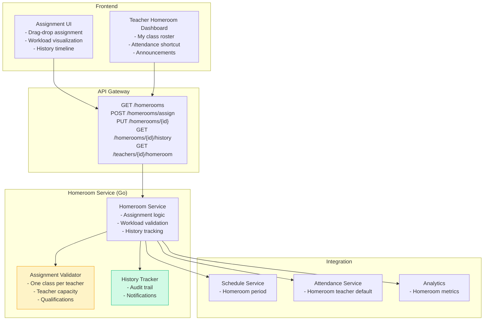
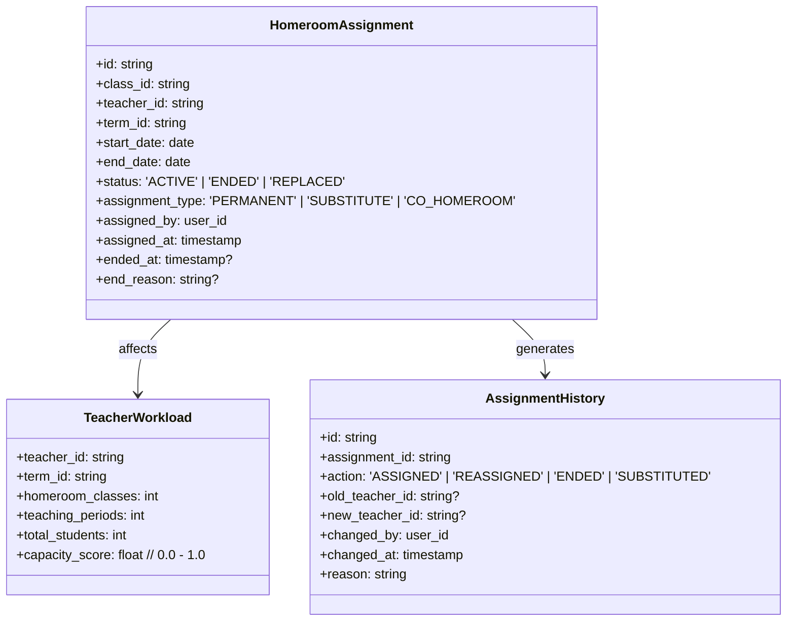
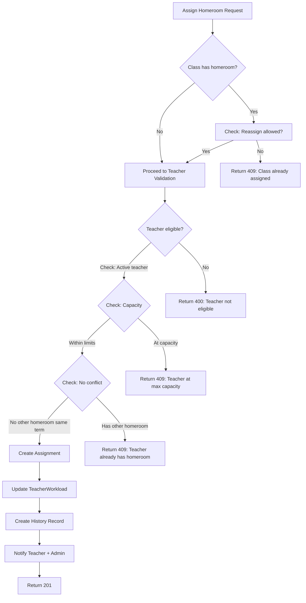
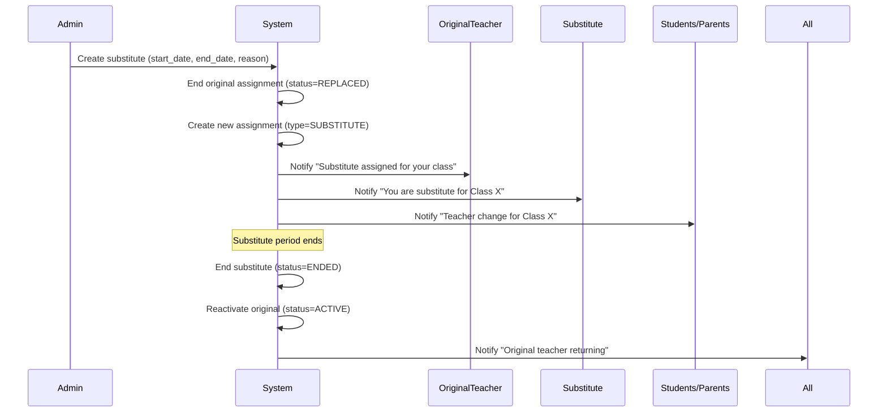

# Homeroom Teacher Assignment Guide

> **Purpose:** Technical specification for homeroom teacher assignment — class-homeroom linking, teacher workload balancing, and assignment UI for Admin Panel SMA.

---

## 1. Overview

### 1.1 Problem Statement

Manage homeroom teacher assignments with:

- **Class-Homeroom Linking** — Each class has exactly one homeroom teacher
- **Teacher Workload Balance** — Fair distribution across teachers
- **Assignment History** — Track changes over time
- **Substitute Management** — Temporary replacements
- **Dashboard Integration** — Homeroom view for teachers

### 1.2 Architecture



### 1.3 Feature Flag

```bash
# Backend
ENABLE_HOMEROOMS=true

# Frontend
VITE_ENABLE_HOMEROOMS=true
```

---

## 2. Data Model

### 2.1 Homeroom Assignment



### 2.2 Teacher Capacity Rules

| Teacher Role             | Max Homerooms | Max Teaching Periods/Week | Notes            |
| ------------------------ | ------------- | ------------------------- | ---------------- |
| **Full-time**            | 1             | 24                        | Standard         |
| **Part-time (0.5 FTE)**  | 0             | 12                        | No homeroom      |
| **Part-time (0.75 FTE)** | 1             | 18                        | With approval    |
| **Department Head**      | 1             | 20                        | Reduced teaching |
| **Vice Principal**       | 0             | 8                         | Administrative   |

---

## 3. API Specification

### 3.1 List Homerooms

```http
GET /api/v1/homerooms?term_id=term_2025_1&status=ACTIVE
Authorization: Bearer <token>
```

**Response:**

```json
{
  "data": [
    {
      "id": "hr_abc123",
      "class_id": "class_10_ip_a",
      "class_name": "10 IPA A",
      "teacher_id": "teacher_xyz",
      "teacher_name": "Budi Santoso",
      "teacher_nip": "198001012005011001",
      "term_id": "term_2025_1",
      "start_date": "2025-07-15",
      "end_date": "2026-06-15",
      "status": "ACTIVE",
      "assignment_type": "PERMANENT",
      "student_count": 32,
      "assigned_at": "2025-07-01T00:00:00Z"
    }
  ]
}
```

### 3.2 Assign Homeroom Teacher

```http
POST /api/v1/homerooms/assign
Content-Type: application/json
Authorization: Bearer <token>

{
  "class_id": "class_10_ip_a",
  "teacher_id": "teacher_xyz",
  "term_id": "term_2025_1",
  "start_date": "2025-07-15",
  "assignment_type": "PERMANENT",
  "reason": "New academic year assignment"
}
```

**Response (201 Created):**

```json
{
  "data": {
    "id": "hr_abc123",
    "class_id": "class_10_ip_a",
    "teacher_id": "teacher_xyz",
    "term_id": "term_2025_1",
    "start_date": "2025-07-15",
    "end_date": "2026-06-15",
    "status": "ACTIVE",
    "assignment_type": "PERMANENT",
    "assigned_at": "2025-07-01T10:30:00Z"
  }
}
```

### 3.3 Reassign / End Assignment

```http
PUT /api/v1/homerooms/{id}
Content-Type: application/json
Authorization: Bearer <token>

{
  "action": "REASSIGN",           // REASSIGN | END | SUBSTITUTE
  "new_teacher_id": "teacher_new",  // Required for REASSIGN/SUBSTITUTE
  "end_date": "2025-12-20",       // Required for END
  "reason": "Teacher on maternity leave"
}
```

### 3.4 Assignment History

```http
GET /api/v1/homerooms/{id}/history
Authorization: Bearer <token>
```

**Response:**

```json
{
  "data": [
    {
      "id": "hist_001",
      "assignment_id": "hr_abc123",
      "action": "ASSIGNED",
      "old_teacher_id": null,
      "new_teacher_id": "teacher_xyz",
      "changed_by": "admin@sma.test",
      "changed_at": "2025-07-01T10:30:00Z",
      "reason": "New academic year assignment"
    },
    {
      "id": "hist_002",
      "assignment_id": "hr_abc123",
      "action": "SUBSTITUTED",
      "old_teacher_id": "teacher_xyz",
      "new_teacher_id": "teacher_sub",
      "changed_by": "admin@sma.test",
      "changed_at": "2025-10-15T08:00:00Z",
      "reason": "Teacher on sick leave"
    }
  ]
}
```

### 3.5 Teacher's Homeroom (for Teacher Dashboard)

```http
GET /api/v1/teachers/{teacher_id}/homeroom?term_id=term_2025_1
Authorization: Bearer <token>
```

**Response:**

```json
{
  "data": {
    "assignment_id": "hr_abc123",
    "class_id": "class_10_ip_a",
    "class_name": "10 IPA A",
    "student_count": 32,
    "students": [
      { "id": "stu_001", "name": "Ahmad", "nis": "2025001" },
      { "id": "stu_002", "name": "Budi", "nis": "2025002" }
    ],
    "schedule": [{ "day": "MONDAY", "period": 0, "subject": "Homeroom", "room": "Ruang 101" }],
    "quick_actions": [
      { "label": "Take Attendance", "url": "/attendance?class=class_10_ip_a" },
      { "label": "View Grades", "url": "/grades?class=class_10_ip_a" },
      { "label": "Send Announcement", "url": "/announcements/create?class=class_10_ip_a" }
    ]
  }
}
```

---

## 4. Assignment Validation Logic

### 4.1 Business Rules



### 4.2 Validation Implementation

```go
// internal/homeroom/validator.go
func (v *Validator) ValidateAssignment(ctx context.Context, req AssignRequest) error {
    // 1. Class exists and is active
    class, err := v.classRepo.GetByID(ctx, req.ClassID)
    if err != nil { return ErrClassNotFound }
    if class.Status != "ACTIVE" { return ErrClassNotActive }

    // 2. Teacher exists and is active
    teacher, err := v.teacherRepo.GetByID(ctx, req.TeacherID)
    if err != nil { return ErrTeacherNotFound }
    if teacher.Status != "ACTIVE" { return ErrTeacherNotActive }

    // 3. Teacher capacity check
    workload, err := v.getTeacherWorkload(ctx, req.TeacherID, req.TermID)
    if err != nil { return err }

    maxHomerooms := v.getMaxHomerooms(teacher.Role, teacher.FTE)
    if workload.HomeroomClasses >= maxHomerooms {
        return ErrTeacherAtCapacity
    }

    // 4. No existing homeroom for this teacher in term
    existing, _ := v.homeroomRepo.GetByTeacherAndTerm(ctx, req.TeacherID, req.TermID)
    if existing != nil && existing.Status == "ACTIVE" {
        return ErrTeacherAlreadyHasHomeroom
    }

    // 5. Class doesn't have active homeroom (unless reassign)
    classHomeroom, _ := v.homeroomRepo.GetByClassAndTerm(ctx, req.ClassID, req.TermID)
    if classHomeroom != nil && classHomeroom.Status == "ACTIVE" && req.Action != "REASSIGN" {
        return ErrClassAlreadyAssigned
    }

    // 6. Teacher qualified for grade level
    if !v.isTeacherQualified(teacher, class.GradeLevel) {
        return ErrTeacherNotQualified
    }

    return nil
}
```

---

## 5. Frontend Implementation Spec

### 5.1 Pages & Components

```
apps/admin/src/
├── features/homerooms/
│   ├── pages/
│   │   ├── HomeroomAssignmentPage.tsx    # Main assignment matrix
│   │   ├── HomeroomDetailPage.tsx        # Single homeroom view
│   │   └── TeacherHomeroomDashboard.tsx  # Teacher's view
│   ├── components/
│   │   ├── AssignmentMatrix.tsx          # Grid: Classes × Teachers
│   │   ├── TeacherWorkloadBar.tsx        # Visual capacity indicator
│   │   ├── AssignmentDialog.tsx          # Assign/reassign modal
│   │   ├── HistoryTimeline.tsx           # Assignment history
│   │   ├── SubstituteManager.tsx         # Temporary assignments
│   │   └── HomeroomCard.tsx              # Teacher dashboard card
│   ├── hooks/
│   │   ├── useHomerooms.ts
│   │   ├── useTeacherWorkload.ts
│   │   └── useAssignmentActions.ts
│   └── types/
│       └── homeroom.ts
```

### 5.2 Assignment Matrix (Drag-Drop)

```tsx
// features/homerooms/components/AssignmentMatrix.tsx
interface AssignmentMatrixProps {
  classes: ClassWithHomeroom[];
  teachers: TeacherWithWorkload[];
  termId: string;
  onAssign: (classId: string, teacherId: string) => void;
  onReassign: (assignmentId: string, newTeacherId: string) => void;
}

export function AssignmentMatrix({
  classes,
  teachers,
  termId,
  onAssign,
  onReassign,
}: AssignmentMatrixProps) {
  return (
    <div className="assignment-matrix">
      <div className="matrix-header">
        <div className="cell header">Class</div>
        <div className="cell header">Grade</div>
        <div className="cell header">Students</div>
        {teachers.map((t) => (
          <TeacherColumnHeader key={t.id} teacher={t} />
        ))}
        <div className="cell header">Actions</div>
      </div>

      {classes.map((cls) => (
        <div key={cls.id} className="matrix-row">
          <div className="cell class-info">
            <strong>{cls.name}</strong>
            <span className="grade-badge">
              {cls.grade_level} {cls.track}
            </span>
          </div>
          <div className="cell">{cls.grade_level}</div>
          <div className="cell student-count">{cls.student_count}</div>

          {teachers.map((teacher) => (
            <AssignmentCell
              key={teacher.id}
              classId={cls.id}
              teacher={teacher}
              currentHomeroom={cls.homeroom}
              onAssign={onAssign}
              onReassign={onReassign}
            />
          ))}

          <div className="cell actions">
            {cls.homeroom && (
              <>
                <Button variant="ghost" size="sm" onClick={() => openHistory(cls.homeroom.id)}>
                  History
                </Button>
                <Button variant="ghost" size="sm" onClick={() => openSubstitute(cls.homeroom.id)}>
                  Substitute
                </Button>
              </>
            )}
          </div>
        </div>
      ))}
    </div>
  );
}

function AssignmentCell({
  classId,
  teacher,
  currentHomeroom,
  onAssign,
  onReassign,
}: AssignmentCellProps) {
  const isAssigned = currentHomeroom?.teacher_id === teacher.id;
  const isAvailable = teacher.workload.capacity_score < 0.8;
  const hasHomeroom = currentHomeroom != null;

  if (isAssigned) {
    return (
      <div
        className="cell assigned"
        title={`${teacher.name} (${teacher.workload.homeroom_classes}/${teacher.workload.max_homerooms})`}
      >
        <Avatar src={teacher.avatar} alt={teacher.name} size="sm" />
        <span className="assigned-badge">✓ Assigned</span>
      </div>
    );
  }

  if (hasHomeroom && !isAvailable) {
    return (
      <div className="cell unavailable" title="Teacher at capacity">
        <span className="capacity-full">⚠ Full</span>
      </div>
    );
  }

  return (
    <div className="cell available">
      <Button
        variant={isAvailable ? "outline" : "ghost"}
        size="sm"
        disabled={!isAvailable}
        onClick={() => onAssign(classId, teacher.id)}
        className="assign-btn"
      >
        Assign
      </Button>
      <CapacityIndicator score={teacher.workload.capacity_score} />
    </div>
  );
}

function TeacherColumnHeader({ teacher }: { teacher: TeacherWithWorkload }) {
  return (
    <div className="cell header teacher-header">
      <div className="teacher-info">
        <Avatar src={teacher.avatar} alt={teacher.name} size="sm" />
        <span>{teacher.name}</span>
      </div>
      <TeacherWorkloadBar
        current={teacher.workload.homeroom_classes}
        max={teacher.workload.max_homerooms}
        score={teacher.workload.capacity_score}
      />
    </div>
  );
}
```

### 5.3 Teacher Workload Visualization

```tsx
// features/homerooms/components/TeacherWorkloadBar.tsx
export function TeacherWorkloadBar({ current, max, score }: TeacherWorkloadBarProps) {
  const percentage = max > 0 ? (current / max) * 100 : 0;
  const color = score < 0.5 ? "green" : score < 0.8 ? "yellow" : "red";

  return (
    <div
      className="workload-bar"
      title={`${current}/${max} homerooms (${Math.round(score * 100)}% capacity)`}
    >
      <div
        className="workload-fill"
        style={{ width: `${percentage}%`, backgroundColor: `var(--color-${color}-500)` }}
      />
      <span className="workload-text">
        {current}/{max}
      </span>
    </div>
  );
}
```

### 5.4 Teacher Homeroom Dashboard

```tsx
// features/homerooms/pages/TeacherHomeroomDashboard.tsx
export function TeacherHomeroomDashboard() {
  const { data: homeroom } = useTeacherHomeroom(teacherId, termId);
  const { data: students } = useClassStudents(homeroom?.class_id);
  const { data: schedule } = useClassSchedule(homeroom?.class_id);

  if (!homeroom) {
    return (
      <EmptyState
        title="No Homeroom Assigned"
        description="You are not assigned as a homeroom teacher this term."
      />
    );
  }

  return (
    <div className="teacher-homeroom-dashboard">
      <div className="dashboard-header">
        <h1>{homeroom.class_name}</h1>
        <div className="stats">
          <StatCard label="Students" value={homeroom.student_count} />
          <StatCard label="Attendance Today" value={todayAttendance.present} />
          <StatCard label="Pending Grades" value={pendingGrades} />
        </div>
      </div>

      <div className="dashboard-grid">
        <div className="panel roster">
          <h2>Class Roster</h2>
          <StudentList students={students} onStudentClick={openStudentDetail} />
        </div>

        <div className="panel schedule">
          <h2>Today's Schedule</h2>
          <ScheduleList schedule={schedule.today} />
        </div>

        <div className="panel quick-actions">
          <h2>Quick Actions</h2>
          <QuickActionButtons actions={homeroom.quick_actions} />
        </div>

        <div className="panel announcements">
          <h2>Recent Announcements</h2>
          <AnnouncementList announcements={recentAnnouncements} />
        </div>
      </div>
    </div>
  );
}
```

---

## 6. Backend Implementation Spec

### 6.1 Service Structure

```
sma-adp-api/internal/
├── homeroom/
│   ├── service.go              # Orchestration
│   ├── assignment.go           # Assignment logic + validation
│   ├── workload.go             # Teacher workload calculation
│   ├── history.go              # Audit trail
│   ├── substitute.go           # Substitute management
│   ├── dto/
│   │   ├── request.go
│   │   └── response.go
│   └── middleware/
│       └── feature_flag.go     # RequireFeature("ENABLE_HOMEROOMS")
```

### 6.2 Database Schema

```sql
CREATE TABLE homeroom_assignments (
    id UUID PRIMARY KEY DEFAULT gen_random_uuid(),
    class_id UUID NOT NULL REFERENCES classes(id),
    teacher_id UUID NOT NULL REFERENCES teachers(id),
    term_id UUID NOT NULL REFERENCES terms(id),
    start_date DATE NOT NULL,
    end_date DATE NOT NULL,
    status VARCHAR(20) DEFAULT 'ACTIVE', -- ACTIVE, ENDED, REPLACED
    assignment_type VARCHAR(20) DEFAULT 'PERMANENT', -- PERMANENT, SUBSTITUTE, CO_HOMEROOM
    assigned_by UUID NOT NULL REFERENCES users(id),
    assigned_at TIMESTAMPTZ DEFAULT NOW(),
    ended_at TIMESTAMPTZ,
    end_reason TEXT,
    created_at TIMESTAMPTZ DEFAULT NOW(),
    updated_at TIMESTAMPTZ DEFAULT NOW(),

    UNIQUE(class_id, term_id, status) WHERE status = 'ACTIVE'
);

CREATE TABLE homeroom_assignment_history (
    id UUID PRIMARY KEY DEFAULT gen_random_uuid(),
    assignment_id UUID NOT NULL REFERENCES homeroom_assignments(id),
    action VARCHAR(20) NOT NULL, -- ASSIGNED, REASSIGNED, ENDED, SUBSTITUTED
    old_teacher_id UUID REFERENCES teachers(id),
    new_teacher_id UUID REFERENCES teachers(id),
    changed_by UUID NOT NULL REFERENCES users(id),
    changed_at TIMESTAMPTZ DEFAULT NOW(),
    reason TEXT
);

CREATE INDEX idx_homeroom_teacher_term ON homeroom_assignments (teacher_id, term_id, status);
CREATE INDEX idx_homeroom_class_term ON homeroom_assignments (class_id, term_id, status);
```

### 6.3 Workload Calculation

```go
// internal/homeroom/workload.go
func (s *Service) CalculateTeacherWorkload(ctx context.Context, teacherID, termID string) (*TeacherWorkload, error) {
    teacher, err := s.teacherRepo.GetByID(ctx, teacherID)
    if err != nil { return nil, err }

    // Count active homerooms
    homerooms, err := s.homeroomRepo.GetByTeacherAndTerm(ctx, teacherID, termID)
    homeroomCount := 0
    for _, h := range homerooms {
        if h.Status == "ACTIVE" && h.AssignmentType == "PERMANENT" {
            homeroomCount++
        }
    }

    // Count teaching periods
    periods, err := s.scheduleRepo.CountTeacherPeriods(ctx, teacherID, termID)

    // Count total students in homeroom classes
    var totalStudents int
    for _, h := range homerooms {
        if h.Status == "ACTIVE" {
            count, _ := s.classRepo.GetStudentCount(ctx, h.ClassID)
            totalStudents += count
        }
    }

    maxHomerooms := s.getMaxHomerooms(teacher.Role, teacher.FTE)
    maxPeriods := s.getMaxPeriods(teacher.Role, teacher.FTE)

    capacityScore := math.Max(
        float64(homeroomCount)/float64(maxHomerooms),
        float64(periods)/float64(maxPeriods),
    )

    return &TeacherWorkload{
        TeacherID:        teacherID,
        TermID:           termID,
        HomeroomClasses:  homeroomCount,
        TeachingPeriods:  periods,
        TotalStudents:    totalStudents,
        MaxHomerooms:     maxHomerooms,
        MaxPeriods:       maxPeriods,
        CapacityScore:    capacityScore,
    }, nil
}
```

---

## 7. Substitute Management

### 7.1 Substitute Flow



### 7.2 Substitute API

```http
POST /api/v1/homerooms/{id}/substitute
Content-Type: application/json
Authorization: Bearer <token>

{
  "substitute_teacher_id": "teacher_sub",
  "start_date": "2025-10-15",
  "end_date": "2025-10-25",
  "reason": "Medical leave"
}
```

---

## 8. Notifications

| Event           | Recipients                              | Channel          | Template                                               |
| --------------- | --------------------------------------- | ---------------- | ------------------------------------------------------ |
| **Assigned**    | Teacher, Admin                          | Push, Email      | "You've been assigned as homeroom teacher for {class}" |
| **Reassigned**  | Old Teacher, New Teacher, Admin         | Push, Email      | "Homeroom assignment changed for {class}"              |
| **Substituted** | Original, Substitute, Students, Parents | Push, Email, SMS | "Temporary teacher change for {class}"                 |
| **Ended**       | Teacher, Admin                          | Email            | "Homeroom assignment ended for {class}"                |

---

## 9. Testing Strategy

### 9.1 Unit Tests

| Test                      | Description                                        |
| ------------------------- | -------------------------------------------------- |
| `TestAssignHomeroom`      | Valid assignment creates record + history          |
| `TestReassignHomeroom`    | Reassign ends old, creates new, notifies           |
| `TestCapacityValidation`  | Teacher at max capacity rejected                   |
| `TestSubstituteFlow`      | Substitute creates temp assignment, restores after |
| `TestWorkloadCalculation` | Correct periods, students, capacity score          |

### 9.2 Integration Tests

```go
func TestHomeroomAssignment_Integration(t *testing.T) {
    // 1. Setup: term, classes, teachers
    // 2. POST /homerooms/assign
    // 3. Verify assignment created, history recorded
    // 4. GET /homerooms → verify in list
    // 5. GET /teachers/{id}/homeroom → verify teacher view
    // 6. PUT /homerooms/{id} {action: REASSIGN}
    // 7. Verify old ended, new created, history has both
}

func TestTeacherWorkload_Integration(t *testing.T) {
    // 1. Assign teacher to max homerooms
    // 2. Try assign another → 409
    // 3. End one assignment → should allow new
}
```

### 9.3 E2E Tests (Playwright)

```typescript
// tests/e2e/feature-specific.spec.ts
test("Homerooms: Assign, view workload, reassign, substitute", async ({ authenticatedPage }) => {
  await gotoAndWait(page, "/homerooms", '[data-testid="assignment-matrix"]');

  // Check workload bars render
  await expect(page.locator('[data-testid="teacher-workload-bar"]')).toHaveCount(5);

  // Assign homeroom
  await page.click('[data-testid="assign-btn-class_10_ip_a-teacher_xyz"]');
  await expect(page.locator('[data-testid="assignment-success-toast"]')).toBeVisible();

  // Verify teacher workload updated
  await expect(page.locator('[data-testid="teacher-workload-teacher_xyz"]')).toHaveText("1/1");

  // Reassign
  await page.click('[data-testid="reassign-btn-hr_abc123"]');
  await page.selectOption('[data-testid="new-teacher-select"]', "teacher_new");
  await page.click('[data-testid="confirm-reassign"]');

  // Verify history
  await page.click('[data-testid="history-btn-hr_abc123"]');
  await expect(page.locator('[data-testid="history-action-REASSIGNED"]')).toBeVisible();
});
```

---

## 10. Future Enhancements

| Feature                         | Priority | Description                              |
| ------------------------------- | -------- | ---------------------------------------- |
| **Co-Homeroom**                 | P2       | Two teachers share one class             |
| **Multi-term Contracts**        | P3       | Auto-renew assignments across terms      |
| **Teacher Preference Matching** | P3       | Algorithm considers teacher preferences  |
| **Parent Portal View**          | P2       | Parents see homeroom teacher contact     |
| **Homeroom Analytics**          | P3       | Attendance, grades, behavior by homeroom |

---

_Last updated: 2025-01-15 | Owner: Platform Team | Review: Per release_
