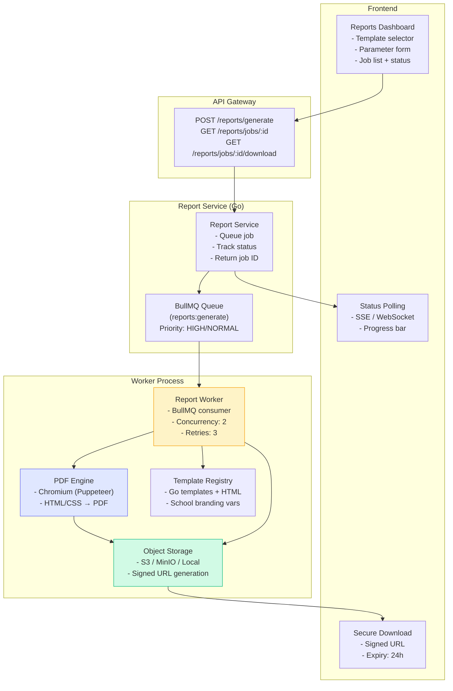
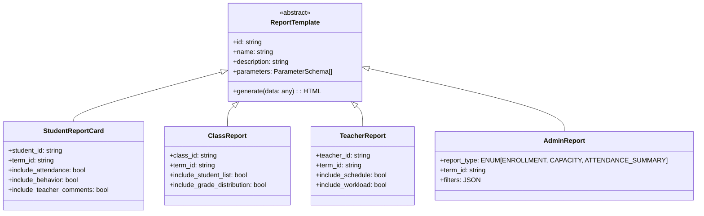
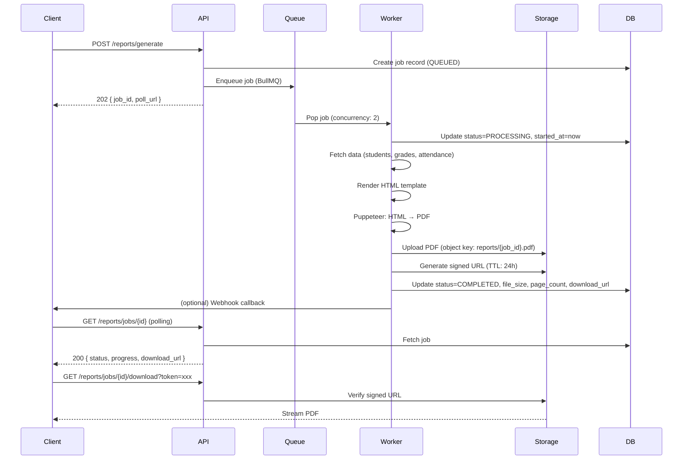
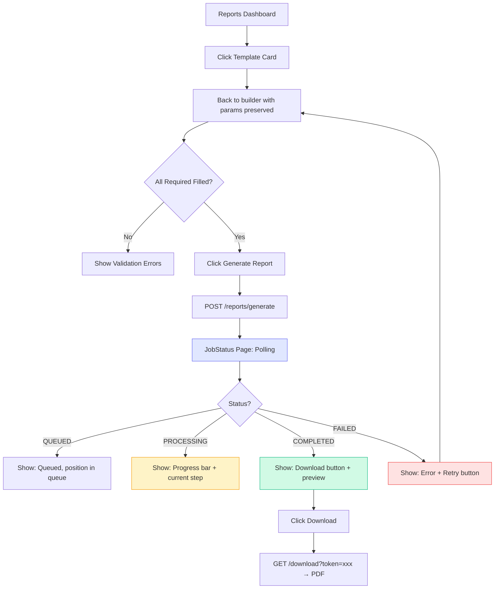

# Reports Generation Guide

> **Purpose:** Technical specification for the report generation system — PDF template engine, async job processing, status tracking, and download UI for Admin Panel SMA.

---

## 1. Overview

### 1.1 Problem Statement

Generate professional PDF reports for:

- **Student Report Cards** — grades, attendance, behavior per term
- **Class Reports** — aggregate performance, attendance summaries
- **Teacher Reports** — class assignments, schedules, workload
- **Administrative Reports** — enrollment stats, capacity planning

Requirements:

- Async generation (large reports take 10-60s)
- Templating system for school-branded layouts
- Signed download URLs (expiring, secure)
- Status polling + real-time updates
- Retention policy (auto-cleanup after 30 days)

### 1.2 Architecture



### 1.3 Feature Flag

```bash
# Backend
ENABLE_REPORTS=true
REPORTS_STORAGE_DIR=./exports
REPORTS_SIGNED_URL_SECRET=change_me_reports
REPORTS_SIGNED_URL_TTL=24h
REPORTS_CLEANUP_INTERVAL=30m
REPORTS_WORKER_CONCURRENCY=2
REPORTS_WORKER_RETRIES=3

# Frontend
VITE_ENABLE_REPORTS=true
```

---

## 2. Report Types & Templates

### 2.1 Supported Report Types



### 2.2 Template Parameter Schemas

| Report Type             | Required Parameters     | Optional Parameters                                                      |
| ----------------------- | ----------------------- | ------------------------------------------------------------------------ |
| **Student Report Card** | `student_id`, `term_id` | `include_attendance`, `include_behavior`, `include_comments`, `language` |
| **Class Report**        | `class_id`, `term_id`   | `include_student_list`, `include_grade_distribution`, `group_by_subject` |
| **Teacher Report**      | `teacher_id`, `term_id` | `include_schedule`, `include_workload`, `include_student_counts`         |
| **Enrollment Summary**  | `term_id`               | `grade_level`, `track`, `format`                                         |
| **Attendance Summary**  | `term_id`               | `class_id`, `date_range`, `group_by`                                     |

### 2.3 Template Structure (HTML + Go Templates)

```
sma-adp-api/
├── internal/reports/
│   ├── templates/
│   │   ├── base/
│   │   │   ├── header.html       # School logo, name, term
│   │   │   ├── footer.html       # Page numbers, confidentiality
│   │   │   └── styles.css        # Shared CSS (print-optimized)
│   │   ├── student_report_card.html
│   │   ├── class_report.html
│   │   ├── teacher_report.html
│   │   └── admin_enrollment.html
│   └── registry.go               # Template registration + validation
```

**Base Template Example:**

```html
<!-- templates/base/header.html -->
<!doctype html>
<html>
  <head>
    <meta charset="utf-8" />
    <title>{{.ReportTitle}}</title>
    <style>
      {{template "styles.css"}}
    </style>
    <style>
      @page {
        margin: 2cm;
        @bottom-center {
          content: "Page " counter(page) " of " counter(pages);
        }
      }
      .page-break {
        page-break-after: always;
      }
    </style>
  </head>
  <body>
    <header class="report-header">
      
      <div class="school-info">
        <h1>{{.SchoolName}}</h1>
        <p>{{.SchoolAddress}}</p>
      </div>
      <div class="report-meta">
        <span>{{.ReportTitle}}</span>
        <span>{{.TermName}}</span>
        <span>Generated: {{.GeneratedAt}}</span>
      </div>
    </header>
    <main class="report-content"></main>
  </body>
</html>
```

---

## 3. API Specification

### 3.1 Generate Report (Async)

```http
POST /api/v1/reports/generate
Content-Type: application/json
Authorization: Bearer <token>

{
  "template_id": "student_report_card",
  "parameters": {
    "student_id": "stu_abc123",
    "term_id": "term_2025_1",
    "include_attendance": true,
    "include_behavior": true,
    "include_teacher_comments": true
  },
  "priority": "NORMAL",
  "callback_url": "https://frontend.example.com/api/reports/webhook"  // optional
}
```

**Response (202 Accepted):**

```json
{
  "data": {
    "job_id": "job_xyz789",
    "status": "QUEUED",
    "template_id": "student_report_card",
    "created_at": "2025-01-15T10:30:00Z",
    "estimated_completion": "2025-01-15T10:30:45Z",
    "poll_url": "/api/v1/reports/jobs/job_xyz789",
    "download_url": "/api/v1/reports/jobs/job_xyz789/download"
  }
}
```

### 3.2 Get Job Status

```http
GET /api/v1/reports/jobs/{job_id}
Authorization: Bearer <token>
```

**Response (200 OK):**

```json
{
  "data": {
    "job_id": "job_xyz789",
    "template_id": "student_report_card",
    "status": "COMPLETED", // QUEUED, PROCESSING, COMPLETED, FAILED, EXPIRED
    "progress": 100,
    "current_step": "PDF generated, uploading to storage",
    "created_at": "2025-01-15T10:30:00Z",
    "started_at": "2025-01-15T10:30:02Z",
    "completed_at": "2025-01-15T10:30:38Z",
    "file_size_bytes": 245760,
    "page_count": 3,
    "error": null,
    "download_url": "/api/v1/reports/jobs/job_xyz789/download?token=signed_xyz",
    "expires_at": "2025-01-16T10:30:38Z"
  }
}
```

### 3.3 Download Report

```http
GET /api/v1/reports/jobs/{job_id}/download?token={signed_token}
Authorization: Bearer <token>
```

**Response:** `Content-Type: application/pdf`, `Content-Disposition: attachment; filename="report_student_stu_abc123_term_2025_1.pdf"`

### 3.4 List Report Jobs

```http
GET /api/v1/reports/jobs?status=COMPLETED&limit=20&offset=0
Authorization: Bearer <token>
```

### 3.5 List Available Templates

```http
GET /api/v1/reports/templates
Authorization: Bearer <token>
```

**Response:**

```json
{
  "data": [
    {
      "id": "student_report_card",
      "name": "Student Report Card",
      "description": "Individual student grades, attendance, and behavior",
      "category": "ACADEMIC",
      "parameters": [
        { "name": "student_id", "type": "string", "required": true, "description": "Student UUID" },
        { "name": "term_id", "type": "string", "required": true, "description": "Term UUID" },
        { "name": "include_attendance", "type": "boolean", "required": false, "default": true },
        { "name": "include_behavior", "type": "boolean", "required": false, "default": true }
      ],
      "estimated_time_seconds": 15
    }
  ]
}
```

---

## 4. Worker Implementation

### 4.1 Job Processing Flow



### 4.2 Worker Configuration

```go
// internal/reports/worker.go
type WorkerConfig struct {
    Concurrency     int           `mapstructure:"REPORTS_WORKER_CONCURRENCY"`     // 2
    MaxRetries      int           `mapstructure:"REPORTS_WORKER_RETRIES"`         // 3
    RetryDelay      time.Duration `mapstructure:"REPORTS_WORKER_RETRY_DELAY"`     // 30s
    JobTimeout      time.Duration `mapstructure:"REPORTS_JOB_TIMEOUT"`            // 5m
    CleanupInterval time.Duration `mapstructure:"REPORTS_CLEANUP_INTERVAL"`       // 30m
    SignedURLTTL    time.Duration `mapstructure:"REPORTS_SIGNED_URL_TTL"`         // 24h
    StorageBackend  string        `mapstructure:"REPORTS_STORAGE_BACKEND"`        // s3|minio|local
}
```

### 4.3 PDF Generation (Puppeteer/Chromium)

```go
// internal/reports/engine.go
type PDFEngine struct {
    browser *rod.Browser  // or chromedp
    timeout time.Duration
}

func (e *PDFEngine) GenerateHTMLToPDF(html string, options PDFOptions) ([]byte, error) {
    page := e.browser.MustPage()
    defer page.Close()

    page.MustSetContent(html)
    page.MustWaitLoad()

    // PDF options for print quality
    pdfOptions := rod.PDFOptions{
        PaperWidth:  8.27,  // A4 inches
        PaperHeight: 11.69,
        MarginTop:   0.79,
        MarginBottom: 0.79,
        MarginLeft:  0.79,
        MarginRight: 0.79,
        PrintBackground: true,
        PreferCSSPageSize: true,
    }

    return page.MustPDF(&pdfOptions), nil
}
```

---

## 5. Frontend Implementation Spec

### 5.1 Pages & Components

```
apps/admin/src/
├── features/reports/
│   ├── pages/
│   │   ├── ReportsDashboard.tsx        # Template list + recent jobs
│   │   ├── ReportBuilder.tsx           # Parameter form per template
│   │   ├── JobStatus.tsx               # Polling status + progress
│   │   └── JobHistory.tsx              # Paginated job list
│   ├── components/
│   │   ├── TemplateCard.tsx            # Template selector card
│   │   ├── ParameterForm.tsx           # Dynamic form from schema
│   │   ├── JobProgressBar.tsx          # Animated progress with steps
│   │   ├── JobStatusBadge.tsx          # QUEUED/PROCESSING/COMPLETED/FAILED
│   │   ├── DownloadButton.tsx          # Signed URL download
│   │   └── ReportPreview.tsx           # iframe PDF preview (optional)
│   ├── hooks/
│   │   ├── useReportGeneration.ts      # Generate + poll status
│   │   ├── useReportTemplates.ts       # Fetch templates
│   │   └── useReportHistory.ts         # Paginated job list
│   └── types/
│       └── reports.ts                  # TypeScript interfaces
```

### 5.2 Report Builder Flow



### 5.3 Polling Hook (Real-time Status)

```typescript
// features/reports/hooks/useReportGeneration.ts
export function useReportGeneration() {
  const [job, setJob] = useState<ReportJob | null>(null);
  const [pollInterval, setPollInterval] = useState<NodeJS.Timeout | null>(null);

  const generate = useCallback(async (templateId: string, parameters: Record<string, any>) => {
    const res = await api.post("/reports/generate", { template_id: templateId, parameters });
    const newJob = res.data.data;
    setJob(newJob);
    startPolling(newJob.job_id);
  }, []);

  const startPolling = useCallback((jobId: string) => {
    const interval = setInterval(async () => {
      const res = await api.get(`/reports/jobs/${jobId}`);
      const updatedJob = res.data.data;
      setJob(updatedJob);

      if (["COMPLETED", "FAILED", "EXPIRED"].includes(updatedJob.status)) {
        stopPolling();
      }
    }, 2000);
    setPollInterval(interval);
  }, []);

  const stopPolling = useCallback(() => {
    if (pollInterval) clearInterval(pollInterval);
    setPollInterval(null);
  }, [pollInterval]);

  useEffect(() => () => stopPolling(), [stopPolling]);

  return { job, generate, stopPolling };
}
```

### 5.4 Progress Steps Component

```tsx
// features/reports/components/JobProgressBar.tsx
const PROGRESS_STEPS = [
  { key: "queued", label: "Queued", weight: 10 },
  { key: "fetching_data", label: "Fetching data", weight: 20 },
  { key: "rendering_html", label: "Rendering template", weight: 30 },
  { key: "generating_pdf", label: "Generating PDF", weight: 30 },
  { key: "uploading", label: "Uploading to storage", weight: 10 },
];

export function JobProgressBar({ job }: { job: ReportJob }) {
  const currentIndex = PROGRESS_STEPS.findIndex((s) => s.key === job.current_step) ?? 0;
  const progress =
    job.status === "COMPLETED"
      ? 100
      : job.status === "QUEUED"
        ? 10
        : PROGRESS_STEPS.slice(0, currentIndex + 1).reduce((sum, s) => sum + s.weight, 0);

  return (
    <div className="progress-container">
      <div
        className="progress-bar"
        role="progressbar"
        aria-valuenow={progress}
        aria-valuemin={0}
        aria-valuemax={100}
      >
        <div className="progress-fill" style={{ width: `${progress}%` }} />
      </div>
      <div className="progress-steps">
        {PROGRESS_STEPS.map((step, i) => (
          <div
            key={step.key}
            className={`step ${i < currentIndex ? "completed" : i === currentIndex ? "active" : "pending"}`}
          >
            <span className="step-label">{step.label}</span>
          </div>
        ))}
      </div>
      {job.error && (
        <div className="error-message" role="alert">
          {job.error}
        </div>
      )}
    </div>
  );
}
```

---

## 6. Storage & Signed URLs

### 6.1 Storage Backends

| Backend   | Config                                                  | Use Case       |
| --------- | ------------------------------------------------------- | -------------- |
| **S3**    | `REPORTS_S3_BUCKET`, `REPORTS_S3_REGION`, `AWS_*` creds | Production     |
| **MinIO** | `REPORTS_MINIO_ENDPOINT`, `REPORTS_MINIO_ACCESS_KEY`    | Staging/Dev    |
| **Local** | `REPORTS_STORAGE_DIR=./exports`                         | Local dev only |

### 6.2 Signed URL Generation

```go
// internal/reports/storage.go
func (s *Storage) GenerateSignedURL(ctx context.Context, objectKey string, ttl time.Duration) (string, error) {
    switch s.backend {
    case "s3":
        return s.s3Client.PresignGetObject(ctx, &s3.GetObjectInput{
            Bucket: aws.String(s.bucket),
            Key:    aws.String(objectKey),
        }, func(o *s3.PresignOptions) { o.Expires = ttl })
    case "minio":
        return s.minioClient.PresignedGetObject(ctx, s.bucket, objectKey, ttl, nil)
    case "local":
        // JWT-signed local URL
        token := jwt.NewWithClaims(jwt.SigningMethodHS256, jwt.MapClaims{
            "key": objectKey,
            "exp": time.Now().Add(ttl).Unix(),
        })
        signed, _ := token.SignedString([]byte(s.secret))
        return fmt.Sprintf("/api/v1/reports/download/local?token=%s", signed), nil
    }
}
```

### 6.3 Object Key Structure

```
reports/
├── {job_id}.pdf                    # Generated PDF
├── {job_id}.metadata.json          # Job metadata (for recovery)
└── templates/
    └── {template_id}.html          # Cached compiled templates
```

---

## 7. Retention & Cleanup

### 7.1 Retention Policy

| Status         | Retention | Action                  |
| -------------- | --------- | ----------------------- |
| **QUEUED**     | 1 hour    | Auto-cancel if stuck    |
| **PROCESSING** | 30 min    | Mark FAILED if timeout  |
| **COMPLETED**  | 30 days   | Delete file + DB record |
| **FAILED**     | 7 days    | Keep for debugging      |
| **EXPIRED**    | Immediate | Cleanup job removes     |

### 7.2 Cleanup Job

```go
// internal/reports/cleanup.go
func (s *Service) CleanupExpiredJobs(ctx context.Context) error {
    // 1. Find jobs older than retention
    expiredJobs, err := s.repo.FindExpiredJobs(ctx, retentionPolicy)
    if err != nil { return err }

    for _, job := range expiredJobs {
        // 2. Delete from storage
        if job.file_key != "" {
            s.storage.Delete(ctx, job.file_key)
        }
        // 3. Delete DB record
        s.repo.Delete(ctx, job.id)
    }
    return nil
}
```

**Scheduled:** Every 30 minutes (`REPORTS_CLEANUP_INTERVAL=30m`)

---

## 8. Testing Strategy

### 8.1 Unit Tests

| Test                   | Description                              |
| ---------------------- | ---------------------------------------- |
| `TestTemplateRegistry` | All templates load, parameters validated |
| `TestHTMLRendering`    | Template + data → valid HTML             |
| `TestPDFGeneration`    | HTML → PDF (page count, size)            |
| `TestSignedURL`        | URL works, expires, invalid rejected     |
| `TestStorageBackends`  | S3/MinIO/Local all implement interface   |

### 8.2 Integration Tests

```go
func TestReportGeneration_Integration(t *testing.T) {
    // 1. Seed: student, grades, attendance, term
    // 2. POST /reports/generate (student_report_card)
    // 3. Poll GET /reports/jobs/{id} until COMPLETED
    // 4. Verify:
    //    - status = COMPLETED
    //    - download_url returns PDF
    //    - PDF has expected page count (≥2)
    //    - PDF contains student name, grades table
}

func TestReportCleanup_Integration(t *testing.T) {
    // 1. Create COMPLETED job with old timestamp
    // 2. Run cleanup
    // 3. Verify file deleted from storage, DB record gone
}
```

### 8.3 E2E Tests (Playwright)

```typescript
// tests/e2e/feature-specific.spec.ts (existing)
test("Reports: Generate Student Report Card, Download PDF", async ({ authenticatedPage }) => {
  await gotoAndWait(page, "/reports", '[data-testid="reports-dashboard"]');

  // Select template
  await page.click('[data-testid="template-student_report_card"]');
  await expect(page.locator('[data-testid="report-builder"]')).toBeVisible();

  // Fill parameters
  await page.selectOption('[data-testid="param-student_id"]', "stu_abc123");
  await page.selectOption('[data-testid="param-term_id"]', "term_2025_1");
  await page.check('[data-testid="param-include_attendance"]');

  // Generate
  await page.click('[data-testid="generate-report-btn"]');
  await expect(page.locator('[data-testid="job-status"]')).toBeVisible();

  // Wait for completion (polling)
  await page.waitForSelector('[data-testid="download-btn"]', { timeout: 60000 });

  // Download
  const downloadPromise = page.waitForEvent("download");
  await page.click('[data-testid="download-btn"]');
  const download = await downloadPromise;

  expect(download.suggestedFilename()).toMatch(/report_student_stu_abc123_term_2025_1\.pdf/);
});
```

---

## 9. Performance & Scaling

### 9.1 Benchmarks

| Report Type         | Data Size                | Generation Time | PDF Size      |
| ------------------- | ------------------------ | --------------- | ------------- |
| Student Report Card | 1 student, 10 subjects   | 8-15s           | 200-500 KB    |
| Class Report        | 30 students, 10 subjects | 20-40s          | 500 KB - 2 MB |
| Teacher Report      | 5 classes, 150 students  | 15-30s          | 300 KB - 1 MB |
| Admin Enrollment    | 500 students             | 30-60s          | 1-5 MB        |

### 9.2 Scaling Knobs

```bash
# Horizontal: Run multiple worker processes
REPORTS_WORKER_CONCURRENCY=4  # per process

# Vertical: Increase Chromium pool
# Puppeteer: browser.pages() pool size

# Queue priority separation
# HIGH: Student report cards (parents waiting)
# NORMAL: Class/Admin reports (batch)
```

### 9.3 Optimization

- **Template caching** — Compile Go templates once at startup
- **Data fetching** — Batch queries, use DataLoader pattern
- **Chromium reuse** — Keep browser pool warm (avoid cold starts)
- **Streaming upload** — Stream PDF to S3 without full buffer in memory

---

## 10. Future Enhancements

| Feature                 | Priority | Description                                         |
| ----------------------- | -------- | --------------------------------------------------- |
| **Report Scheduling**   | P2       | Cron-based generation (e.g., monthly report cards)  |
| **Email Delivery**      | P2       | Send PDF via email on completion                    |
| **Multi-format Export** | P3       | Excel (grades), CSV (attendance), JSON (API)        |
| **Template Editor**     | P3       | Visual drag-drop template builder (admin)           |
| **Digital Signatures**  | P3       | Cryptographic signing of official reports           |
| **Batch Generation**    | P2       | Generate all student reports for a class in one job |
| **Watermarking**        | P3       | "DRAFT" / "CONFIDENTIAL" dynamic watermarks         |

---

_Last updated: 2025-01-15 | Owner: Platform Team | Review: Per release_
