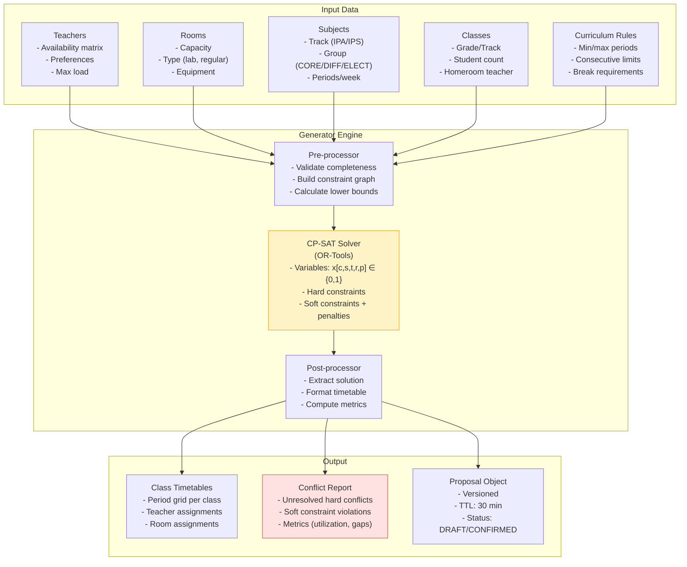
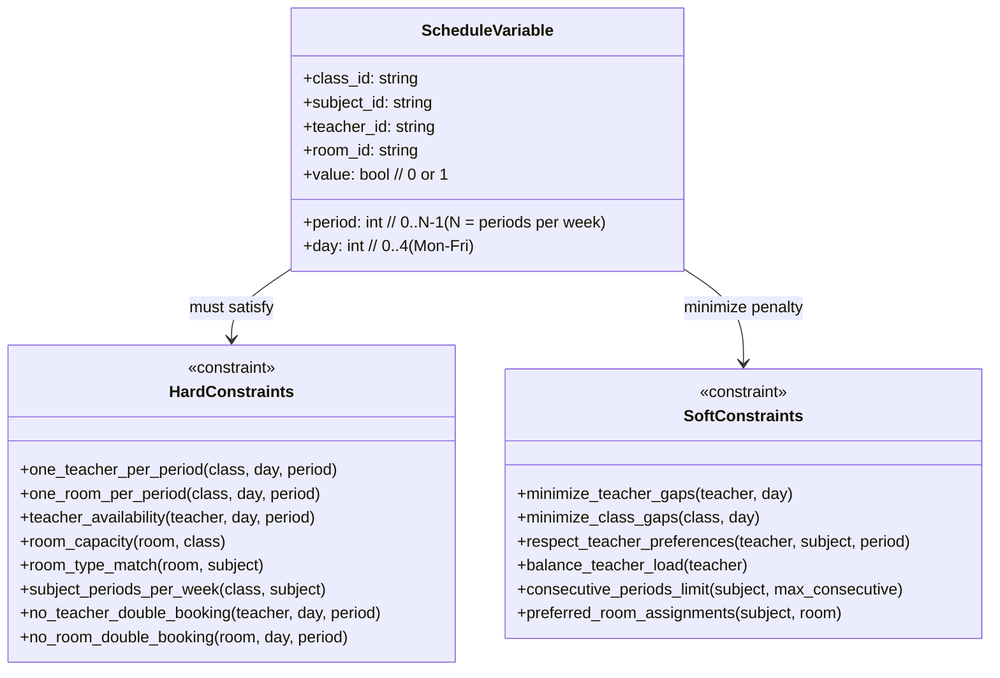
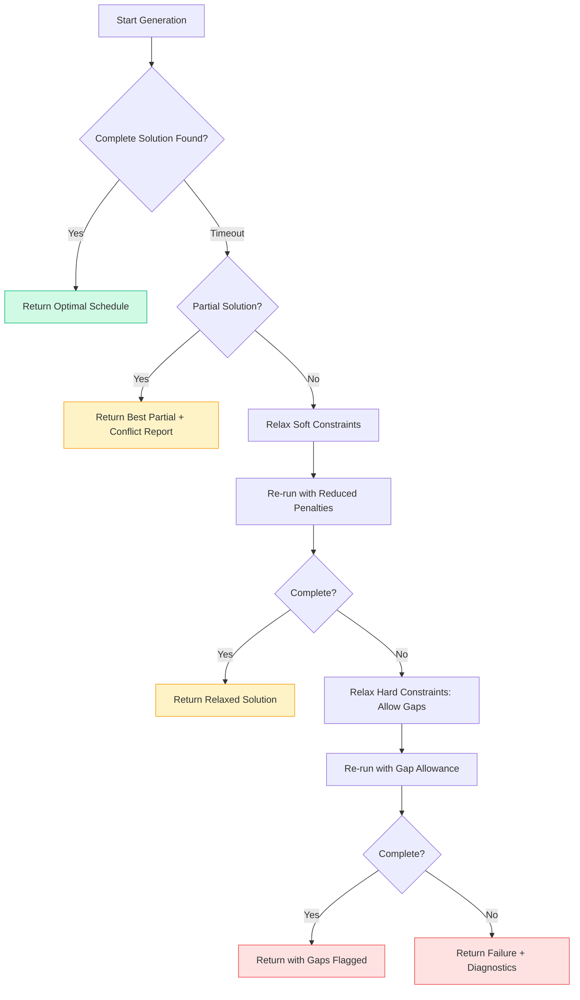
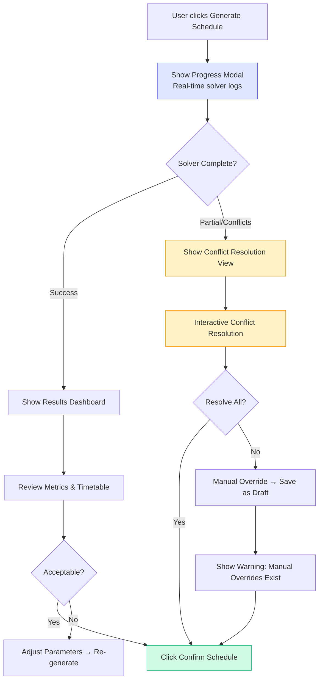
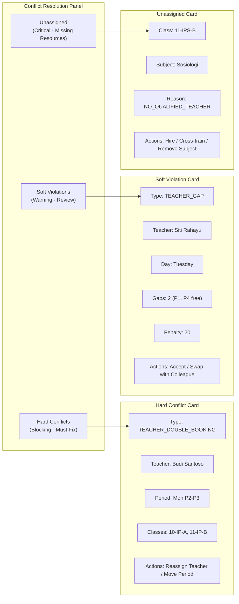
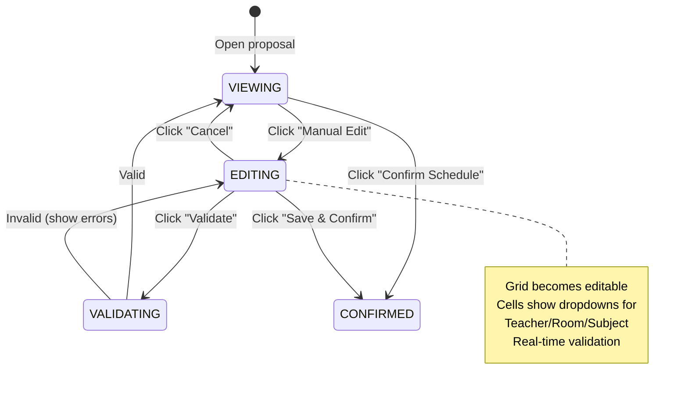
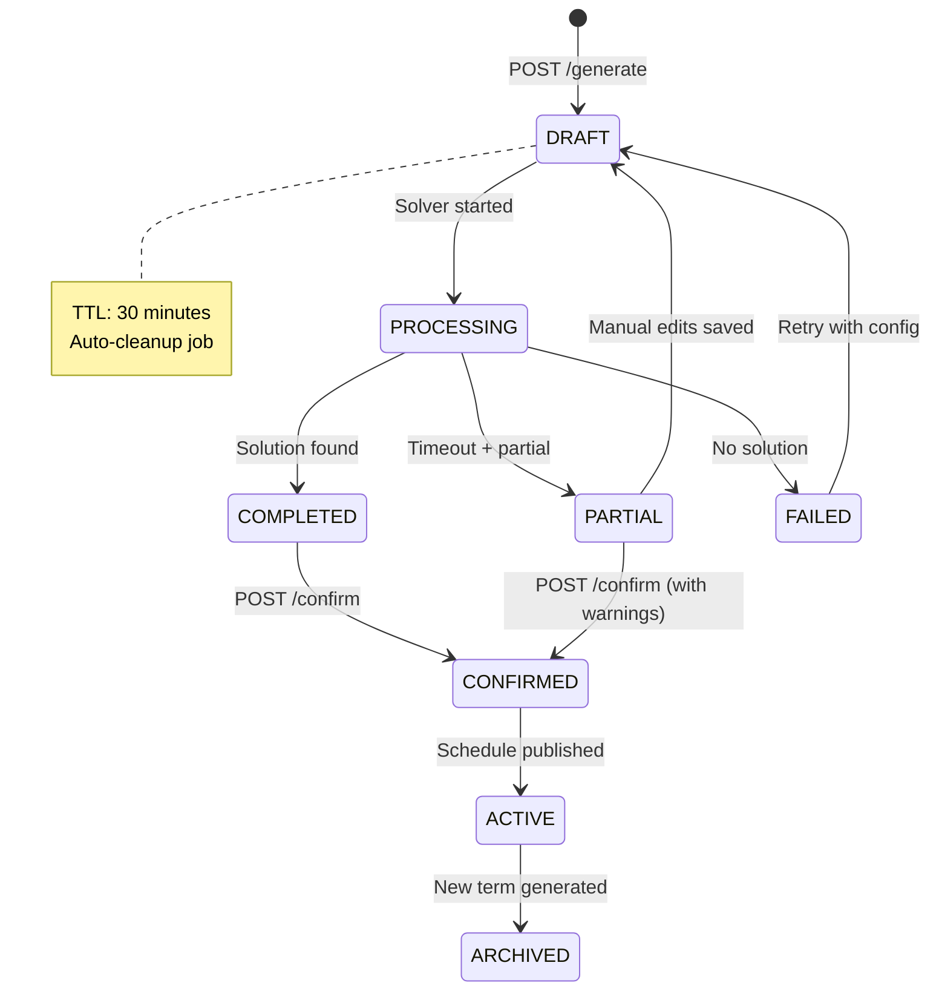

# Scheduler Generator Guide

> **Purpose:** Technical specification for the schedule generation algorithm, conflict detection, and resolution UI for the Admin Panel SMA.

---

## 1. Overview

### 1.1 Problem Statement

Generate conflict-free semester schedules for all classes, respecting:

- Teacher availability & preferences
- Room constraints (capacity, type, equipment)
- Subject requirements (track: IPA/IPS, group: CORE/DIFFERENTIATED/ELECTIVE)
- Curriculum rules (min/max periods per subject per week)
- No teacher double-booking, no room double-booking, no class gaps > 1 period

### 1.2 Architecture



### 1.3 Feature Flag

```bash
# Backend
ENABLE_SCHEDULER=true

# Frontend
VITE_ENABLE_SCHEDULER=true
```

---

## 2. Algorithm Specification

### 2.1 Mathematical Model (CP-SAT)



#### Variables

```
x[c, s, t, r, d, p] ∈ {0, 1}
  c ∈ Classes
  s ∈ Subjects (assigned to class c)
  t ∈ Teachers (qualified for s)
  r ∈ Rooms (suitable for s)
  d ∈ {0..4}  // Mon-Fri
  p ∈ {0..P-1}  // Periods per day (e.g., 8)
```

#### Hard Constraints

| #   | Constraint                                     | Formula                                                      |
| --- | ---------------------------------------------- | ------------------------------------------------------------ |
| H1  | Each class gets exactly one subject per period | `∑_s ∑_t ∑_r x[c,s,t,r,d,p] = 1` ∀ c,d,p                     |
| H2  | Teacher teaches at most one class per period   | `∑_c ∑_s ∑_r x[c,s,t,r,d,p] ≤ 1` ∀ t,d,p                     |
| H3  | Room hosts at most one class per period        | `∑_c ∑_s ∑_t x[c,s,t,r,d,p] ≤ 1` ∀ r,d,p                     |
| H4  | Teacher availability                           | `x[c,s,t,r,d,p] = 0` if `t` unavailable at `(d,p)`           |
| H5  | Room capacity ≥ class size                     | `x[c,s,t,r,d,p] = 0` if `capacity(r) < size(c)`              |
| H6  | Room type matches subject                      | `x[c,s,t,r,d,p] = 0` if `type(r) ≠ required_type(s)`         |
| H7  | Subject weekly periods met                     | `∑_d ∑_p ∑_t ∑_r x[c,s,t,r,d,p] = periods_per_week(s)` ∀ c,s |
| H8  | Teacher qualified for subject                  | `x[c,s,t,r,d,p] = 0` if `t` not qualified for `s`            |

#### Soft Constraints (with Penalties)

| #   | Constraint          | Penalty Weight         | Description                           |
| --- | ------------------- | ---------------------- | ------------------------------------- |
| S1  | Teacher daily gaps  | 10 per gap             | Minimize free periods between classes |
| S2  | Class daily gaps    | 15 per gap             | Minimize student free periods         |
| S3  | Teacher preference  | 5 per violation        | Preferred (subject, period) pairs     |
| S4  | Load balance        | 20 per period over avg | Fair distribution across teachers     |
| S5  | Consecutive periods | 30 per extra           | Max 2 consecutive for same subject    |
| S6  | Room preference     | 5 per violation        | Preferred room for subject            |

### 2.2 Solver Configuration

```python
# Internal solver config (Go wrapper around OR-Tools)
solver_config = {
    "max_time_seconds": 120,           # Hard timeout
    "num_search_workers": 8,           # Parallel search
    "log_search_progress": True,       # Debug logging
    "relative_gap_limit": 0.05,        # Stop at 5% from optimal
    "solution_callback": log_progress, # Custom callback
}
```

### 2.3 Fallback Strategies



---

## 3. API Specification

### 3.1 Generate Schedule

```http
POST /api/v1/scheduler/generate
Content-Type: application/json
Authorization: Bearer <token>

{
  "term_id": "term_2025_1",
  "config": {
    "max_solve_time_seconds": 120,
    "allow_gaps": false,
    "prioritize": ["teacher_gaps", "class_gaps", "load_balance"],
    "seed": 42
  }
}
```

**Response (202 Accepted):**

```json
{
  "data": {
    "proposal_id": "prop_abc123",
    "status": "PROCESSING",
    "started_at": "2025-01-15T10:30:00Z",
    "estimated_completion": "2025-01-15T10:32:00Z"
  }
}
```

### 3.2 Get Proposal Status

```http
GET /api/v1/scheduler/proposals/{proposal_id}
Authorization: Bearer <token>
```

**Response (200 OK):**

```json
{
  "data": {
    "proposal_id": "prop_abc123",
    "status": "COMPLETED",
    "term_id": "term_2025_1",
    "timetable": {
      "class_10_ip_a": {
        "monday": [
          {"period": 0, "subject": "Matematika", "teacher": "Budi Santoso", "room": "Lab Komputer 1"},
          {"period": 1, "subject": "Fisika", "teacher": "Siti Rahayu", "room": "Lab Fisika"},
          {"period": 2, "subject": null, "teacher": null, "room": null},  // Gap
          {"period": 3, "subject": "Bahasa Indonesia", "teacher": "Ani Wijaya", "room": "Ruang 101"}
        ],
        ...
      }
    },
    "conflicts": {
      "hard": [],
      "soft": [
        {"type": "TEACHER_GAP", "teacher": "Budi Santoso", "day": "Monday", "gap_count": 2, "penalty": 20},
        {"type": "CLASS_GAP", "class": "class_10_ip_a", "day": "Monday", "gap_count": 1, "penalty": 15}
      ],
      "unassigned": [
        {"class": "class_11_ips_b", "subject": "Sosiologi", "reason": "NO_QUALIFIED_TEACHER"}
      ]
    },
    "metrics": {
      "teacher_utilization": 0.78,
      "room_utilization": 0.65,
      "total_gaps_teachers": 12,
      "total_gaps_classes": 8,
      "load_balance_index": 0.15,
      "solve_time_seconds": 45.2
    },
    "completed_at": "2025-01-15T10:30:45Z"
  }
}
```

### 3.3 Save Proposal (Confirm)

```http
POST /api/v1/scheduler/proposals/{proposal_id}/confirm
Authorization: Bearer <token>
```

**Response (200 OK):**

```json
{
  "data": {
    "schedule_id": "sched_xyz789",
    "proposal_id": "prop_abc123",
    "term_id": "term_2025_1",
    "status": "ACTIVE",
    "confirmed_at": "2025-01-15T10:35:00Z",
    "confirmed_by": "admin@sma.test"
  }
}
```

### 3.4 List Semester Schedules

```http
GET /api/v1/scheduler/schedules?term_id=term_2025_1
Authorization: Bearer <token>
```

---

## 4. Conflict Resolution UI Specification

### 4.1 User Flow



### 4.2 Conflict Resolution View Components



### 4.3 Interactive Resolution Actions

| Conflict Type              | UI Action                    | Backend Effect                      |
| -------------------------- | ---------------------------- | ----------------------------------- |
| **Teacher Double Booking** | Drag-drop to swap periods    | Re-run solver with fixed assignment |
| **Room Double Booking**    | Select alternative room      | Add room constraint, re-solve       |
| **Teacher Gap**            | "Accept Gaps" checkbox       | Relax S1 penalty to 0               |
| **Class Gap**              | "Compact Schedule" button    | Add constraint: max 1 gap/day       |
| **Unassigned Subject**     | "Assign Substitute" dropdown | Add temporary teacher qualification |
| **Load Imbalance**         | "Rebalance" slider           | Adjust S4 weight dynamically        |

### 4.4 Manual Override Mode



---

## 5. Frontend Implementation Spec

### 5.1 Pages & Components

```
apps/admin/src/
├── features/scheduler/
│   ├── pages/
│   │   ├── SchedulerDashboard.tsx      # List proposals + generate button
│   │   ├── GenerateProgress.tsx        # Real-time solver progress
│   │   ├── ConflictResolution.tsx      # Tabbed conflict review
│   │   ├── TimetableViewer.tsx         # Grid view per class/teacher/room
│   │   └── ManualEditor.tsx            # Editable grid for overrides
│   ├── components/
│   │   ├── TimetableGrid.tsx           # Reusable period grid
│   │   ├── ConflictCard.tsx            # Expandable conflict detail
│   │   ├── ResolutionActions.tsx       # Action buttons per conflict
│   │   ├── MetricsPanel.tsx            # Utilization, gaps, balance
│   │   └── ProposalStatusBadge.tsx     # PROCESSING/COMPLETED/FAILED
│   ├── hooks/
│   │   ├── useSchedulerGenerate.ts     # Polling for generation status
│   │   ├── useConflictResolution.ts    # Optimistic updates for fixes
│   │   └── useTimetableData.ts         # Fetch + transform timetable
│   └── types/
│       └── scheduler.ts                # TypeScript interfaces
```

### 5.2 Timetable Grid Component

```tsx
// features/scheduler/components/TimetableGrid.tsx
interface TimetableGridProps {
  view: "class" | "teacher" | "room";
  entityId: string;
  timetable: TimetableData;
  editable?: boolean;
  onCellChange?: (cell: GridCell, newValue: CellValue) => void;
  highlightConflicts?: boolean;
}

// Grid structure:
// Rows: Periods (0-7)
// Columns: Days (Mon-Fri)
// Cell: { subject, teacher, room, conflictType? }
```

### 5.3 Real-time Generation Progress

```tsx
// features/scheduler/hooks/useSchedulerGenerate.ts
export function useSchedulerGenerate(termId: string) {
  const [proposal, setProposal] = useState<Proposal | null>(null);
  const [progress, setProgress] = useState<SolverProgress>({
    phase: "INITIALIZING",
    elapsedSeconds: 0,
    bestObjective: null,
    currentObjective: null,
  });

  const generate = useCallback(async () => {
    const res = await api.post("/scheduler/generate", { term_id: termId });
    setProposal(res.data.data);
    pollStatus(res.data.data.proposal_id);
  }, [termId]);

  const pollStatus = useCallback(async (proposalId: string) => {
    const interval = setInterval(async () => {
      const res = await api.get(`/scheduler/proposals/${proposalId}`);
      const data = res.data.data;
      setProposal(data);
      if (data.status === "COMPLETED" || data.status === "FAILED") {
        clearInterval(interval);
      }
    }, 2000);
    return () => clearInterval(interval);
  }, []);

  return { proposal, progress, generate };
}
```

---

## 6. Backend Implementation Spec

### 6.1 Service Structure

```
sma-adp-api/internal/
├── scheduler/
│   ├── service.go              # Orchestration
│   ├── solver/
│   │   ├── model.go            # CP-SAT model builder
│   │   ├── constraints.go      # Hard/soft constraint definitions
│   │   ├── solution.go         # Solution extraction
│   │   └── ortools_wrapper.go  # CGO/Wrapper for OR-Tools
│   ├── repository.go           # Proposal/Timetable persistence
│   ├── dto/
│   │   ├── request.go
│   │   └── response.go
│   └── middleware/
│       └── feature_flag.go     # RequireFeature("ENABLE_SCHEDULER")
```

### 6.2 Data Models

```go
// internal/scheduler/dto/response.go
type TimetableResponse struct {
    Classes map[string]ClassTimetable `json:"classes"`
    Teachers map[string]TeacherTimetable `json:"teachers"`
    Rooms map[string]RoomTimetable `json:"rooms"`
}

type ClassTimetable struct {
    ClassID   string             `json:"class_id"`
    ClassName string             `json:"class_name"`
    Schedule  [5][8]*PeriodSlot  `json:"schedule"` // [day][period]
}

type PeriodSlot struct {
    SubjectID   *string `json:"subject_id,omitempty"`
    SubjectName *string `json:"subject_name,omitempty"`
    TeacherID   *string `json:"teacher_id,omitempty"`
    TeacherName *string `json:"teacher_name,omitempty"`
    RoomID      *string `json:"room_id,omitempty"`
    RoomName    *string `json:"room_name,omitempty"`
    Conflict    *ConflictInfo `json:"conflict,omitempty"`
}

type ConflictInfo struct {
    Type        string `json:"type"` // HARD / SOFT / UNASSIGNED
    Code        string `json:"code"` // TEACHER_DOUBLE_BOOKING, etc.
    Message     string `json:"message"`
    Penalty     int    `json:"penalty,omitempty"`
    Suggestions []string `json:"suggestions,omitempty"`
}
```

### 6.3 Proposal Lifecycle



---

## 7. Testing Strategy

### 7.1 Unit Tests (Solver)

| Test Case                | Description                              |
| ------------------------ | ---------------------------------------- |
| `TestModelBuilding`      | Verify all variables/constraints created |
| `TestHardConstraints`    | Each H1-H8 satisfied in solution         |
| `TestSoftPenalties`      | Penalty calculation matches spec         |
| `TestFallbackRelaxation` | Progressive relaxation works             |
| `TestSeedDeterminism`    | Same seed → same solution                |

### 7.2 Integration Tests

```go
// internal/scheduler/service_integration_test.go
func TestGenerateSchedule_Integration(t *testing.T) {
    // 1. Seed test data: 4 classes, 8 teachers, 6 rooms, 12 subjects
    // 2. Call GenerateSchedule
    // 3. Poll until COMPLETED
    // 4. Verify:
    //    - All classes have full timetable
    //    - No hard conflicts
    //    - Subject periods/week met
    //    - Teacher qualifications respected
    //    - Room capacities respected
}

func TestConflictResolution_Integration(t *testing.T) {
    // 1. Generate schedule with known conflict (force double-booking)
    // 2. Verify conflict appears in response
    // 3. Apply manual fix via API
    // 4. Re-validate → conflict resolved
}
```

### 7.3 E2E Tests (Playwright)

```typescript
// tests/e2e/feature-specific.spec.ts (existing)
test("Scheduler: Generate, Review Conflicts, Confirm", async ({ authenticatedPage }) => {
  await gotoAndWait(page, "/scheduler", '[data-testid="scheduler-dashboard"]');

  // Generate
  await page.click('[data-testid="generate-schedule-btn"]');
  await expect(page.locator('[data-testid="progress-modal"]')).toBeVisible();

  // Wait for completion (polling)
  await page.waitForSelector('[data-testid="conflict-tabs"]', { timeout: 120000 });

  // Review conflicts
  await page.click('[data-testid="tab-soft-violations"]');
  await expect(page.locator('[data-testid="conflict-card"]')).toHaveCount(3);

  // Accept and confirm
  await page.click('[data-testid="confirm-schedule-btn"]');
  await expect(page.locator('[data-testid="success-toast"]')).toBeVisible();
});
```

---

## 8. Performance Benchmarks

| Scenario | Classes | Teachers | Rooms | Subjects | Target Solve Time |
| -------- | ------- | -------- | ----- | -------- | ----------------- |
| Small    | 10      | 20       | 15    | 30       | < 15s             |
| Medium   | 25      | 50       | 30    | 60       | < 60s             |
| Large    | 50      | 100      | 50    | 100      | < 180s            |

**Optimization knobs:**

- Reduce `max_solve_time_seconds` for faster, suboptimal results
- Increase `num_search_workers` for parallel hardware
- Pre-assign fixed constraints (e.g., lab periods) to reduce search space

---

## 9. Migration Notes (v1 → v2)

| v1 (NestJS)              | v2 (Go)                                | Status        |
| ------------------------ | -------------------------------------- | ------------- |
| Basic CRUD for schedules | CP-SAT generator + conflict resolution | **New in v2** |
| Manual drag-drop only    | Generate → Review → Manual override    | **Enhanced**  |
| No conflict detection    | Hard/soft conflict classification      | **New in v2** |
| Single timetable view    | Class/Teacher/Room multi-view          | **New in v2** |

---

## 10. Future Enhancements

| Feature                          | Priority | Description                                        |
| -------------------------------- | -------- | -------------------------------------------------- |
| **Multi-objective Optimization** | P2       | Pareto frontier: gaps vs. preferences vs. load     |
| **Incremental Re-generation**    | P2       | Fix one conflict, re-optimize only affected subset |
| **Teacher Preference Learning**  | P3       | ML model from historical confirmations             |
| **Room Equipment Matching**      | P2       | Projector, whiteboard, AC requirements             |
| **Split Class Support**          | P3       | Same subject, different teachers, same period      |
| **Exam Schedule Mode**           | P3       | Different constraints for exam periods             |

---

_Last updated: 2025-01-15 | Owner: Platform Team | Review: Per release_
